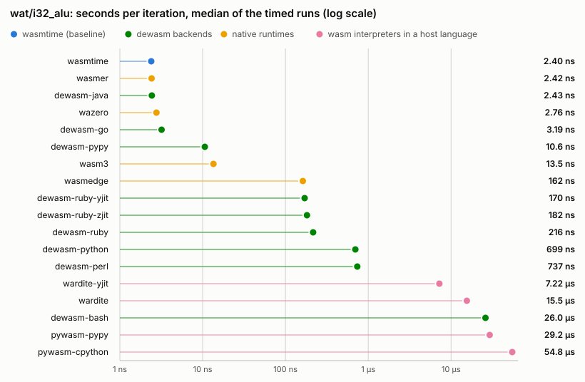

# Benchmarks

<!-- AUTO-GENERATED by `cargo xtask bench`; do not edit by hand. Unlike docs/support.md there is no freshness test: timings are not reproducible byte-for-byte, so this file is a dated measurement, not a compared snapshot. -->

How fast is a wasm program after dewasm has turned it into Ruby, Python, Perl, Go, Java, or Bash source? This page is the measured answer, regenerated by `cargo xtask bench`. It is a *dated* answer: the numbers below were taken on one host on one day, and the section headers say which.

## Environment

Measured 2026-08-02T01:43:47Z.

| | |
| --- | --- |
| OS | macOS 26.5.2 |
| Kernel | Darwin 25.5.0 |
| CPU | Apple M1 Pro |
| Arch | aarch64 |
| Repetitions | 1 timed runs after one warmup |
| Calibration target | 50 ms of compute per sample |

Every version string below was captured by executing the runtime, not copied from a lockfile.

| Runner | Version | Status |
| --- | --- | --- |
| `wasmtime` | wasmtime 47.0.3 (5554cc1a6 2026-07-31) | available |
| `wasmer` | wasmer 7.2.1 | available |
| `wasmedge` | wasmedge version 0.17.1 | available |
| `wazero` | 1.12.0 | available |
| `wasm3` | Wasm3 v0.5.0 on arm64-v8a | available |
| `dewasm-ruby` | ruby 4.0.4 (2026-05-12 revision b89eb1bcbf) +PRISM [arm64-darwin25] | available |
| `dewasm-ruby-yjit` | ruby 4.0.4 (2026-05-12 revision b89eb1bcbf) +PRISM [arm64-darwin25] | available |
| `dewasm-ruby-zjit` | ruby 4.0.4 (2026-05-12 revision b89eb1bcbf) +PRISM [arm64-darwin25] | available |
| `dewasm-python` | Python 3.14.6 (main, Jun 10 2026, 10:03:53) [Clang 21.0.0 (clang-2100.0.123.102)] | available |
| `dewasm-pypy` | Python 3.11.15 (194f9f44b505, Jul 15 2026, 12:14:56) | available |
| `dewasm-perl` | v5.42.2 | available |
| `dewasm-go` | go version go1.26.2 darwin/arm64 | available |
| `dewasm-java` | java version "25.0.4" 2026-07-21 LTS | available |
| `dewasm-bash` | 5.3.15(1)-release | available |
| `pywasm-cpython` | pywasm 2.2.3 | available |
| `pywasm-pypy` | pywasm 2.2.3 | available |
| `wardite` | wardite 0.9.0 | available |
| `wardite-yjit` | wardite 0.9.0 | available |

## How this is measured

The fastest and slowest runners here differ by a factor of 280000 on `wat/i32_alu` alone — read the `vs wasmtime` column for the span on each workload — so a single fixed iteration count would be meaningless: it either measures nothing but process startup on wasmtime or takes minutes per sample on Bash. Four rules make the comparison honest:

1. **Per-runner iteration scaling.** Each microbenchmark takes an `<iterations>` argument and each workload declares a ceiling; the harness calibrates every (workload, runner) pair up from a trivial count until one sample reaches the compute target. The headline number is therefore normalized throughput (ns/op), with the raw times printed beside it so nothing is hidden.
2. **The zero run is subtracted.** Every microbenchmark also runs at `<iterations> = 0`, which does no work but still starts the process, loads the module, and prints a result line. That time is the **cold start** column; `t(N) - t(0)` is the compute time. This removes process startup and module load uniformly for every runner — they differ enormously (an empty Ruby is ~0.05 s; loading the generated Ruby for SQLite costs ~0.7 s before any work happens).
3. **Minimum and median.** One warmup run, then N timed runs; both the minimum (the least noise-contaminated estimate) and the median are reported, so a noisy host is visible rather than smoothed away. The charts plot the median, because that is the figure a user of the generated code actually experiences; on this record the two agree to well under 1%, so nothing here turns on the choice.
4. **Every runner's stdout is diffed against wasmtime's** at the same iteration count. A mismatch is a hard failure recorded in this table, not a quietly fast wrong answer — exactly the class of bug the spec harness exists for ([ADR-3](adr/3-testing-strategy.md), [ADR-2](adr/2-numeric-semantics.md)).

A runner that is not installed, a module that has not been built, and a pair that is deliberately excluded are all listed under [Not measured](#not-measured) with a reason. A blank cell never means "covered".

## Results

Every workload carries a chart, with its full numbers folded away underneath. The axis is log10 — the span is too wide for anything else — and it is in **seconds** on every chart, never a ratio: seconds per *iteration* for a microbenchmark, seconds per *run* for an app, which the title of each chart states. The mark is a dot rather than a bar, because a bar states a length measured from zero and a log axis has no zero. Color is the runner family; the numbers are in the table either way.

### Microbenchmarks

Seconds per **iteration**. The iteration count is calibrated per runner so that every sample takes a comparable amount of time, which means the raw wall times are not comparable across rows but the per-iteration figures are. The `wat/` programs are hand-written and each isolates a single operation type; the `c/` ones are algorithms compiled from C.

#### `wat/i32_alu`

<picture>
  <source media="(prefers-color-scheme: dark)" srcset="benchmarks/wat-i32-alu-dark.svg">
  
</picture>

Full numbers for <code>wat/i32_alu</code>

| Runner | Iterations | ns/op (min) | ns/op (median) | Cold start `t(0)` | Total `t(N)` | vs wasmtime | Load |
| --- | --- | --- | --- | --- | --- | --- | --- |
| `wasmtime` | 20 332 751 | 2.40 | 2.40 | 5.7 ms | 54.4 ms | 1.00x | — |
| `wasmer` | 16 777 216 | 2.37 | 2.37 | 9.2 ms | 48.9 ms | 0.99x | — |
| `wasmedge` | 303 490 | 162.4 | 162.4 | 16.4 ms | 65.7 ms | 68x | — |
| `wazero` | 16 777 216 | 2.67 | 2.67 | 6.2 ms | 51.0 ms | 1.12x | — |
| `wasm3` | 7 269 661 | 13.3 | 13.3 | 4.9 ms | 101.8 ms | 5.57x | — |
| `dewasm-ruby` | 185 899 | 226.3 | 226.3 | 38.2 ms | 80.3 ms | 94x | — |
| `dewasm-ruby-yjit` | 288 820 | 168.8 | 168.8 | 39.4 ms | 88.2 ms | 70x | — |
| `dewasm-ruby-zjit` | 262 623 | 179.1 | 179.1 | 40.3 ms | 87.3 ms | 75x | — |
| `dewasm-python` | 65 536 | 686.1 | 686.1 | 30.0 ms | 75.0 ms | 286x | — |
| `dewasm-pypy` | 4 815 114 | 11.7 | 11.7 | 40.8 ms | 97.1 ms | 4.88x | — |
| `dewasm-perl` | 67 925 | 731.2 | 731.2 | 11.2 ms | 60.9 ms | 305x | — |
| `dewasm-go` | 16 777 216 | 3.16 | 3.16 | 3.2 ms | 56.1 ms | 1.32x | — |
| `dewasm-java` | 14 538 083 | 2.86 | 2.86 | 61.4 ms | 102.9 ms | 1.19x | — |
| `dewasm-bash` | 2 166 | 25548 | 25548 | 13.5 ms | 68.9 ms | 10666x | — |
| `pywasm-cpython` | 1 056 | 51548 | 51548 | 46.3 ms | 100.8 ms | 21521x | 0.6 ms |
| `pywasm-pypy` | 79 | 653341 | 653341 | 81.2 ms | 132.8 ms | 272770x | 3.7 ms |
| `wardite` | 3 080 | 15529 | 15529 | 53.5 ms | 101.4 ms | 6483x | 4.2 ms |
| `wardite-yjit` | 4 104 | 8804 | 8804 | 103.2 ms | 139.3 ms | 3676x | 9.4 ms |

## Not measured

Nothing: every (workload, runner) pair in the matrix was measured.

