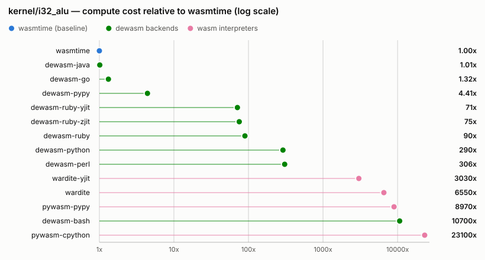
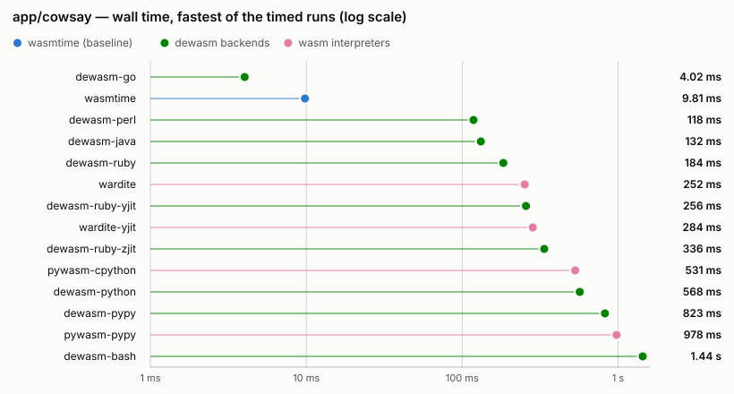
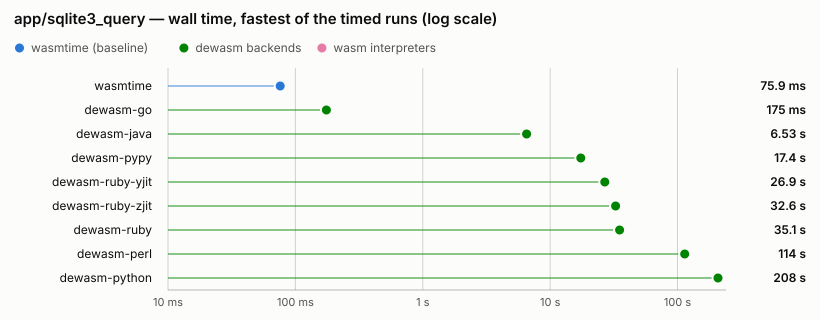

# Benchmarks

<!-- AUTO-GENERATED by `cargo xtask bench`; do not edit by hand. Unlike docs/support.md there is no freshness test: timings are not reproducible byte-for-byte, so this file is a dated measurement, not a compared snapshot. -->

How fast is a wasm program after dewasm has turned it into Ruby, Python, Perl, Go, Java, or Bash source? This page is the measured answer, regenerated by `cargo xtask bench`. It is a *dated* answer: the numbers below were taken on one host on one day, and the section headers say which.

## Environment

Measured 2026-08-01T22:16:40Z.

| | |
| --- | --- |
| OS | macOS 26.5.2 |
| Kernel | Darwin 25.5.0 |
| CPU | Apple M1 Pro |
| Arch | aarch64 |
| Repetitions | 3 timed runs after one warmup |
| Calibration target | 300 ms of compute per sample |

Every version string below was captured by executing the runtime, not copied from a lockfile.

| Runner | Version | Status |
| --- | --- | --- |
| `wasmtime` | wasmtime 47.0.3 (5554cc1a6 2026-07-31) | available |
| `dewasm-ruby` | ruby 4.0.4 (2026-05-12 revision b89eb1bcbf) +PRISM [arm64-darwin25] | available |
| `dewasm-ruby-yjit` | ruby 4.0.4 (2026-05-12 revision b89eb1bcbf) +PRISM [arm64-darwin25] | available |
| `dewasm-ruby-zjit` | ruby 4.0.4 (2026-05-12 revision b89eb1bcbf) +PRISM [arm64-darwin25] | available |
| `dewasm-python` | Python 3.14.6 (main, Jun 10 2026, 10:03:53) [Clang 21.0.0 (clang-2100.0.123.102)] | available |
| `dewasm-pypy` | Python 3.11.15 (194f9f44b505, Jul 15 2026, 12:14:56) | available |
| `dewasm-perl` | v5.42.2 | available |
| `dewasm-go` | go version go1.26.2 darwin/arm64 | available |
| `dewasm-java` | java version "25.0.4" 2026-07-21 LTS | available |
| `dewasm-bash` | 5.3.15(1)-release | available |
| `pywasm-cpython` | pywasm 2.2.3 | available |
| `pywasm-pypy` | pywasm 2.2.3 | available |
| `wardite` | wardite 0.9.0 | available |
| `wardite-yjit` | wardite 0.9.0 | available |

## How this is measured

The fastest and slowest runners here differ by a factor of about 23000 on the same kernel — read the `vs wasmtime` column for the actual span on each workload — so a single fixed iteration count would be meaningless: it either measures nothing but process startup on wasmtime or takes minutes per sample on Bash. Four rules make the comparison honest:

1. **Per-runner iteration scaling.** Each kernel takes an `<iterations>` argument and each workload declares a ceiling; the harness calibrates every (workload, runner) pair up from a trivial count until one sample reaches the compute target. The headline number is therefore normalized throughput (ns/op), with the raw times printed beside it so nothing is hidden.
2. **The zero run is subtracted.** Every kernel also runs at `<iterations> = 0`, which does no work but still starts the process, loads the module, and prints a result line. That time is the **cold start** column; `t(N) - t(0)` is the compute time. This removes process startup and module load uniformly for every runner — they differ enormously (an empty Ruby is ~0.05 s; loading the generated Ruby for SQLite costs ~0.7 s before any work happens).
3. **Minimum and median.** One warmup run, then N timed runs; both the minimum (the least noise-contaminated estimate) and the median are reported, so a noisy host is visible rather than smoothed away.
4. **Every runner's stdout is diffed against wasmtime's** at the same iteration count. A mismatch is a hard failure recorded in this table, not a quietly fast wrong answer — exactly the class of bug the spec harness exists for ([ADR-3](adr/3-testing-strategy.md), [ADR-2](adr/2-numeric-semantics.md)).

A runner that is not installed, a module that has not been built, and a pair that is deliberately excluded are all listed under [Not measured](#not-measured) with a reason. A blank cell never means "covered".

## Results

Three of the workloads carry a chart above their table. The axis is log10 — the span is too wide for anything else — and the mark is a dot rather than a bar, because a bar states a length measured from zero and a log axis has no zero. Color is the runner family; the numbers are in the table either way.

### `kernel/call_direct`

| Runner | Iterations | ns/op (min) | ns/op (median) | Cold start `t(0)` | Total `t(N)` | vs wasmtime | Load |
| --- | --- | --- | --- | --- | --- | --- | --- |
| `wasmtime` | 82 282 767 | 3.63 | 3.64 | 5.7 ms | 304.7 ms | 1.00x | — |
| `dewasm-ruby` | 1 264 892 | 226.8 | 226.4 | 41.3 ms | 328.2 ms | 62x | — |
| `dewasm-ruby-yjit` | 2 315 198 | 123.2 | 123.5 | 40.8 ms | 326.0 ms | 34x | — |
| `dewasm-ruby-zjit` | 2 353 072 | 149.8 | 149.7 | 41.7 ms | 394.3 ms | 41x | — |
| `dewasm-python` | 626 242 | 463.8 | 462.8 | 30.4 ms | 320.8 ms | 128x | — |
| `dewasm-pypy` | 2 282 357 | 92.0 | 92.5 | 43.2 ms | 253.3 ms | 25x | — |
| `dewasm-perl` | 252 328 | 1147 | 1152 | 11.9 ms | 301.4 ms | 316x | — |
| `dewasm-go` | 70 120 542 | 4.30 | 4.31 | 3.0 ms | 304.4 ms | 1.18x | — |
| `dewasm-java` | 65 160 473 | 3.75 | 3.75 | 65.6 ms | 310.2 ms | 1.03x | — |
| `dewasm-bash` | 5 152 | 57421 | 57508 | 12.9 ms | 308.8 ms | 15803x | — |
| `pywasm-cpython` | 5 409 | 48145 | 50031 | 42.4 ms | 302.8 ms | 13250x | 0.7 ms |
| `pywasm-pypy` | 24 068 | 9936 | 9924 | 78.6 ms | 317.7 ms | 2734x | 3.7 ms |
| `wardite` | 15 717 | 18288 | 18306 | 51.9 ms | 339.3 ms | 5033x | 3.6 ms |
| `wardite-yjit` | 32 454 | 8482 | 8484 | 102.4 ms | 377.7 ms | 2334x | 10.6 ms |

### `kernel/call_indirect`

| Runner | Iterations | ns/op (min) | ns/op (median) | Cold start `t(0)` | Total `t(N)` | vs wasmtime | Load |
| --- | --- | --- | --- | --- | --- | --- | --- |
| `wasmtime` | 16 777 216 | 10.8 | 10.9 | 5.4 ms | 186.8 ms | 1.00x | — |
| `dewasm-ruby` | 423 033 | 697.1 | 697.2 | 39.3 ms | 334.2 ms | 64x | — |
| `dewasm-ruby-yjit` | 628 525 | 424.4 | 428.3 | 39.9 ms | 306.6 ms | 39x | — |
| `dewasm-ruby-zjit` | 517 534 | 500.1 | 506.0 | 40.4 ms | 299.3 ms | 46x | — |
| `dewasm-python` | 328 663 | 922.4 | 924.8 | 30.1 ms | 333.3 ms | 85x | — |
| `dewasm-pypy` | 1 594 365 | 144.5 | 144.4 | 39.4 ms | 269.7 ms | 13x | — |
| `dewasm-perl` | 115 875 | 2544 | 2548 | 10.8 ms | 305.6 ms | 235x | — |
| `dewasm-go` | 16 777 216 | 11.0 | 11.0 | 2.5 ms | 187.8 ms | 1.02x | — |
| `dewasm-java` | 3 477 687 | 58.1 | 58.2 | 63.7 ms | 265.7 ms | 5.37x | — |
| `dewasm-bash` | 3 633 | 77807 | 77856 | 12.5 ms | 295.2 ms | 7198x | — |
| `pywasm-cpython` | 3 432 | 83174 | 83240 | 43.0 ms | 328.4 ms | 7695x | 0.7 ms |
| `pywasm-pypy` | 4 156 | 43068 | 42901 | 78.4 ms | 257.4 ms | 3984x | 4.3 ms |
| `wardite` | 8 353 | 28439 | 28317 | 51.6 ms | 289.1 ms | 2631x | 4.1 ms |
| `wardite-yjit` | 16 182 | 14377 | 14388 | 99.9 ms | 332.5 ms | 1330x | 9.6 ms |

### `kernel/f64_alu`

| Runner | Iterations | ns/op (min) | ns/op (median) | Cold start `t(0)` | Total `t(N)` | vs wasmtime | Load |
| --- | --- | --- | --- | --- | --- | --- | --- |
| `wasmtime` | 302 252 841 | 1.00 | 1.00 | 5.6 ms | 307.7 ms | 1.00x | — |
| `dewasm-ruby` | 2 642 462 | 116.2 | 116.4 | 38.1 ms | 345.2 ms | 116x | — |
| `dewasm-ruby-yjit` | 4 429 191 | 87.1 | 87.7 | 39.5 ms | 425.1 ms | 87x | — |
| `dewasm-ruby-zjit` | 2 350 617 | 95.7 | 95.4 | 38.4 ms | 263.2 ms | 96x | — |
| `dewasm-python` | 1 603 452 | 177.2 | 176.9 | 28.7 ms | 312.8 ms | 177x | — |
| `dewasm-pypy` | 106 123 022 | 2.21 | 2.23 | 39.5 ms | 273.6 ms | 2.21x | — |
| `dewasm-perl` | 340 166 | 855.1 | 855.3 | 14.8 ms | 305.7 ms | 855x | — |
| `dewasm-go` | 83 323 300 | 3.60 | 3.62 | 2.8 ms | 302.8 ms | 3.60x | — |
| `dewasm-java` | 166 861 750 | 1.67 | 1.67 | 60.0 ms | 339.2 ms | 1.67x | — |
| `dewasm-bash` | 497 | 587097 | 592510 | 12.6 ms | 304.4 ms | 587338x | — |
| `pywasm-cpython` | 9 310 | 30044 | 30031 | 42.0 ms | 321.7 ms | 30056x | 0.7 ms |
| `pywasm-pypy` | 35 536 | 6242 | 6279 | 78.3 ms | 300.1 ms | 6245x | 3.6 ms |
| `wardite` | 31 919 | 7729 | 7746 | 51.9 ms | 298.6 ms | 7732x | 4.2 ms |
| `wardite-yjit` | 71 709 | 3594 | 3601 | 102.8 ms | 360.5 ms | 3595x | 10.0 ms |

### `kernel/i32_alu`

<picture>
  <source media="(prefers-color-scheme: dark)" srcset="benchmarks/i32-alu-dark.svg">
  
</picture>

| Runner | Iterations | ns/op (min) | ns/op (median) | Cold start `t(0)` | Total `t(N)` | vs wasmtime | Load |
| --- | --- | --- | --- | --- | --- | --- | --- |
| `wasmtime` | 124 589 451 | 2.38 | 2.38 | 5.4 ms | 302.1 ms | 1.00x | — |
| `dewasm-ruby` | 1 324 071 | 213.6 | 214.7 | 38.6 ms | 321.4 ms | 90x | — |
| `dewasm-ruby-yjit` | 1 523 255 | 169.3 | 170.3 | 39.0 ms | 296.9 ms | 71x | — |
| `dewasm-ruby-zjit` | 1 217 796 | 179.3 | 178.4 | 38.6 ms | 256.9 ms | 75x | — |
| `dewasm-python` | 420 499 | 691.5 | 696.8 | 28.8 ms | 319.5 ms | 290x | — |
| `dewasm-pypy` | 25 182 154 | 10.5 | 10.5 | 40.6 ms | 305.3 ms | 4.41x | — |
| `dewasm-perl` | 399 718 | 728.4 | 731.6 | 10.8 ms | 302.0 ms | 306x | — |
| `dewasm-go` | 95 814 674 | 3.15 | 3.15 | 3.2 ms | 304.7 ms | 1.32x | — |
| `dewasm-java` | 120 817 251 | 2.41 | 2.41 | 59.2 ms | 350.4 ms | 1.01x | — |
| `dewasm-bash` | 11 229 | 25401 | 25435 | 13.2 ms | 298.4 ms | 10667x | — |
| `pywasm-cpython` | 5 097 | 55010 | 55006 | 42.4 ms | 322.8 ms | 23102x | 0.7 ms |
| `pywasm-pypy` | 9 120 | 21360 | 21544 | 80.3 ms | 275.1 ms | 8970x | 3.7 ms |
| `wardite` | 12 607 | 15586 | 15566 | 51.3 ms | 247.8 ms | 6545x | 4.2 ms |
| `wardite-yjit` | 29 970 | 7203 | 7200 | 99.4 ms | 315.3 ms | 3025x | 9.2 ms |

### `kernel/i64_alu`

| Runner | Iterations | ns/op (min) | ns/op (median) | Cold start `t(0)` | Total `t(N)` | vs wasmtime | Load |
| --- | --- | --- | --- | --- | --- | --- | --- |
| `wasmtime` | 123 386 326 | 2.39 | 2.38 | 5.2 ms | 299.5 ms | 1.00x | — |
| `dewasm-ruby` | 186 137 | 1547 | 1550 | 38.0 ms | 326.0 ms | 649x | — |
| `dewasm-ruby-yjit` | 255 044 | 1126 | 1129 | 38.6 ms | 325.8 ms | 472x | — |
| `dewasm-ruby-zjit` | 205 156 | 1274 | 1283 | 38.5 ms | 299.9 ms | 534x | — |
| `dewasm-python` | 408 794 | 705.6 | 704.1 | 28.2 ms | 316.6 ms | 296x | — |
| `dewasm-pypy` | 832 576 | 248.2 | 249.7 | 40.1 ms | 246.8 ms | 104x | — |
| `dewasm-perl` | 289 547 | 1038 | 1046 | 10.9 ms | 311.4 ms | 435x | — |
| `dewasm-go` | 110 340 325 | 2.70 | 2.70 | 2.6 ms | 300.9 ms | 1.13x | — |
| `dewasm-java` | 134 979 580 | 2.41 | 2.41 | 59.8 ms | 385.6 ms | 1.01x | — |
| `dewasm-bash` | 10 175 | 27921 | 27969 | 13.5 ms | 297.6 ms | 11706x | — |
| `pywasm-cpython` | 4 985 | 58335 | 59069 | 43.2 ms | 334.0 ms | 24457x | 0.6 ms |
| `pywasm-pypy` | 517 | 378773 | 377852 | 81.8 ms | 277.7 ms | 158803x | 3.6 ms |
| `wardite` | 17 630 | 17059 | 16979 | 50.2 ms | 351.0 ms | 7152x | 4.2 ms |
| `wardite-yjit` | 34 764 | 9266 | 9302 | 99.3 ms | 421.4 ms | 3885x | 9.6 ms |

### `kernel/mandelbrot`

| Runner | Iterations | ns/op (min) | ns/op (median) | Cold start `t(0)` | Total `t(N)` | vs wasmtime | Load |
| --- | --- | --- | --- | --- | --- | --- | --- |
| `wasmtime` | 3 304 567 | 98.5 | 98.8 | 5.5 ms | 331.2 ms | 1.00x | — |
| `dewasm-ruby` | 63 134 | 5046 | 5049 | 38.7 ms | 357.3 ms | 51x | — |
| `dewasm-ruby-yjit` | 44 114 | 4977 | 4980 | 38.9 ms | 258.5 ms | 51x | — |
| `dewasm-ruby-zjit` | 59 824 | 5013 | 5019 | 39.6 ms | 339.5 ms | 51x | — |
| `dewasm-python` | 47 290 | 5461 | 5457 | 29.4 ms | 287.7 ms | 55x | — |
| `dewasm-pypy` | 1 655 889 | 148.5 | 147.7 | 40.3 ms | 286.1 ms | 1.51x | — |
| `dewasm-perl` | 5 024 | 57718 | 57810 | 10.5 ms | 300.5 ms | 586x | — |
| `dewasm-go` | 1 250 368 | 241.3 | 241.3 | 2.7 ms | 304.4 ms | 2.45x | — |
| `dewasm-java` | 2 279 210 | 102.1 | 101.6 | 59.3 ms | 291.9 ms | 1.04x | — |
| `dewasm-bash` | 105 | 20984802 | 20988719 | 12.6 ms | 2.22 s | 212939x | — |
| `pywasm-cpython` | 256 | 1514948 | 1514753 | 43.4 ms | 431.3 ms | 15373x | 0.9 ms |
| `pywasm-pypy` | 256 | 1093343 | 1094079 | 80.0 ms | 359.9 ms | 11094x | 5.5 ms |
| `wardite` | 757 | 385255 | 386238 | 52.6 ms | 344.3 ms | 3909x | 4.3 ms |
| `wardite-yjit` | 1 409 | 186974 | 187438 | 100.8 ms | 364.2 ms | 1897x | 9.6 ms |

### `kernel/mem_rw`

| Runner | Iterations | ns/op (min) | ns/op (median) | Cold start `t(0)` | Total `t(N)` | vs wasmtime | Load |
| --- | --- | --- | --- | --- | --- | --- | --- |
| `wasmtime` | 284 454 684 | 1.03 | 1.04 | 5.3 ms | 299.0 ms | 1.00x | — |
| `dewasm-ruby` | 1 704 724 | 171.0 | 171.0 | 38.7 ms | 330.2 ms | 166x | — |
| `dewasm-ruby-yjit` | 1 689 344 | 147.2 | 147.1 | 39.0 ms | 287.7 ms | 143x | — |
| `dewasm-ruby-zjit` | 1 792 090 | 155.1 | 155.1 | 38.1 ms | 316.0 ms | 150x | — |
| `dewasm-python` | 394 188 | 779.6 | 779.3 | 28.4 ms | 335.7 ms | 755x | — |
| `dewasm-pypy` | 5 355 863 | 55.1 | 55.6 | 41.2 ms | 336.4 ms | 53x | — |
| `dewasm-perl` | 299 846 | 995.1 | 995.6 | 10.8 ms | 309.2 ms | 964x | — |
| `dewasm-go` | 193 324 570 | 1.55 | 1.55 | 2.6 ms | 302.2 ms | 1.50x | — |
| `dewasm-java` | 142 731 626 | 1.84 | 1.83 | 59.9 ms | 322.5 ms | 1.78x | — |
| `dewasm-bash` | 9 263 | 31734 | 32002 | 12.4 ms | 306.4 ms | 30729x | — |
| `pywasm-cpython` | 5 843 | 40182 | 40368 | 42.4 ms | 277.2 ms | 38909x | 0.7 ms |
| `pywasm-pypy` | 28 356 | 8192 | 8209 | 79.6 ms | 311.8 ms | 7932x | 4.5 ms |
| `wardite` | 24 525 | 13032 | 13204 | 52.4 ms | 372.0 ms | 12620x | 3.9 ms |
| `wardite-yjit` | 40 651 | 6298 | 6314 | 100.9 ms | 357.0 ms | 6099x | 8.7 ms |

### `kernel/sha256`

| Runner | Iterations | ns/op (min) | ns/op (median) | Cold start `t(0)` | Total `t(N)` | vs wasmtime | Load |
| --- | --- | --- | --- | --- | --- | --- | --- |
| `wasmtime` | 1 004 085 | 300.2 | 300.5 | 5.4 ms | 306.8 ms | 1.00x | — |
| `dewasm-ruby` | 3 510 | 81902 | 82259 | 39.2 ms | 326.7 ms | 273x | — |
| `dewasm-ruby-yjit` | 4 805 | 53953 | 54468 | 39.2 ms | 298.5 ms | 180x | — |
| `dewasm-ruby-zjit` | 4 634 | 58073 | 58250 | 39.4 ms | 308.5 ms | 193x | — |
| `dewasm-python` | 1 017 | 294538 | 295402 | 30.1 ms | 329.6 ms | 981x | — |
| `dewasm-pypy` | 22 674 | 13852 | 13837 | 41.6 ms | 355.7 ms | 46x | — |
| `dewasm-perl` | 894 | 325293 | 328593 | 10.6 ms | 301.5 ms | 1084x | — |
| `dewasm-go` | 839 923 | 357.7 | 357.4 | 2.7 ms | 303.1 ms | 1.19x | — |
| `dewasm-java` | 404 890 | 524.6 | 533.2 | 59.8 ms | 272.2 ms | 1.75x | — |
| `dewasm-bash` | 17 | 15984005 | 15976358 | 14.5 ms | 286.2 ms | 53246x | — |
| `pywasm-cpython` | 22 | 14646820 | 14701011 | 44.5 ms | 366.8 ms | 48792x | 1.4 ms |
| `pywasm-pypy` | 28 | 7220204 | 7258900 | 88.2 ms | 290.4 ms | 24052x | 7.5 ms |
| `wardite` | 49 | 4230245 | 4251503 | 51.0 ms | 258.3 ms | 14092x | 4.1 ms |
| `wardite-yjit` | 136 | 1884283 | 1928240 | 103.4 ms | 359.6 ms | 6277x | 9.8 ms |

### `kernel/wordcount`

| Runner | Iterations | ns/op (min) | ns/op (median) | Cold start `t(0)` | Total `t(N)` | vs wasmtime | Load |
| --- | --- | --- | --- | --- | --- | --- | --- |
| `wasmtime` | 159 301 150 | 1.72 | 1.74 | 5.3 ms | 279.4 ms | 1.00x | — |
| `dewasm-ruby` | 706 376 | 418.2 | 418.7 | 40.6 ms | 336.0 ms | 243x | — |
| `dewasm-ruby-yjit` | 881 609 | 299.8 | 300.6 | 40.1 ms | 304.4 ms | 174x | — |
| `dewasm-ruby-zjit` | 898 856 | 324.6 | 324.5 | 40.9 ms | 332.6 ms | 189x | — |
| `dewasm-python` | 306 165 | 973.8 | 976.5 | 32.8 ms | 330.9 ms | 566x | — |
| `dewasm-pypy` | 4 759 868 | 58.4 | 58.5 | 46.6 ms | 324.4 ms | 34x | — |
| `dewasm-perl` | 194 262 | 1504 | 1504 | 18.6 ms | 310.7 ms | 874x | — |
| `dewasm-go` | 116 076 853 | 2.50 | 2.52 | 2.7 ms | 292.8 ms | 1.45x | — |
| `dewasm-java` | 46 491 286 | 3.81 | 3.85 | 62.1 ms | 239.3 ms | 2.21x | — |
| `dewasm-bash` | 6 652 | 43618 | 43811 | 126.7 ms | 416.8 ms | 25345x | — |
| `pywasm-cpython` | 4 954 | 60095 | 60168 | 287.3 ms | 585.0 ms | 34919x | 1.4 ms |
| `pywasm-pypy` | 12 164 | 16088 | 16463 | 194.6 ms | 390.3 ms | 9348x | 8.2 ms |
| `wardite` | 11 826 | 21019 | 21164 | 122.4 ms | 371.0 ms | 12213x | 4.2 ms |
| `wardite-yjit` | 25 866 | 9898 | 10071 | 141.4 ms | 397.5 ms | 5752x | 10.3 ms |

### `app/cowsay`

<picture>
  <source media="(prefers-color-scheme: dark)" srcset="benchmarks/cowsay-dark.svg">
  
</picture>

| Runner | Wall time (min) | Wall time (median) | Cold start `t(0)` | Compute `t(N)-t(0)` | vs wasmtime | Load |
| --- | --- | --- | --- | --- | --- | --- |
| `wasmtime` | 9.8 ms | 10.0 ms | — | — | 1.00x | — |
| `dewasm-ruby` | 183.7 ms | 184.0 ms | — | — | 19x | — |
| `dewasm-ruby-yjit` | 256.4 ms | 260.2 ms | — | — | 26x | — |
| `dewasm-ruby-zjit` | 336.0 ms | 336.7 ms | — | — | 34x | — |
| `dewasm-python` | 567.6 ms | 572.6 ms | — | — | 58x | — |
| `dewasm-pypy` | 823.2 ms | 829.3 ms | — | — | 84x | — |
| `dewasm-perl` | 118.2 ms | 119.4 ms | — | — | 12x | — |
| `dewasm-go` | 4.0 ms | 4.4 ms | — | — | 0.41x | — |
| `dewasm-java` | 131.7 ms | 133.0 ms | — | — | 13x | — |
| `dewasm-bash` | 1.44 s | 1.44 s | — | — | 147x | — |
| `pywasm-cpython` | 531.0 ms | 551.7 ms | — | — | 54x | 280.8 ms |
| `pywasm-pypy` | 977.7 ms | 982.8 ms | — | — | 100x | 476.7 ms |
| `wardite` | 251.9 ms | 257.8 ms | — | — | 26x | 109.0 ms |
| `wardite-yjit` | 283.8 ms | 285.9 ms | — | — | 29x | 86.5 ms |

### `app/sqlite3_query`

<picture>
  <source media="(prefers-color-scheme: dark)" srcset="benchmarks/sqlite3-query-dark.svg">
  
</picture>

| Runner | Wall time (min) | Wall time (median) | Cold start `t(0)` | Compute `t(N)-t(0)` | vs wasmtime | Load |
| --- | --- | --- | --- | --- | --- | --- |
| `wasmtime` | 75.9 ms | 76.1 ms | 17.6 ms | 58.4 ms | 1.00x | — |
| `dewasm-ruby` | 35.08 s | 35.09 s | 712.5 ms | 34.37 s | 462x | — |
| `dewasm-ruby-yjit` | 26.87 s | 26.88 s | 787.2 ms | 26.09 s | 354x | — |
| `dewasm-ruby-zjit` | 32.64 s | 32.71 s | 904.2 ms | 31.74 s | 430x | — |
| `dewasm-python` | 207.77 s | 208.91 s | 2.19 s | 205.58 s | 2736x | — |
| `dewasm-pypy` | 17.40 s | 17.47 s | 3.22 s | 14.18 s | 229x | — |
| `dewasm-perl` | 113.85 s | 113.86 s | 471.5 ms | 113.38 s | 1499x | — |
| `dewasm-go` | 175.0 ms | 175.6 ms | 7.9 ms | 167.2 ms | 2.30x | — |
| `dewasm-java` | 6.53 s | 6.59 s | 260.8 ms | 6.27 s | 86x | — |

## Not measured

Every pair the suite did not measure, and why. A missing runner or an unbuilt module is stated here rather than left as a gap in the tables above.

| Workload | Runner | Reason |
| --- | --- | --- |
| `app/sqlite3_query` | `dewasm-bash` | excluded: bash runs ~10000x slower than wasmtime on compute, so 100k SQL inserts do not finish in a practical time |
| `app/sqlite3_query` | `pywasm-cpython` | excluded on cost, not capability: pywasm runs this program correctly (byte-identical to wasmtime under -batch) at ~17.9 ms/row — measured 358 s at 20k rows, so the 100k-row script needs roughly half an hour per sample |
| `app/sqlite3_query` | `pywasm-pypy` | excluded on cost, not capability: pywasm runs this program correctly (byte-identical to wasmtime under -batch) at ~17.9 ms/row — measured 358 s at 20k rows, so the 100k-row script needs roughly half an hour per sample |
| `app/sqlite3_query` | `wardite` | excluded: wardite loads sqlite3-shell.wasm but cannot execute a query — it raises Wardite::EvalError ("maybe empty or invalid stack", convert.generated.rb:200) as soon as any SQL runs |
| `app/sqlite3_query` | `wardite-yjit` | excluded: wardite loads sqlite3-shell.wasm but cannot execute a query — it raises Wardite::EvalError ("maybe empty or invalid stack", convert.generated.rb:200) as soon as any SQL runs |

## What these numbers do not say

- **dewasm is not competitive with an AOT compiler, and is not trying to be.** wasmtime compiles to native code; every dewasm backend emits source for a host language and pays that language's interpretation cost on every wasm instruction. Bash is the extreme, running roughly 10000x slower than wasmtime on compute, because a shell has no integers-as-machine-words and no floats at all ([ADR-5](adr/5-bash-softfloat.md), [ADR-13](adr/13-bash-softfloat-conventions.md)).
- **We are not competitive with wasm2c or w2c2 either.** Those translate wasm to C, which a C compiler then optimizes to native code; the comparison that matters for dewasm is against *running wasm on the host language at all*, which is what the pywasm and wardite columns are ([related work](related-work.md)).
- **Interpreters legitimately beat us on cold start.** A wasm interpreter parses a module and starts executing; a dewasm backend hands the host language a large generated source file to parse first. The `app/sqlite3_cold_start` case exists to show that, not to hide it.
- **Iteration counts differ per runner by design.** Comparing raw wall times across rows is wrong; compare the ns/op column, and read the minimum against the median before trusting a small difference.
- **One host, one day.** Nothing here is a regression gate. There is no freshness test on this file precisely because a timing is not a snapshot.
