# Benchmarks

<!-- AUTO-GENERATED by `cargo xtask render-speed`; do not edit by hand. Unlike docs/support.md there is no freshness test: timings are not reproducible byte-for-byte, so this file is a dated measurement, not a compared snapshot. -->

Measured performance of dewasm-generated code against wasm runtimes and same-language wasm interpreters, taken on one host on one day.
How to run and read these measurements is [README.md](README.md).

## Environment

Measured 2026-08-31T09:49:13Z.

| | |
| --- | --- |
| OS | macOS 26.6.2 |
| Kernel | Darwin 25.6.0 |
| CPU | Apple M1 Pro |
| Arch | aarch64 |

Version strings are captured by executing each runtime.
A runner missing from this table was unavailable on this host; its cells appear under [Not measured](#not-measured).

| Runner | Version |
| --- | --- |
| `wasmtime` | wasmtime 48.0.1 (7bac2c277 2026-08-24) |
| `wasmer` | wasmer 7.3.0 |
| `wasmedge` | wasmedge version 0.17.1 |
| `wazero` | 1.12.0 |
| `wasm3` | Wasm3 v0.9.0 on arm64-v8a |
| `dewasm-ruby` | ruby 4.0.4 (2026-05-12 revision b89eb1bcbf) +PRISM [arm64-darwin25] |
| `dewasm-ruby-yjit` | ruby 4.0.4 (2026-05-12 revision b89eb1bcbf) +PRISM [arm64-darwin25] |
| `dewasm-ruby-zjit` | ruby 4.0.4 (2026-05-12 revision b89eb1bcbf) +PRISM [arm64-darwin25] |
| `dewasm-python` | Python 3.14.7 (main, Aug  5 2026, 10:29:49) [Clang 21.0.0 (clang-2100.1.1.101)] |
| `dewasm-pypy` | Python 3.11.15 (194f9f44b505, Aug 22 2026, 08:59:40) |
| `dewasm-perl` | v5.44.0 |
| `dewasm-go` | go version go1.26.2 darwin/arm64 |
| `dewasm-java` | java version "25.0.4.1" 2026-08-18 LTS |
| `dewasm-bash` | 5.3.15(1)-release |
| `wasm3-ruby` | Wasm3 v0.9.0 on wasm |
| `wasm3-ruby-yjit` | Wasm3 v0.9.0 on wasm |
| `wasm3-python` | Wasm3 v0.9.0 on wasm |
| `wasm3-pypy` | Wasm3 v0.9.0 on wasm |
| `pywasm-cpython` | pywasm 2.2.3 |
| `pywasm-pypy` | pywasm 2.2.3 |
| `wardite` | wardite 0.9.0 |
| `wardite-yjit` | wardite 0.9.0 |

## Results

Each workload has a chart (log axis, seconds; the title states the unit) with its full numbers folded underneath.
Color is the runner family.

### Microbenchmarks

Seconds per **iteration**.
Iteration counts are calibrated per runner, so compare the per-iteration figures, not the raw wall times.

#### `wat/br_table`

<picture>
  <source media="(prefers-color-scheme: dark)" srcset="figs/wat-br-table-dark.svg">
  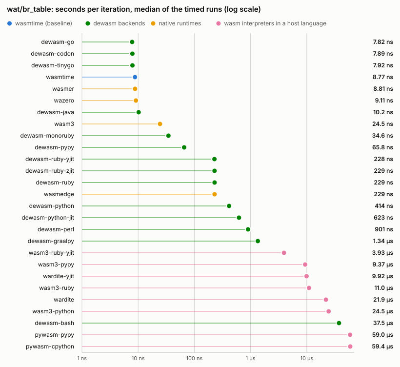
</picture>

Full numbers for <code>wat/br_table</code>

| Runner | Iterations | ns/op (min) | ns/op (median) | Cold start `t(0)` | Total `t(N)` | vs wasmtime | Load |
| --- | --- | --- | --- | --- | --- | --- | --- |
| `wasmtime` | 35 580 703 | 8.39 | 8.42 | 5.1 ms | 303.8 ms | 1.00x | — |
| `wasmer` | 35 566 665 | 8.41 | 8.41 | 8.1 ms | 307.3 ms | 1.00x | — |
| `wasmedge` | 1 427 536 | 216.0 | 217.5 | 14.4 ms | 322.8 ms | 26x | — |
| `wazero` | 34 445 047 | 8.71 | 8.72 | 4.6 ms | 304.8 ms | 1.04x | — |
| `wasm3` | 8 285 355 | 26.3 | 26.4 | 3.9 ms | 222.1 ms | 3.14x | — |
| `dewasm-ruby` | 1 185 366 | 213.1 | 213.9 | 35.1 ms | 287.7 ms | 25x | — |
| `dewasm-ruby-yjit` | 1 231 670 | 212.7 | 212.7 | 36.0 ms | 297.9 ms | 25x | — |
| `dewasm-ruby-zjit` | 1 286 196 | 212.6 | 212.7 | 35.3 ms | 308.8 ms | 25x | — |
| `dewasm-python` | 769 013 | 390.7 | 392.6 | 26.3 ms | 326.8 ms | 47x | — |
| `dewasm-pypy` | 4 270 974 | 61.4 | 61.2 | 36.0 ms | 298.0 ms | 7.31x | — |
| `dewasm-perl` | 352 630 | 858.2 | 864.2 | 10.0 ms | 312.6 ms | 102x | — |
| `dewasm-go` | 39 624 796 | 7.59 | 7.65 | 2.6 ms | 303.5 ms | 0.90x | — |
| `dewasm-java` | 27 398 136 | 9.68 | 9.61 | 60.4 ms | 325.5 ms | 1.15x | — |
| `dewasm-bash` | 8 019 | 35833 | 35831 | 11.5 ms | 298.9 ms | 4269x | — |
| `wasm3-ruby` | 38 466 | 9616 | 9619 | 116.8 ms | 486.7 ms | 1146x | — |
| `wasm3-ruby-yjit` | 58 577 | 3318 | 3347 | 286.8 ms | 481.1 ms | 395x | — |
| `wasm3-python` | 10 201 | 23324 | 23032 | 313.5 ms | 551.5 ms | 2779x | — |
| `wasm3-pypy` | 33 152 | 6288 | 6251 | 483.1 ms | 691.5 ms | 749x | — |
| `pywasm-cpython` | 5 949 | 49399 | 49422 | 38.9 ms | 332.8 ms | 5885x | 0.9 ms |
| `pywasm-pypy` | 8 600 | 23239 | 23384 | 70.6 ms | 270.5 ms | 2769x | 5.1 ms |
| `wardite` | 15 366 | 20165 | 20187 | 46.4 ms | 356.3 ms | 2402x | 3.6 ms |
| `wardite-yjit` | 30 532 | 8388 | 8394 | 91.4 ms | 347.5 ms | 999x | 8.7 ms |

#### `wat/call_direct`

<picture>
  <source media="(prefers-color-scheme: dark)" srcset="figs/wat-call-direct-dark.svg">
  
</picture>

Full numbers for <code>wat/call_direct</code>

| Runner | Iterations | ns/op (min) | ns/op (median) | Cold start `t(0)` | Total `t(N)` | vs wasmtime | Load |
| --- | --- | --- | --- | --- | --- | --- | --- |
| `wasmtime` | 84 753 866 | 3.42 | 3.43 | 5.0 ms | 294.8 ms | 1.00x | — |
| `wasmer` | 87 391 953 | 3.44 | 3.44 | 7.9 ms | 308.2 ms | 1.01x | — |
| `wasmedge` | 1 486 788 | 198.0 | 201.0 | 14.1 ms | 308.5 ms | 58x | — |
| `wazero` | 50 901 297 | 5.90 | 5.91 | 4.4 ms | 304.7 ms | 1.73x | — |
| `wasm3` | 6 978 720 | 43.6 | 43.7 | 4.0 ms | 308.4 ms | 13x | — |
| `dewasm-ruby` | 1 364 086 | 200.7 | 200.9 | 34.4 ms | 308.2 ms | 59x | — |
| `dewasm-ruby-yjit` | 2 304 123 | 105.4 | 105.9 | 34.9 ms | 277.7 ms | 31x | — |
| `dewasm-ruby-zjit` | 1 925 696 | 122.2 | 122.2 | 35.0 ms | 270.2 ms | 36x | — |
| `dewasm-python` | 738 481 | 408.4 | 409.7 | 25.6 ms | 327.2 ms | 119x | — |
| `dewasm-pypy` | 2 663 117 | 86.8 | 88.0 | 36.1 ms | 267.2 ms | 25x | — |
| `dewasm-perl` | 273 922 | 1075 | 1077 | 9.9 ms | 304.5 ms | 315x | — |
| `dewasm-go` | 74 343 248 | 4.04 | 4.05 | 2.4 ms | 303.0 ms | 1.18x | — |
| `dewasm-java` | 71 772 145 | 3.52 | 3.52 | 60.1 ms | 312.8 ms | 1.03x | — |
| `dewasm-bash` | 5 383 | 54106 | 54105 | 11.4 ms | 302.7 ms | 15827x | — |
| `wasm3-ruby` | 9 852 | 21707 | 21557 | 113.4 ms | 327.2 ms | 6350x | — |
| `wasm3-ruby-yjit` | 23 446 | 8650 | 8746 | 198.2 ms | 401.0 ms | 2530x | — |
| `wasm3-python` | 4 546 | 55867 | 56171 | 308.7 ms | 562.7 ms | 16342x | — |
| `wasm3-pypy` | 12 500 | 18407 | 18442 | 472.0 ms | 702.0 ms | 5385x | — |
| `pywasm-cpython` | 6 188 | 47871 | 48132 | 38.4 ms | 334.7 ms | 14003x | 0.6 ms |
| `pywasm-pypy` | 30 422 | 8336 | 8343 | 68.9 ms | 322.5 ms | 2438x | 3.5 ms |
| `wardite` | 14 381 | 17198 | 17284 | 46.2 ms | 293.5 ms | 5031x | 3.4 ms |
| `wardite-yjit` | 37 699 | 7991 | 7977 | 90.8 ms | 392.1 ms | 2337x | 8.4 ms |

#### `wat/call_indirect`

<picture>
  <source media="(prefers-color-scheme: dark)" srcset="figs/wat-call-indirect-dark.svg">
  
</picture>

Full numbers for <code>wat/call_indirect</code>

| Runner | Iterations | ns/op (min) | ns/op (median) | Cold start `t(0)` | Total `t(N)` | vs wasmtime | Load |
| --- | --- | --- | --- | --- | --- | --- | --- |
| `wasmtime` | 33 554 432 | 10.2 | 10.3 | 5.2 ms | 348.8 ms | 1.00x | — |
| `wasmer` | 33 554 432 | 10.3 | 10.3 | 8.1 ms | 354.0 ms | 1.01x | — |
| `wasmedge` | 761 262 | 398.1 | 398.3 | 14.1 ms | 317.2 ms | 39x | — |
| `wazero` | 16 777 216 | 11.6 | 11.6 | 4.5 ms | 198.4 ms | 1.13x | — |
| `wasm3` | 4 680 818 | 64.4 | 64.7 | 4.0 ms | 305.2 ms | 6.29x | — |
| `dewasm-ruby` | 420 916 | 652.1 | 655.7 | 34.7 ms | 309.2 ms | 64x | — |
| `dewasm-ruby-yjit` | 708 117 | 399.2 | 399.6 | 35.1 ms | 317.7 ms | 39x | — |
| `dewasm-ruby-zjit` | 614 939 | 460.0 | 463.8 | 35.2 ms | 318.1 ms | 45x | — |
| `dewasm-python` | 392 868 | 764.2 | 769.9 | 25.8 ms | 326.0 ms | 75x | — |
| `dewasm-pypy` | 1 978 238 | 138.4 | 138.7 | 35.9 ms | 309.8 ms | 14x | — |
| `dewasm-perl` | 131 072 | 2378 | 2394 | 10.7 ms | 322.4 ms | 232x | — |
| `dewasm-go` | 33 554 432 | 10.6 | 10.6 | 2.6 ms | 357.9 ms | 1.03x | — |
| `dewasm-java` | 3 944 469 | 53.6 | 53.5 | 58.9 ms | 270.2 ms | 5.23x | — |
| `dewasm-bash` | 4 038 | 72936 | 73036 | 11.6 ms | 306.1 ms | 7123x | — |
| `wasm3-ruby` | 8 645 | 31223 | 31356 | 114.4 ms | 384.3 ms | 3049x | — |
| `wasm3-ruby-yjit` | 20 390 | 11772 | 11765 | 235.0 ms | 475.0 ms | 1150x | — |
| `wasm3-python` | 3 429 | 86298 | 86883 | 307.9 ms | 603.8 ms | 8428x | — |
| `wasm3-pypy` | 4 760 | 40376 | 40979 | 474.3 ms | 666.4 ms | 3943x | — |
| `pywasm-cpython` | 3 695 | 79416 | 79488 | 38.4 ms | 331.8 ms | 7756x | 0.7 ms |
| `pywasm-pypy` | 7 448 | 26572 | 26534 | 69.6 ms | 267.5 ms | 2595x | 4.1 ms |
| `wardite` | 10 110 | 27025 | 27368 | 46.4 ms | 319.6 ms | 2639x | 3.5 ms |
| `wardite-yjit` | 21 391 | 13477 | 13455 | 91.6 ms | 379.9 ms | 1316x | 8.3 ms |

#### `wat/conv`

<picture>
  <source media="(prefers-color-scheme: dark)" srcset="figs/wat-conv-dark.svg">
  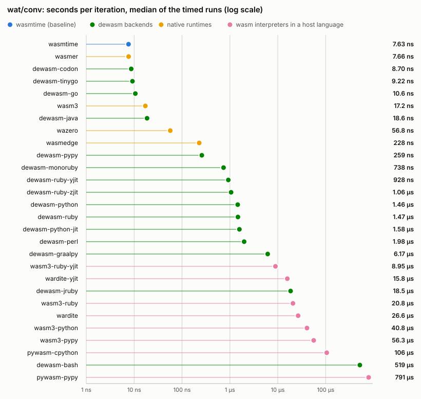
</picture>

Full numbers for <code>wat/conv</code>

| Runner | Iterations | ns/op (min) | ns/op (median) | Cold start `t(0)` | Total `t(N)` | vs wasmtime | Load |
| --- | --- | --- | --- | --- | --- | --- | --- |
| `wasmtime` | 40 042 826 | 7.51 | 7.51 | 5.1 ms | 305.8 ms | 1.00x | — |
| `wasmer` | 39 934 989 | 7.53 | 7.54 | 8.0 ms | 308.8 ms | 1.00x | — |
| `wasmedge` | 1 359 832 | 221.3 | 221.4 | 14.2 ms | 315.0 ms | 29x | — |
| `wazero` | 5 217 891 | 56.0 | 56.3 | 4.5 ms | 296.7 ms | 7.46x | — |
| `wasm3` | 13 394 056 | 21.2 | 21.2 | 3.9 ms | 288.2 ms | 2.83x | — |
| `dewasm-ruby` | 225 461 | 1311 | 1313 | 34.8 ms | 330.5 ms | 175x | — |
| `dewasm-ruby-yjit` | 327 852 | 833.4 | 834.3 | 34.9 ms | 308.2 ms | 111x | — |
| `dewasm-ruby-zjit` | 287 444 | 952.5 | 952.9 | 35.1 ms | 308.9 ms | 127x | — |
| `dewasm-python` | 217 112 | 1379 | 1381 | 25.8 ms | 325.2 ms | 184x | — |
| `dewasm-pypy` | 723 178 | 252.6 | 252.8 | 35.9 ms | 218.6 ms | 34x | — |
| `dewasm-perl` | 138 082 | 2193 | 2214 | 13.6 ms | 316.3 ms | 292x | — |
| `dewasm-go` | 33 554 432 | 10.3 | 10.3 | 2.5 ms | 349.5 ms | 1.38x | — |
| `dewasm-java` | 11 105 278 | 18.1 | 18.1 | 60.2 ms | 261.1 ms | 2.41x | — |
| `dewasm-bash` | 603 | 499694 | 503765 | 12.8 ms | 314.1 ms | 66541x | — |
| `wasm3-ruby` | 21 330 | 18214 | 18415 | 114.2 ms | 502.7 ms | 2425x | — |
| `wasm3-ruby-yjit` | 32 416 | 7812 | 7912 | 238.5 ms | 491.8 ms | 1040x | — |
| `wasm3-python` | 7 562 | 40479 | 40642 | 311.0 ms | 617.1 ms | 5390x | — |
| `wasm3-pypy` | 5 536 | 35268 | 34898 | 471.6 ms | 666.8 ms | 4696x | — |
| `pywasm-cpython` | 2 976 | 98522 | 98728 | 38.5 ms | 331.7 ms | 13120x | 0.6 ms |
| `pywasm-pypy` | 351 | 710404 | 726053 | 69.0 ms | 318.4 ms | 94601x | 3.6 ms |
| `wardite` | 10 969 | 25273 | 25265 | 46.7 ms | 323.9 ms | 3365x | 3.5 ms |
| `wardite-yjit` | 15 601 | 14700 | 14722 | 90.0 ms | 319.4 ms | 1957x | 8.6 ms |

#### `wat/eh_throw`

<picture>
  <source media="(prefers-color-scheme: dark)" srcset="figs/wat-eh-throw-dark.svg">
  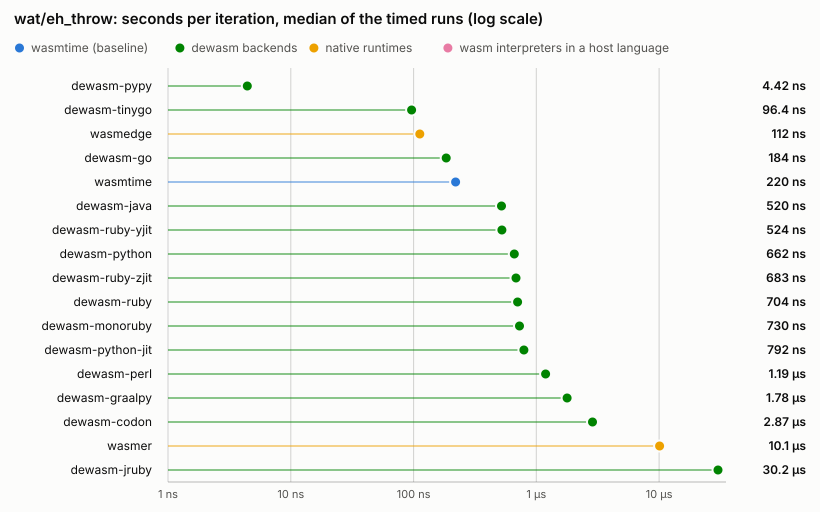
</picture>

Full numbers for <code>wat/eh_throw</code>

| Runner | Iterations | ns/op (min) | ns/op (median) | Cold start `t(0)` | Total `t(N)` | vs wasmtime | Load |
| --- | --- | --- | --- | --- | --- | --- | --- |
| `wasmtime` | 1 376 525 | 214.2 | 217.0 | 5.1 ms | 299.9 ms | 1.00x | — |
| `wasmer` | 28 628 | 9951 | 9956 | 8.0 ms | 292.8 ms | 46x | — |
| `wasmedge` | 2 710 245 | 111.1 | 112.0 | 14.1 ms | 315.2 ms | 0.52x | — |
| `dewasm-ruby` | 474 641 | 609.5 | 618.6 | 34.6 ms | 323.9 ms | 2.85x | — |
| `dewasm-ruby-yjit` | 490 564 | 449.5 | 461.1 | 35.0 ms | 255.6 ms | 2.10x | — |
| `dewasm-ruby-zjit` | 496 372 | 587.7 | 594.2 | 35.1 ms | 326.8 ms | 2.74x | — |
| `dewasm-python` | 460 195 | 655.6 | 656.9 | 25.8 ms | 327.5 ms | 3.06x | — |
| `dewasm-pypy` | 4 000 000 | 4.30 | 4.26 | 35.5 ms | 52.7 ms | 0.02x | — |
| `dewasm-perl` | 261 333 | 1154 | 1166 | 10.7 ms | 312.3 ms | 5.39x | — |
| `dewasm-go` | 1 504 226 | 193.3 | 193.6 | 2.4 ms | 293.2 ms | 0.90x | — |
| `dewasm-java` | 423 986 | 507.5 | 508.9 | 59.9 ms | 275.1 ms | 2.37x | — |

#### `wat/eh_try`

<picture>
  <source media="(prefers-color-scheme: dark)" srcset="figs/wat-eh-try-dark.svg">
  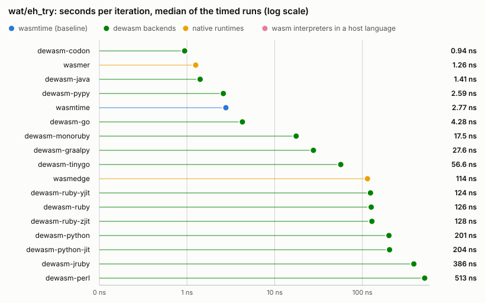
</picture>

Full numbers for <code>wat/eh_try</code>

| Runner | Iterations | ns/op (min) | ns/op (median) | Cold start `t(0)` | Total `t(N)` | vs wasmtime | Load |
| --- | --- | --- | --- | --- | --- | --- | --- |
| `wasmtime` | 110 122 947 | 2.73 | 2.72 | 5.1 ms | 305.2 ms | 1.00x | — |
| `wasmer` | 236 489 418 | 1.25 | 1.25 | 7.8 ms | 302.6 ms | 0.46x | — |
| `wasmedge` | 2 622 853 | 112.3 | 112.4 | 14.0 ms | 308.6 ms | 41x | — |
| `dewasm-ruby` | 2 451 420 | 119.1 | 119.3 | 34.6 ms | 326.5 ms | 44x | — |
| `dewasm-ruby-yjit` | 2 515 871 | 120.4 | 120.6 | 34.9 ms | 337.7 ms | 44x | — |
| `dewasm-ruby-zjit` | 2 547 973 | 119.9 | 119.6 | 35.2 ms | 340.6 ms | 44x | — |
| `dewasm-python` | 1 527 977 | 194.9 | 198.0 | 25.7 ms | 323.5 ms | 72x | — |
| `dewasm-pypy` | 114 891 453 | 2.55 | 2.55 | 35.6 ms | 328.3 ms | 0.93x | — |
| `dewasm-perl` | 595 735 | 502.5 | 505.5 | 9.9 ms | 309.2 ms | 184x | — |
| `dewasm-go` | 73 850 197 | 4.13 | 4.22 | 2.6 ms | 307.4 ms | 1.51x | — |
| `dewasm-java` | 208 221 136 | 1.41 | 1.41 | 59.3 ms | 352.8 ms | 0.52x | — |

#### `wat/f32_alu`

<picture>
  <source media="(prefers-color-scheme: dark)" srcset="figs/wat-f32-alu-dark.svg">
  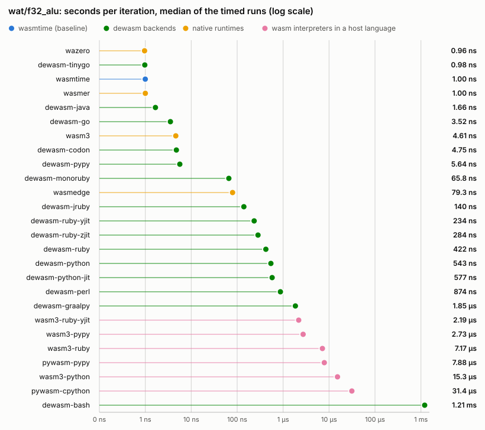
</picture>

Full numbers for <code>wat/f32_alu</code>

| Runner | Iterations | ns/op (min) | ns/op (median) | Cold start `t(0)` | Total `t(N)` | vs wasmtime | Load |
| --- | --- | --- | --- | --- | --- | --- | --- |
| `wasmtime` | 303 074 129 | 0.98 | 0.99 | 4.9 ms | 303.0 ms | 1.00x | — |
| `wasmer` | 303 555 463 | 0.98 | 0.99 | 8.0 ms | 306.6 ms | 1.00x | — |
| `wasmedge` | 3 458 870 | 78.1 | 78.1 | 14.1 ms | 284.1 ms | 79x | — |
| `wazero` | 319 029 219 | 0.94 | 0.94 | 4.6 ms | 304.1 ms | 0.95x | — |
| `wasm3` | 43 912 660 | 6.87 | 6.87 | 4.0 ms | 305.8 ms | 6.99x | — |
| `dewasm-ruby` | 839 681 | 357.8 | 357.7 | 34.8 ms | 335.2 ms | 364x | — |
| `dewasm-ruby-yjit` | 1 279 059 | 222.9 | 222.6 | 35.2 ms | 320.3 ms | 227x | — |
| `dewasm-ruby-zjit` | 1 017 492 | 274.5 | 274.9 | 35.1 ms | 314.3 ms | 279x | — |
| `dewasm-python` | 560 975 | 537.7 | 538.1 | 26.0 ms | 327.6 ms | 547x | — |
| `dewasm-pypy` | 51 030 231 | 5.42 | 5.42 | 35.8 ms | 312.4 ms | 5.51x | — |
| `dewasm-perl` | 199 606 | 1508 | 1527 | 9.9 ms | 310.9 ms | 1533x | — |
| `dewasm-go` | 87 970 797 | 3.42 | 3.42 | 2.7 ms | 303.8 ms | 3.48x | — |
| `dewasm-java` | 178 975 442 | 1.62 | 1.62 | 60.0 ms | 349.2 ms | 1.64x | — |
| `dewasm-bash` | 162 | 1163938 | 1162900 | 11.7 ms | 200.2 ms | 1183411x | — |
| `wasm3-ruby` | 47 000 | 6253 | 6240 | 112.5 ms | 406.4 ms | 6358x | — |
| `wasm3-ruby-yjit` | 125 035 | 2069 | 2060 | 217.7 ms | 476.4 ms | 2104x | — |
| `wasm3-python` | 19 886 | 14430 | 14480 | 307.1 ms | 594.1 ms | 14671x | — |
| `wasm3-pypy` | 121 778 | 2458 | 2462 | 468.8 ms | 768.1 ms | 2499x | — |
| `pywasm-cpython` | 10 049 | 28268 | 28282 | 38.3 ms | 322.3 ms | 28741x | 0.6 ms |
| `pywasm-pypy` | 33 756 | 6144 | 6153 | 69.0 ms | 276.4 ms | 6247x | 3.1 ms |

#### `wat/f64_alu`

<picture>
  <source media="(prefers-color-scheme: dark)" srcset="figs/wat-f64-alu-dark.svg">
  
</picture>

Full numbers for <code>wat/f64_alu</code>

| Runner | Iterations | ns/op (min) | ns/op (median) | Cold start `t(0)` | Total `t(N)` | vs wasmtime | Load |
| --- | --- | --- | --- | --- | --- | --- | --- |
| `wasmtime` | 309 722 106 | 0.96 | 0.96 | 4.8 ms | 302.2 ms | 1.00x | — |
| `wasmer` | 310 531 849 | 0.96 | 0.97 | 7.9 ms | 307.1 ms | 1.00x | — |
| `wasmedge` | 3 762 387 | 77.1 | 76.9 | 14.1 ms | 304.2 ms | 80x | — |
| `wazero` | 312 611 669 | 0.95 | 0.95 | 4.3 ms | 301.8 ms | 0.99x | — |
| `wasm3` | 57 022 852 | 5.30 | 5.32 | 4.0 ms | 306.0 ms | 5.52x | — |
| `dewasm-ruby` | 3 083 361 | 100.6 | 100.9 | 34.6 ms | 344.7 ms | 105x | — |
| `dewasm-ruby-yjit` | 4 179 925 | 74.0 | 74.1 | 35.4 ms | 344.7 ms | 77x | — |
| `dewasm-ruby-zjit` | 3 621 106 | 81.2 | 82.0 | 35.2 ms | 329.3 ms | 85x | — |
| `dewasm-python` | 1 602 770 | 150.1 | 150.0 | 25.8 ms | 266.3 ms | 156x | — |
| `dewasm-pypy` | 138 501 581 | 2.11 | 2.12 | 35.9 ms | 328.3 ms | 2.20x | — |
| `dewasm-perl` | 369 755 | 810.6 | 821.0 | 13.6 ms | 313.3 ms | 844x | — |
| `dewasm-go` | 87 154 116 | 3.45 | 3.45 | 2.5 ms | 302.8 ms | 3.59x | — |
| `dewasm-java` | 182 196 682 | 1.61 | 1.61 | 60.2 ms | 352.9 ms | 1.67x | — |
| `dewasm-bash` | 535 | 561158 | 561266 | 11.8 ms | 312.0 ms | 584494x | — |
| `wasm3-ruby` | 58 497 | 5458 | 5530 | 113.8 ms | 433.1 ms | 5685x | — |
| `wasm3-ruby-yjit` | 165 520 | 1691 | 1691 | 218.4 ms | 498.4 ms | 1762x | — |
| `wasm3-python` | 54 626 | 13189 | 13194 | 310.0 ms | 1.03 s | 13737x | — |
| `wasm3-pypy` | 111 750 | 2027 | 2018 | 469.5 ms | 696.1 ms | 2112x | — |
| `pywasm-cpython` | 10 362 | 28512 | 28542 | 38.5 ms | 333.9 ms | 29698x | 0.6 ms |
| `pywasm-pypy` | 44 700 | 5176 | 5206 | 69.0 ms | 300.4 ms | 5391x | 3.2 ms |
| `wardite` | 37 254 | 7368 | 7369 | 46.6 ms | 321.1 ms | 7674x | 3.5 ms |
| `wardite-yjit` | 83 370 | 3431 | 3427 | 94.5 ms | 380.5 ms | 3574x | 8.2 ms |

#### `wat/i32_alu`

<picture>
  <source media="(prefers-color-scheme: dark)" srcset="figs/wat-i32-alu-dark.svg">
  
</picture>

Full numbers for <code>wat/i32_alu</code>

| Runner | Iterations | ns/op (min) | ns/op (median) | Cold start `t(0)` | Total `t(N)` | vs wasmtime | Load |
| --- | --- | --- | --- | --- | --- | --- | --- |
| `wasmtime` | 131 671 637 | 2.28 | 2.28 | 4.9 ms | 305.5 ms | 1.00x | — |
| `wasmer` | 131 513 515 | 2.28 | 2.29 | 8.0 ms | 308.3 ms | 1.00x | — |
| `wasmedge` | 2 056 604 | 147.4 | 147.8 | 14.1 ms | 317.3 ms | 65x | — |
| `wazero` | 115 104 499 | 2.62 | 2.62 | 4.4 ms | 305.8 ms | 1.15x | — |
| `wasm3` | 16 777 216 | 12.8 | 12.8 | 3.9 ms | 217.9 ms | 5.59x | — |
| `dewasm-ruby` | 1 675 249 | 180.2 | 181.7 | 34.7 ms | 336.6 ms | 79x | — |
| `dewasm-ruby-yjit` | 2 190 852 | 136.3 | 137.0 | 35.2 ms | 333.9 ms | 60x | — |
| `dewasm-ruby-zjit` | 1 912 475 | 148.2 | 148.8 | 34.9 ms | 318.3 ms | 65x | — |
| `dewasm-python` | 548 200 | 550.5 | 554.8 | 25.7 ms | 327.5 ms | 241x | — |
| `dewasm-pypy` | 30 309 930 | 9.41 | 9.42 | 35.7 ms | 320.9 ms | 4.12x | — |
| `dewasm-perl` | 444 661 | 675.0 | 682.0 | 9.9 ms | 310.1 ms | 296x | — |
| `dewasm-go` | 99 371 466 | 3.01 | 3.01 | 2.5 ms | 302.0 ms | 1.32x | — |
| `dewasm-java` | 133 502 140 | 2.29 | 2.29 | 60.1 ms | 365.7 ms | 1.00x | — |
| `dewasm-bash` | 12 121 | 24552 | 24598 | 11.9 ms | 309.5 ms | 10754x | — |
| `wasm3-ruby` | 26 526 | 10923 | 10916 | 112.8 ms | 402.5 ms | 4784x | — |
| `wasm3-ruby-yjit` | 73 092 | 3799 | 3785 | 233.6 ms | 511.3 ms | 1664x | — |
| `wasm3-python` | 20 313 | 26265 | 26582 | 309.2 ms | 842.7 ms | 11504x | — |
| `wasm3-pypy` | 26 535 | 6994 | 7148 | 471.8 ms | 657.4 ms | 3064x | — |
| `pywasm-cpython` | 5 519 | 52638 | 52669 | 38.5 ms | 329.0 ms | 23055x | 0.6 ms |
| `pywasm-pypy` | 14 028 | 15861 | 15861 | 71.2 ms | 293.7 ms | 6947x | 3.4 ms |
| `wardite` | 17 510 | 14878 | 14982 | 47.0 ms | 307.5 ms | 6516x | 3.5 ms |
| `wardite-yjit` | 31 422 | 6817 | 6834 | 90.8 ms | 305.0 ms | 2986x | 8.0 ms |

#### `wat/i32_div`

<picture>
  <source media="(prefers-color-scheme: dark)" srcset="figs/wat-i32-div-dark.svg">
  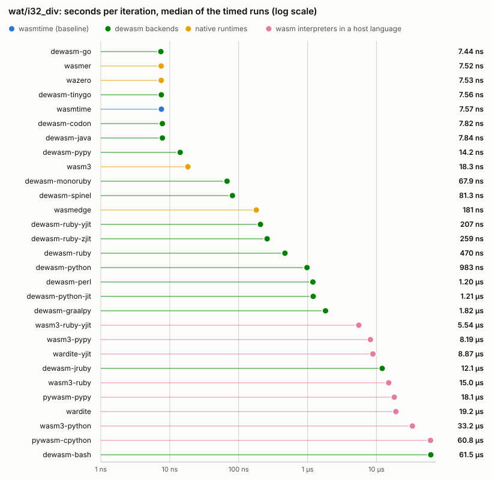
</picture>

Full numbers for <code>wat/i32_div</code>

| Runner | Iterations | ns/op (min) | ns/op (median) | Cold start `t(0)` | Total `t(N)` | vs wasmtime | Load |
| --- | --- | --- | --- | --- | --- | --- | --- |
| `wasmtime` | 40 050 301 | 7.53 | 7.55 | 4.9 ms | 306.4 ms | 1.00x | — |
| `wasmer` | 40 159 084 | 7.53 | 7.57 | 8.2 ms | 310.6 ms | 1.00x | — |
| `wasmedge` | 1 714 168 | 178.0 | 179.1 | 14.3 ms | 319.4 ms | 24x | — |
| `wazero` | 39 514 012 | 7.53 | 7.53 | 4.4 ms | 302.0 ms | 1.00x | — |
| `wasm3` | 16 777 216 | 15.5 | 15.6 | 3.9 ms | 264.3 ms | 2.06x | — |
| `dewasm-ruby` | 806 591 | 362.8 | 368.8 | 35.0 ms | 327.6 ms | 48x | — |
| `dewasm-ruby-yjit` | 1 304 573 | 193.0 | 194.2 | 35.6 ms | 287.5 ms | 26x | — |
| `dewasm-ruby-zjit` | 822 294 | 238.6 | 239.2 | 35.4 ms | 231.7 ms | 32x | — |
| `dewasm-python` | 286 040 | 962.6 | 973.6 | 26.1 ms | 301.4 ms | 128x | — |
| `dewasm-pypy` | 13 730 730 | 13.9 | 13.9 | 35.9 ms | 226.9 ms | 1.85x | — |
| `dewasm-perl` | 248 573 | 1196 | 1204 | 10.1 ms | 307.4 ms | 159x | — |
| `dewasm-go` | 39 698 098 | 7.58 | 7.59 | 2.5 ms | 303.5 ms | 1.01x | — |
| `dewasm-java` | 23 905 571 | 7.91 | 7.93 | 60.5 ms | 249.7 ms | 1.05x | — |
| `dewasm-bash` | 4 357 | 67025 | 67131 | 11.5 ms | 303.5 ms | 8903x | — |
| `wasm3-ruby` | 16 332 | 13591 | 13503 | 113.2 ms | 335.2 ms | 1805x | — |
| `wasm3-ruby-yjit` | 44 309 | 5149 | 5188 | 227.4 ms | 455.5 ms | 684x | — |
| `wasm3-python` | 9 220 | 32267 | 32508 | 308.4 ms | 605.9 ms | 4286x | — |
| `wasm3-pypy` | 27 298 | 7881 | 7882 | 470.5 ms | 685.6 ms | 1047x | — |
| `pywasm-cpython` | 4 855 | 60300 | 60580 | 38.3 ms | 331.1 ms | 8010x | 0.6 ms |
| `pywasm-pypy` | 9 760 | 21399 | 21432 | 69.7 ms | 278.5 ms | 2842x | 3.4 ms |
| `wardite` | 14 812 | 17798 | 17841 | 46.6 ms | 310.2 ms | 2364x | 3.4 ms |
| `wardite-yjit` | 27 205 | 8384 | 8482 | 91.0 ms | 319.0 ms | 1114x | 8.0 ms |

#### `wat/i64_alu`

<picture>
  <source media="(prefers-color-scheme: dark)" srcset="figs/wat-i64-alu-dark.svg">
  
</picture>

Full numbers for <code>wat/i64_alu</code>

| Runner | Iterations | ns/op (min) | ns/op (median) | Cold start `t(0)` | Total `t(N)` | vs wasmtime | Load |
| --- | --- | --- | --- | --- | --- | --- | --- |
| `wasmtime` | 131 932 944 | 2.29 | 2.29 | 5.1 ms | 307.3 ms | 1.00x | — |
| `wasmer` | 131 695 323 | 2.29 | 2.30 | 8.3 ms | 309.6 ms | 1.00x | — |
| `wasmedge` | 2 037 678 | 149.1 | 149.7 | 14.1 ms | 317.8 ms | 65x | — |
| `wazero` | 112 301 993 | 2.60 | 2.61 | 4.9 ms | 297.3 ms | 1.14x | — |
| `wasm3` | 16 777 216 | 11.8 | 11.8 | 3.9 ms | 202.1 ms | 5.16x | — |
| `dewasm-ruby` | 242 355 | 1228 | 1222 | 35.1 ms | 332.6 ms | 536x | — |
| `dewasm-ruby-yjit` | 309 953 | 939.1 | 940.2 | 35.0 ms | 326.0 ms | 410x | — |
| `dewasm-ruby-zjit` | 251 132 | 998.0 | 1004 | 35.1 ms | 285.7 ms | 436x | — |
| `dewasm-python` | 479 435 | 615.9 | 626.8 | 25.6 ms | 320.9 ms | 269x | — |
| `dewasm-pypy` | 1 107 302 | 216.9 | 220.5 | 35.6 ms | 275.8 ms | 95x | — |
| `dewasm-perl` | 302 703 | 975.2 | 980.3 | 9.9 ms | 305.1 ms | 426x | — |
| `dewasm-go` | 115 816 204 | 2.59 | 2.59 | 2.5 ms | 302.0 ms | 1.13x | — |
| `dewasm-java` | 79 902 297 | 2.34 | 2.33 | 60.1 ms | 246.9 ms | 1.02x | — |
| `dewasm-bash` | 8 274 | 26986 | 27067 | 12.2 ms | 235.5 ms | 11779x | — |
| `wasm3-ruby` | 27 258 | 11865 | 11978 | 114.3 ms | 437.7 ms | 5179x | — |
| `wasm3-ruby-yjit` | 53 063 | 5024 | 5056 | 233.8 ms | 500.5 ms | 2193x | — |
| `wasm3-python` | 9 648 | 25589 | 25873 | 309.9 ms | 556.8 ms | 11169x | — |
| `wasm3-pypy` | 22 842 | 9399 | 9623 | 470.6 ms | 685.3 ms | 4103x | — |
| `pywasm-cpython` | 5 374 | 56187 | 56265 | 38.8 ms | 340.8 ms | 24524x | 0.6 ms |
| `pywasm-pypy` | 649 | 282904 | 285800 | 72.6 ms | 256.2 ms | 123481x | 3.4 ms |
| `wardite` | 11 634 | 16041 | 16244 | 46.3 ms | 232.9 ms | 7002x | 3.6 ms |
| `wardite-yjit` | 36 512 | 8836 | 8892 | 89.2 ms | 411.8 ms | 3857x | 8.6 ms |

#### `wat/i64_div`

<picture>
  <source media="(prefers-color-scheme: dark)" srcset="figs/wat-i64-div-dark.svg">
  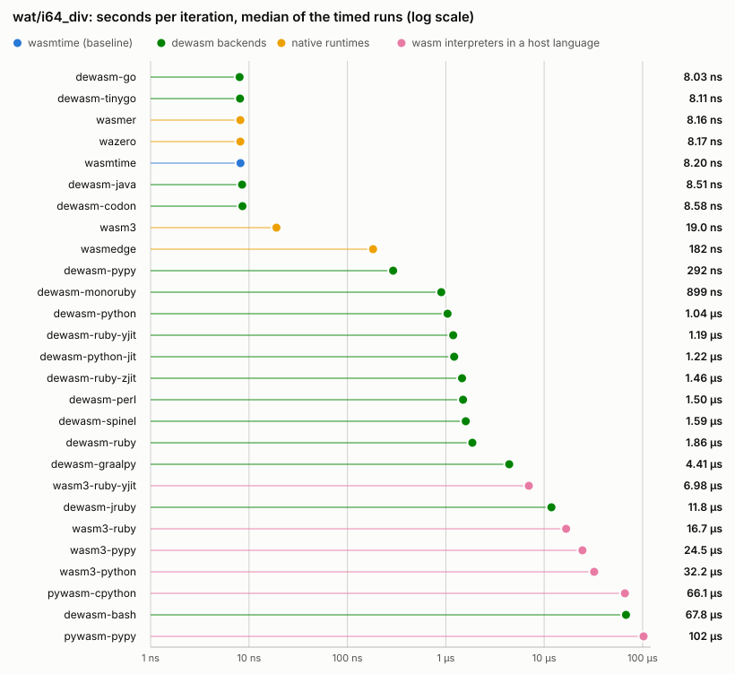
</picture>

Full numbers for <code>wat/i64_div</code>

| Runner | Iterations | ns/op (min) | ns/op (median) | Cold start `t(0)` | Total `t(N)` | vs wasmtime | Load |
| --- | --- | --- | --- | --- | --- | --- | --- |
| `wasmtime` | 36 833 376 | 8.15 | 8.15 | 5.0 ms | 305.1 ms | 1.00x | — |
| `wasmer` | 36 430 157 | 8.13 | 8.13 | 8.1 ms | 304.2 ms | 1.00x | — |
| `wasmedge` | 1 748 598 | 179.6 | 179.5 | 14.3 ms | 328.3 ms | 22x | — |
| `wazero` | 36 531 881 | 8.14 | 8.16 | 4.4 ms | 301.7 ms | 1.00x | — |
| `wasm3` | 16 739 719 | 15.9 | 15.9 | 3.9 ms | 269.2 ms | 1.95x | — |
| `dewasm-ruby` | 170 863 | 1632 | 1635 | 34.7 ms | 313.6 ms | 200x | — |
| `dewasm-ruby-yjit` | 232 551 | 1085 | 1110 | 35.0 ms | 287.3 ms | 133x | — |
| `dewasm-ruby-zjit` | 200 310 | 1371 | 1372 | 35.2 ms | 309.8 ms | 168x | — |
| `dewasm-python` | 292 937 | 1037 | 1038 | 25.6 ms | 329.3 ms | 127x | — |
| `dewasm-pypy` | 766 931 | 265.7 | 266.1 | 35.7 ms | 239.4 ms | 33x | — |
| `dewasm-perl` | 202 182 | 1484 | 1486 | 9.8 ms | 309.9 ms | 182x | — |
| `dewasm-go` | 36 463 918 | 8.15 | 8.16 | 2.5 ms | 299.5 ms | 1.00x | — |
| `dewasm-java` | 26 114 761 | 8.43 | 8.46 | 60.6 ms | 280.8 ms | 1.03x | — |
| `dewasm-bash` | 3 923 | 74640 | 74918 | 11.5 ms | 304.4 ms | 9161x | — |
| `wasm3-ruby` | 21 603 | 14597 | 14607 | 113.8 ms | 429.2 ms | 1792x | — |
| `wasm3-ruby-yjit` | 35 811 | 6559 | 6424 | 227.4 ms | 462.3 ms | 805x | — |
| `wasm3-python` | 10 756 | 31161 | 31395 | 308.5 ms | 643.7 ms | 3825x | — |
| `wasm3-pypy` | 10 036 | 19757 | 20012 | 471.3 ms | 669.5 ms | 2425x | — |
| `pywasm-cpython` | 4 638 | 64861 | 64998 | 38.6 ms | 339.5 ms | 7961x | 0.6 ms |
| `pywasm-pypy` | 460 | 388403 | 389395 | 69.2 ms | 247.9 ms | 47672x | 3.4 ms |

#### `wat/mem_narrow`

<picture>
  <source media="(prefers-color-scheme: dark)" srcset="figs/wat-mem-narrow-dark.svg">
  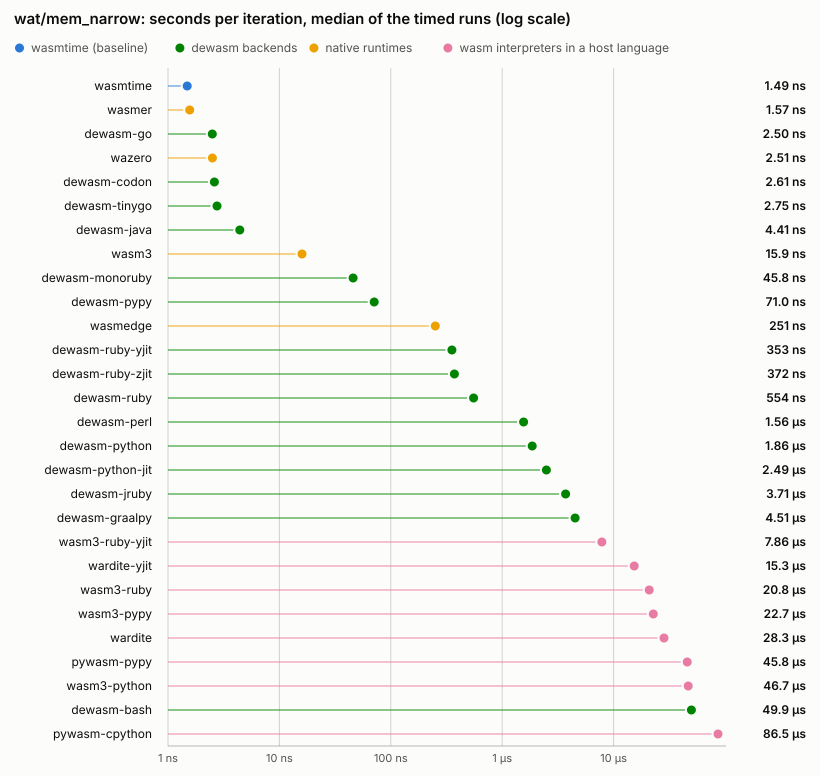
</picture>

Full numbers for <code>wat/mem_narrow</code>

| Runner | Iterations | ns/op (min) | ns/op (median) | Cold start `t(0)` | Total `t(N)` | vs wasmtime | Load |
| --- | --- | --- | --- | --- | --- | --- | --- |
| `wasmtime` | 204 340 275 | 1.47 | 1.47 | 5.0 ms | 304.6 ms | 1.00x | — |
| `wasmer` | 192 003 237 | 1.55 | 1.56 | 7.9 ms | 305.8 ms | 1.06x | — |
| `wasmedge` | 1 215 436 | 248.7 | 248.9 | 14.0 ms | 316.2 ms | 170x | — |
| `wazero` | 122 401 742 | 2.47 | 2.49 | 4.5 ms | 307.3 ms | 1.69x | — |
| `wasm3` | 15 076 340 | 19.6 | 19.8 | 4.0 ms | 298.8 ms | 13x | — |
| `dewasm-ruby` | 712 448 | 425.1 | 426.5 | 34.6 ms | 337.4 ms | 290x | — |
| `dewasm-ruby-yjit` | 904 085 | 301.6 | 301.8 | 34.7 ms | 307.4 ms | 206x | — |
| `dewasm-ruby-zjit` | 842 104 | 323.1 | 326.9 | 35.2 ms | 307.3 ms | 220x | — |
| `dewasm-python` | 164 381 | 1834 | 1840 | 25.8 ms | 327.3 ms | 1251x | — |
| `dewasm-pypy` | 4 012 239 | 69.3 | 70.6 | 36.6 ms | 314.7 ms | 47x | — |
| `dewasm-perl` | 65 536 | 2938 | 2994 | 9.8 ms | 202.4 ms | 2003x | — |
| `dewasm-go` | 122 957 926 | 2.45 | 2.45 | 2.4 ms | 303.3 ms | 1.67x | — |
| `dewasm-java` | 52 135 954 | 4.22 | 4.27 | 59.8 ms | 280.1 ms | 2.88x | — |
| `dewasm-bash` | 6 337 | 48425 | 48480 | 11.5 ms | 318.4 ms | 33023x | — |
| `wasm3-ruby` | 14 546 | 18499 | 18496 | 114.5 ms | 383.6 ms | 12615x | — |
| `wasm3-ruby-yjit` | 38 711 | 6819 | 7105 | 240.4 ms | 504.4 ms | 4650x | — |
| `wasm3-python` | 5 584 | 47951 | 47555 | 308.4 ms | 576.1 ms | 32699x | — |
| `wasm3-pypy` | 10 604 | 19123 | 19067 | 472.0 ms | 674.8 ms | 13041x | — |
| `pywasm-cpython` | 3 506 | 84605 | 84760 | 38.6 ms | 335.3 ms | 57694x | 0.7 ms |
| `pywasm-pypy` | 4 528 | 40485 | 40703 | 70.8 ms | 254.1 ms | 27608x | 4.8 ms |
| `wardite` | 11 204 | 26717 | 26835 | 46.7 ms | 346.1 ms | 18219x | 3.6 ms |
| `wardite-yjit` | 25 328 | 13613 | 13683 | 91.2 ms | 436.0 ms | 9283x | 8.1 ms |

#### `wat/mem_rw`

<picture>
  <source media="(prefers-color-scheme: dark)" srcset="figs/wat-mem-rw-dark.svg">
  
</picture>

Full numbers for <code>wat/mem_rw</code>

| Runner | Iterations | ns/op (min) | ns/op (median) | Cold start `t(0)` | Total `t(N)` | vs wasmtime | Load |
| --- | --- | --- | --- | --- | --- | --- | --- |
| `wasmtime` | 300 255 922 | 0.98 | 0.98 | 5.0 ms | 300.6 ms | 1.00x | — |
| `wasmer` | 307 213 294 | 0.98 | 0.98 | 7.9 ms | 309.8 ms | 1.00x | — |
| `wasmedge` | 2 694 983 | 121.2 | 121.0 | 14.7 ms | 341.2 ms | 123x | — |
| `wazero` | 197 883 085 | 1.51 | 1.52 | 4.4 ms | 303.4 ms | 1.53x | — |
| `wasm3` | 33 554 432 | 9.77 | 9.79 | 4.0 ms | 331.8 ms | 9.92x | — |
| `dewasm-ruby` | 1 722 736 | 175.1 | 176.4 | 34.5 ms | 336.2 ms | 178x | — |
| `dewasm-ruby-yjit` | 2 126 756 | 129.9 | 131.8 | 34.7 ms | 311.1 ms | 132x | — |
| `dewasm-ruby-zjit` | 1 923 394 | 137.6 | 138.0 | 35.2 ms | 299.9 ms | 140x | — |
| `dewasm-python` | 391 714 | 727.2 | 733.8 | 25.4 ms | 310.3 ms | 738x | — |
| `dewasm-pypy` | 5 812 182 | 52.2 | 52.4 | 36.6 ms | 339.8 ms | 53x | — |
| `dewasm-perl` | 308 837 | 943.0 | 957.2 | 9.7 ms | 301.0 ms | 958x | — |
| `dewasm-go` | 202 985 666 | 1.48 | 1.48 | 2.5 ms | 302.2 ms | 1.50x | — |
| `dewasm-java` | 166 020 287 | 1.72 | 1.72 | 60.3 ms | 345.1 ms | 1.74x | — |
| `dewasm-bash` | 10 077 | 29885 | 30047 | 11.5 ms | 312.7 ms | 30347x | — |
| `wasm3-ruby` | 39 498 | 8885 | 8885 | 112.4 ms | 463.3 ms | 9022x | — |
| `wasm3-ruby-yjit` | 94 331 | 3006 | 3004 | 223.9 ms | 507.5 ms | 3053x | — |
| `wasm3-python` | 8 753 | 22717 | 22869 | 308.6 ms | 507.5 ms | 23068x | — |
| `wasm3-pypy` | 55 812 | 4479 | 4461 | 471.1 ms | 721.1 ms | 4548x | — |
| `pywasm-cpython` | 7 025 | 38394 | 38650 | 38.3 ms | 308.0 ms | 38987x | 0.7 ms |
| `pywasm-pypy` | 35 016 | 7187 | 7210 | 70.4 ms | 322.0 ms | 7298x | 4.5 ms |
| `wardite` | 14 722 | 12686 | 12737 | 46.4 ms | 233.1 ms | 12883x | 3.6 ms |
| `wardite-yjit` | 39 520 | 5908 | 5958 | 89.7 ms | 323.2 ms | 6000x | 8.2 ms |

#### `wat/tail_call`

<picture>
  <source media="(prefers-color-scheme: dark)" srcset="figs/wat-tail-call-dark.svg">
  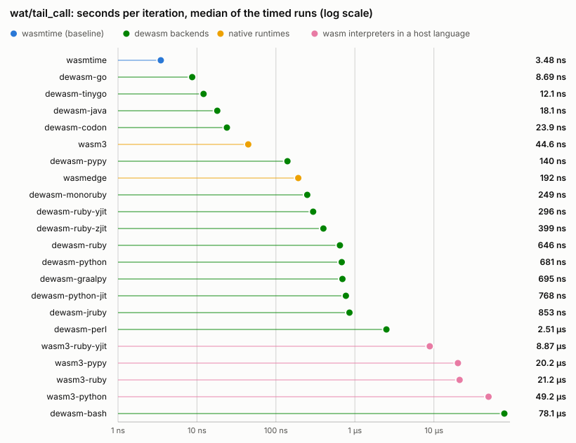
</picture>

Full numbers for <code>wat/tail_call</code>

| Runner | Iterations | ns/op (min) | ns/op (median) | Cold start `t(0)` | Total `t(N)` | vs wasmtime | Load |
| --- | --- | --- | --- | --- | --- | --- | --- |
| `wasmtime` | 87 823 627 | 3.43 | 3.43 | 5.0 ms | 306.2 ms | 1.00x | — |
| `wasmedge` | 1 622 373 | 185.2 | 188.0 | 14.0 ms | 314.5 ms | 54x | — |
| `wasm3` | 5 743 174 | 51.3 | 52.3 | 3.9 ms | 298.3 ms | 15x | — |
| `dewasm-ruby` | 483 388 | 615.6 | 620.2 | 34.6 ms | 332.2 ms | 179x | — |
| `dewasm-ruby-yjit` | 978 383 | 267.5 | 270.1 | 34.8 ms | 296.5 ms | 78x | — |
| `dewasm-ruby-zjit` | 630 900 | 373.0 | 374.1 | 35.1 ms | 270.4 ms | 109x | — |
| `dewasm-python` | 444 673 | 669.1 | 682.4 | 25.8 ms | 323.3 ms | 195x | — |
| `dewasm-pypy` | 1 491 521 | 138.9 | 138.9 | 35.5 ms | 242.7 ms | 41x | — |
| `dewasm-perl` | 118 652 | 2456 | 2466 | 10.0 ms | 301.4 ms | 716x | — |
| `dewasm-go` | 34 414 360 | 8.89 | 9.08 | 2.5 ms | 308.5 ms | 2.59x | — |
| `dewasm-java` | 13 927 883 | 17.6 | 17.6 | 58.8 ms | 303.9 ms | 5.13x | — |
| `dewasm-bash` | 3 871 | 77043 | 77113 | 11.9 ms | 310.1 ms | 22461x | — |
| `wasm3-ruby` | 15 860 | 18552 | 18633 | 112.0 ms | 406.2 ms | 5409x | — |
| `wasm3-ruby-yjit` | 30 103 | 7509 | 7501 | 198.3 ms | 424.4 ms | 2189x | — |
| `wasm3-python` | 7 028 | 48131 | 48833 | 309.4 ms | 647.7 ms | 14032x | — |
| `wasm3-pypy` | 12 320 | 18864 | 18840 | 470.5 ms | 702.9 ms | 5500x | — |

#### `c/mandelbrot`

<picture>
  <source media="(prefers-color-scheme: dark)" srcset="figs/c-mandelbrot-dark.svg">
  
</picture>

Full numbers for <code>c/mandelbrot</code>

| Runner | Iterations | ns/op (min) | ns/op (median) | Cold start `t(0)` | Total `t(N)` | vs wasmtime | Load |
| --- | --- | --- | --- | --- | --- | --- | --- |
| `wasmtime` | 3 073 840 | 94.3 | 94.6 | 4.9 ms | 294.9 ms | 1.00x | — |
| `wasmer` | 2 911 399 | 94.4 | 94.5 | 8.3 ms | 283.1 ms | 1.00x | — |
| `wasmedge` | 65 536 | 3688 | 3727 | 14.1 ms | 255.8 ms | 39x | — |
| `wazero` | 2 833 631 | 105.9 | 106.3 | 4.8 ms | 305.0 ms | 1.12x | — |
| `wasm3` | 673 524 | 443.6 | 448.2 | 4.0 ms | 302.7 ms | 4.70x | — |
| `dewasm-ruby` | 42 173 | 4568 | 4635 | 35.2 ms | 227.8 ms | 48x | — |
| `dewasm-ruby-yjit` | 135 395 | 1545 | 1530 | 35.3 ms | 244.5 ms | 16x | — |
| `dewasm-ruby-zjit` | 81 804 | 3492 | 3503 | 35.4 ms | 321.0 ms | 37x | — |
| `dewasm-python` | 65 536 | 3543 | 3555 | 26.4 ms | 258.5 ms | 38x | — |
| `dewasm-pypy` | 2 288 272 | 138.2 | 138.2 | 36.2 ms | 352.5 ms | 1.47x | — |
| `dewasm-perl` | 5 403 | 54312 | 54392 | 10.0 ms | 303.4 ms | 576x | — |
| `dewasm-go` | 1 299 150 | 231.0 | 231.1 | 2.5 ms | 302.5 ms | 2.45x | — |
| `dewasm-java` | 2 611 945 | 95.7 | 95.4 | 59.9 ms | 309.8 ms | 1.01x | — |
| `dewasm-bash` | 180 | 19314657 | 19369017 | 12.2 ms | 3.49 s | 204751x | — |
| `wasm3-ruby` | 1 086 | 273259 | 275968 | 115.3 ms | 412.0 ms | 2897x | — |
| `wasm3-ruby-yjit` | 2 964 | 94166 | 93970 | 260.0 ms | 539.1 ms | 998x | — |
| `wasm3-python` | 512 | 656694 | 655244 | 312.5 ms | 648.7 ms | 6961x | — |
| `wasm3-pypy` | 932 | 235064 | 235012 | 478.9 ms | 698.0 ms | 2492x | — |
| `pywasm-cpython` | 256 | 1447154 | 1450451 | 38.4 ms | 408.9 ms | 15341x | 0.8 ms |
| `pywasm-pypy` | 196 | 1120033 | 1119270 | 70.9 ms | 290.4 ms | 11873x | 5.1 ms |
| `wardite` | 792 | 371401 | 372049 | 46.4 ms | 340.5 ms | 3937x | 3.5 ms |
| `wardite-yjit` | 1 448 | 175391 | 175064 | 92.2 ms | 346.1 ms | 1859x | 8.9 ms |

#### `c/sha256`

<picture>
  <source media="(prefers-color-scheme: dark)" srcset="figs/c-sha256-dark.svg">
  
</picture>

Full numbers for <code>c/sha256</code>

| Runner | Iterations | ns/op (min) | ns/op (median) | Cold start `t(0)` | Total `t(N)` | vs wasmtime | Load |
| --- | --- | --- | --- | --- | --- | --- | --- |
| `wasmtime` | 1 041 374 | 287.8 | 288.4 | 4.9 ms | 304.7 ms | 1.00x | — |
| `wasmer` | 999 866 | 287.8 | 288.5 | 8.3 ms | 296.0 ms | 1.00x | — |
| `wasmedge` | 7 623 | 39554 | 39894 | 14.3 ms | 315.8 ms | 137x | — |
| `wazero` | 802 548 | 370.9 | 371.7 | 4.6 ms | 302.3 ms | 1.29x | — |
| `wasm3` | 53 700 | 4828 | 4828 | 4.0 ms | 263.2 ms | 17x | — |
| `dewasm-ruby` | 3 383 | 78457 | 78533 | 34.8 ms | 300.2 ms | 273x | — |
| `dewasm-ruby-yjit` | 5 624 | 33956 | 33921 | 36.1 ms | 227.1 ms | 118x | — |
| `dewasm-ruby-zjit` | 5 740 | 52926 | 53045 | 35.6 ms | 339.4 ms | 184x | — |
| `dewasm-python` | 1 083 | 264689 | 265307 | 26.7 ms | 313.4 ms | 920x | — |
| `dewasm-pypy` | 13 308 | 14074 | 14244 | 37.1 ms | 224.4 ms | 49x | — |
| `dewasm-perl` | 954 | 311542 | 315047 | 10.1 ms | 307.3 ms | 1082x | — |
| `dewasm-go` | 871 481 | 343.6 | 343.9 | 2.5 ms | 302.0 ms | 1.19x | — |
| `dewasm-java` | 512 038 | 549.0 | 554.2 | 59.8 ms | 340.9 ms | 1.91x | — |
| `dewasm-bash` | 19 | 15261283 | 15272239 | 13.8 ms | 303.8 ms | 53023x | — |
| `wasm3-ruby` | 75 | 3553375 | 3598362 | 117.2 ms | 383.7 ms | 12346x | — |
| `wasm3-ruby-yjit` | 192 | 1282779 | 1287357 | 276.7 ms | 523.0 ms | 4457x | — |
| `wasm3-python` | 27 | 9130228 | 9136816 | 320.1 ms | 566.6 ms | 31722x | — |
| `wasm3-pypy` | 36 | 6078487 | 6166523 | 506.4 ms | 725.2 ms | 21119x | — |
| `pywasm-cpython` | 20 | 14282075 | 14300394 | 39.7 ms | 325.3 ms | 49621x | 1.2 ms |
| `pywasm-pypy` | 32 | 6265911 | 6224393 | 80.2 ms | 280.7 ms | 21770x | 7.6 ms |
| `wardite` | 74 | 4033930 | 4039560 | 47.6 ms | 346.1 ms | 14015x | 3.7 ms |
| `wardite-yjit` | 133 | 1867489 | 1868561 | 92.7 ms | 341.1 ms | 6488x | 9.0 ms |

#### `c/wordcount`

<picture>
  <source media="(prefers-color-scheme: dark)" srcset="figs/c-wordcount-dark.svg">
  
</picture>

Full numbers for <code>c/wordcount</code>

| Runner | Iterations | ns/op (min) | ns/op (median) | Cold start `t(0)` | Total `t(N)` | vs wasmtime | Load |
| --- | --- | --- | --- | --- | --- | --- | --- |
| `wasmtime` | 194 548 513 | 1.47 | 1.51 | 5.1 ms | 290.9 ms | 1.00x | — |
| `wasmer` | 181 965 736 | 1.61 | 1.62 | 8.2 ms | 301.8 ms | 1.10x | — |
| `wasmedge` | 1 574 328 | 195.9 | 195.9 | 14.9 ms | 323.3 ms | 133x | — |
| `wazero` | 101 770 561 | 2.98 | 2.99 | 4.9 ms | 308.1 ms | 2.03x | — |
| `wasm3` | 14 845 801 | 19.8 | 19.9 | 4.0 ms | 297.9 ms | 13x | — |
| `dewasm-ruby` | 763 679 | 401.1 | 404.0 | 36.5 ms | 342.9 ms | 273x | — |
| `dewasm-ruby-yjit` | 1 088 816 | 267.1 | 268.4 | 36.8 ms | 327.6 ms | 182x | — |
| `dewasm-ruby-zjit` | 1 017 402 | 290.6 | 291.0 | 37.6 ms | 333.2 ms | 198x | — |
| `dewasm-python` | 335 071 | 887.2 | 887.4 | 29.7 ms | 327.0 ms | 604x | — |
| `dewasm-pypy` | 5 086 382 | 55.9 | 55.9 | 41.2 ms | 325.4 ms | 38x | — |
| `dewasm-perl` | 206 406 | 1444 | 1447 | 17.2 ms | 315.1 ms | 982x | — |
| `dewasm-go` | 109 934 030 | 2.67 | 2.71 | 2.6 ms | 296.2 ms | 1.82x | — |
| `dewasm-java` | 65 208 823 | 3.38 | 3.39 | 61.0 ms | 281.6 ms | 2.30x | — |
| `dewasm-bash` | 7 261 | 41335 | 41318 | 118.9 ms | 419.0 ms | 28132x | — |
| `wasm3-ruby` | 18 633 | 13380 | 13425 | 166.9 ms | 416.2 ms | 9106x | — |
| `wasm3-ruby-yjit` | 58 242 | 4599 | 4628 | 305.1 ms | 572.9 ms | 3130x | — |
| `wasm3-python` | 7 176 | 34317 | 34923 | 439.3 ms | 685.6 ms | 23356x | — |
| `wasm3-pypy` | 11 815 | 15178 | 15256 | 592.0 ms | 771.3 ms | 10330x | — |
| `pywasm-cpython` | 4 794 | 58426 | 59361 | 269.6 ms | 549.7 ms | 39765x | 1.2 ms |
| `pywasm-pypy` | 12 468 | 15370 | 15267 | 176.3 ms | 368.0 ms | 10461x | 7.6 ms |
| `wardite` | 17 382 | 20178 | 20392 | 113.7 ms | 464.5 ms | 13733x | 3.7 ms |
| `wardite-yjit` | 32 149 | 9399 | 9657 | 130.5 ms | 432.6 ms | 6397x | 9.1 ms |

### Application benchmarks

Seconds per **run** of a real cached program on fixed input.
Every runner executes the same work, so wall times compare directly.

#### `app/cowsay`

<picture>
  <source media="(prefers-color-scheme: dark)" srcset="figs/app-cowsay-dark.svg">
  
</picture>

Full numbers for <code>app/cowsay</code>

| Runner | Runs/sample | Wall time (min) | Wall time (median) | vs wasmtime | Load |
| --- | --- | --- | --- | --- | --- |
| `wasmtime` | 32 | 9.2 ms | 9.2 ms | 1.00x | — |
| `wasmer` | 25 | 12.4 ms | 12.5 ms | 1.35x | — |
| `wasmedge` | 13 | 23.7 ms | 23.7 ms | 2.58x | — |
| `wazero` | 3 | 100.3 ms | 100.7 ms | 11x | — |
| `wasm3` | 42 | 7.3 ms | 7.4 ms | 0.80x | — |
| `dewasm-ruby` | 3 | 132.5 ms | 133.0 ms | 14x | — |
| `dewasm-ruby-yjit` | 2 | 180.2 ms | 180.8 ms | 20x | — |
| `dewasm-ruby-zjit` | 2 | 235.8 ms | 236.4 ms | 26x | — |
| `dewasm-python` | 1 | 393.9 ms | 394.3 ms | 43x | — |
| `dewasm-pypy` | 1 | 596.5 ms | 597.5 ms | 65x | — |
| `dewasm-perl` | 3 | 102.1 ms | 102.4 ms | 11x | — |
| `dewasm-go` | 64 | 3.9 ms | 3.9 ms | 0.43x | — |
| `dewasm-java` | 3 | 120.6 ms | 121.5 ms | 13x | — |
| `dewasm-bash` | 1 | 1.25 s | 1.26 s | 137x | — |
| `wasm3-ruby` | 1 | 815.8 ms | 819.0 ms | 89x | — |
| `wasm3-ruby-yjit` | 1 | 1.11 s | 1.11 s | 121x | — |
| `wasm3-python` | 1 | 2.32 s | 2.33 s | 252x | — |
| `wasm3-pypy` | 1 | 1.75 s | 1.75 s | 190x | — |
| `pywasm-cpython` | 1 | 470.0 ms | 473.8 ms | 51x | 262.9 ms |
| `pywasm-pypy` | 1 | 813.6 ms | 829.0 ms | 89x | 432.9 ms |
| `wardite` | 2 | 217.6 ms | 219.4 ms | 24x | 103.9 ms |
| `wardite-yjit` | 2 | 243.5 ms | 244.9 ms | 26x | 77.6 ms |

#### `app/sqlite3_query`

<picture>
  <source media="(prefers-color-scheme: dark)" srcset="figs/app-sqlite3-query-dark.svg">
  
</picture>

Full numbers for <code>app/sqlite3_query</code>

| Runner | Runs/sample | Wall time (min) | Wall time (median) | vs wasmtime | Load |
| --- | --- | --- | --- | --- | --- |
| `wasmtime` | 4 | 74.8 ms | 75.2 ms | 1.00x | — |
| `wasmer` | 4 | 83.1 ms | 83.1 ms | 1.11x | — |
| `wasmedge` | 1 | 9.42 s | 9.45 s | 126x | — |
| `wazero` | 1 | 605.4 ms | 612.3 ms | 8.09x | — |
| `wasm3` | 1 | 1.09 s | 1.10 s | 15x | — |
| `dewasm-ruby` | 1 | 18.64 s | 18.75 s | 249x | — |
| `dewasm-ruby-yjit` | 1 | 8.81 s | 8.84 s | 118x | — |
| `dewasm-ruby-zjit` | 1 | 13.41 s | 13.41 s | 179x | — |
| `dewasm-pypy` | 1 | 11.36 s | 11.36 s | 152x | — |
| `dewasm-go` | 2 | 168.3 ms | 168.4 ms | 2.25x | — |
| `dewasm-java` | 1 | 2.29 s | 2.30 s | 31x | — |

#### `app/sqlite3_mod_query`

<picture>
  <source media="(prefers-color-scheme: dark)" srcset="figs/app-sqlite3-mod-query-dark.svg">
  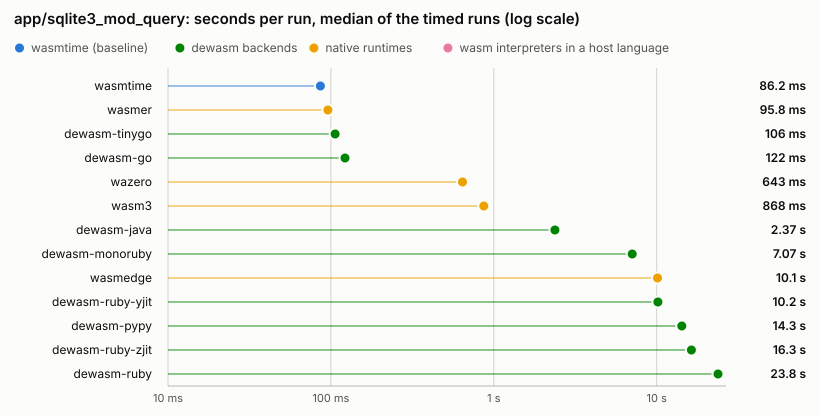
</picture>

Full numbers for <code>app/sqlite3_mod_query</code>

| Runner | Runs/sample | Wall time (min) | Wall time (median) | vs wasmtime | Load |
| --- | --- | --- | --- | --- | --- |
| `wasmtime` | 4 | 82.6 ms | 82.6 ms | 1.00x | — |
| `wasmer` | 4 | 85.6 ms | 85.9 ms | 1.04x | — |
| `wasmedge` | 1 | 9.76 s | 9.80 s | 118x | — |
| `wazero` | 1 | 600.5 ms | 605.5 ms | 7.27x | — |
| `wasm3` | 1 | 1.16 s | 1.17 s | 14x | — |
| `dewasm-ruby` | 1 | 19.75 s | 19.82 s | 239x | — |
| `dewasm-ruby-yjit` | 1 | 8.03 s | 8.07 s | 97x | — |
| `dewasm-ruby-zjit` | 1 | 13.79 s | 13.83 s | 167x | — |
| `dewasm-pypy` | 1 | 12.16 s | 12.23 s | 147x | — |
| `dewasm-go` | 3 | 122.1 ms | 122.6 ms | 1.48x | — |
| `dewasm-java` | 1 | 5.35 s | 5.36 s | 65x | — |

#### `app/minigzip`

<picture>
  <source media="(prefers-color-scheme: dark)" srcset="figs/app-minigzip-dark.svg">
  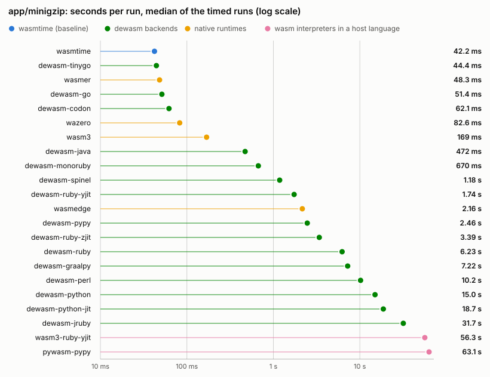
</picture>

Full numbers for <code>app/minigzip</code>

| Runner | Runs/sample | Wall time (min) | Wall time (median) | vs wasmtime | Load |
| --- | --- | --- | --- | --- | --- |
| `wasmtime` | 7 | 42.6 ms | 42.7 ms | 1.00x | — |
| `wasmer` | 7 | 49.0 ms | 49.0 ms | 1.15x | — |
| `wasmedge` | 1 | 2.15 s | 2.15 s | 50x | — |
| `wazero` | 4 | 84.1 ms | 84.3 ms | 1.97x | — |
| `wasm3` | 2 | 248.1 ms | 248.8 ms | 5.82x | — |
| `dewasm-ruby` | 1 | 5.12 s | 5.16 s | 120x | — |
| `dewasm-ruby-yjit` | 1 | 1.56 s | 1.56 s | 37x | — |
| `dewasm-ruby-zjit` | 1 | 3.19 s | 3.20 s | 75x | — |
| `dewasm-python` | 1 | 14.94 s | 15.00 s | 351x | — |
| `dewasm-pypy` | 1 | 2.58 s | 2.58 s | 60x | — |
| `dewasm-perl` | 1 | 23.49 s | 23.67 s | 551x | — |
| `dewasm-go` | 6 | 55.6 ms | 55.9 ms | 1.31x | — |
| `dewasm-java` | 1 | 506.4 ms | 525.7 ms | 12x | — |
| `wasm3-ruby-yjit` | 1 | 52.92 s | 53.02 s | 1242x | — |
| `pywasm-pypy` | 1 | 77.85 s | 78.05 s | 1827x | 305.1 ms |

## Not measured

Every pair the suite did not measure, and why.
A missing runner or an unbuilt module is stated here rather than left as a gap in the tables above.
Kind classifies the gap: *cost* (runs correctly, but too slowly to keep in the suite), *capability* (the runner cannot execute the workload), *setup* (this host lacks the runner or the built module).

| Workload | Runner | Kind | Reason |
| --- | --- | --- | --- |
| `wat/eh_throw` | `wazero` | capability | wazero 1.12.0 rejects the module: "tag section not supported as feature \"exception-handling\" is disabled" |
| `wat/eh_throw` | `wasm3` | capability | wasm3 0.9.0 fails to load it: "out of order Wasm section" (the tag section is unknown to it) |
| `wat/eh_throw` | `dewasm-bash` | capability | the bash backend has no exception-handling lowering and rejects the module at conversion time with "unsupported (exception-handling): tag, exnref value, or try_table/throw/throw_ref instruction" (see docs/support.md) |
| `wat/eh_throw` | `wasm3-ruby` | capability | the converted wasm3 0.9.0 fails to load it like the native one, "out of order Wasm section" (the tag section is unknown to it), measured through the converted interpreter |
| `wat/eh_throw` | `wasm3-ruby-yjit` | capability | the converted wasm3 0.9.0 fails to load it like the native one, "out of order Wasm section" (the tag section is unknown to it), measured through the converted interpreter |
| `wat/eh_throw` | `wasm3-python` | capability | the converted wasm3 0.9.0 fails to load it like the native one, "out of order Wasm section" (the tag section is unknown to it), measured through the converted interpreter |
| `wat/eh_throw` | `wasm3-pypy` | capability | the converted wasm3 0.9.0 fails to load it like the native one, "out of order Wasm section" (the tag section is unknown to it), measured through the converted interpreter |
| `wat/eh_throw` | `pywasm-cpython` | capability | pywasm 2.2.3 has no exception-handling opcodes; decoding dies with AssertionError on the throw/try_table opcode (pywasm/core.py, from_reader) |
| `wat/eh_throw` | `pywasm-pypy` | capability | pywasm 2.2.3 has no exception-handling opcodes; decoding dies with AssertionError on the throw/try_table opcode (pywasm/core.py, from_reader) |
| `wat/eh_throw` | `wardite` | capability | wardite 0.9.0 fails to load the tag section: Wardite::LoadError "unknown code: 13" |
| `wat/eh_throw` | `wardite-yjit` | capability | wardite 0.9.0 fails to load the tag section: Wardite::LoadError "unknown code: 13" |
| `wat/eh_try` | `wazero` | capability | wazero 1.12.0 rejects the module: "tag section not supported as feature \"exception-handling\" is disabled" |
| `wat/eh_try` | `wasm3` | capability | wasm3 0.9.0 fails to load it: "out of order Wasm section" (the tag section is unknown to it) |
| `wat/eh_try` | `dewasm-bash` | capability | the bash backend has no exception-handling lowering and rejects the module at conversion time with "unsupported (exception-handling): tag, exnref value, or try_table/throw/throw_ref instruction" (see docs/support.md) |
| `wat/eh_try` | `wasm3-ruby` | capability | the converted wasm3 0.9.0 fails to load it like the native one, "out of order Wasm section" (the tag section is unknown to it), measured through the converted interpreter |
| `wat/eh_try` | `wasm3-ruby-yjit` | capability | the converted wasm3 0.9.0 fails to load it like the native one, "out of order Wasm section" (the tag section is unknown to it), measured through the converted interpreter |
| `wat/eh_try` | `wasm3-python` | capability | the converted wasm3 0.9.0 fails to load it like the native one, "out of order Wasm section" (the tag section is unknown to it), measured through the converted interpreter |
| `wat/eh_try` | `wasm3-pypy` | capability | the converted wasm3 0.9.0 fails to load it like the native one, "out of order Wasm section" (the tag section is unknown to it), measured through the converted interpreter |
| `wat/eh_try` | `pywasm-cpython` | capability | pywasm 2.2.3 has no exception-handling opcodes; decoding dies with AssertionError on the throw/try_table opcode (pywasm/core.py, from_reader) |
| `wat/eh_try` | `pywasm-pypy` | capability | pywasm 2.2.3 has no exception-handling opcodes; decoding dies with AssertionError on the throw/try_table opcode (pywasm/core.py, from_reader) |
| `wat/eh_try` | `wardite` | capability | wardite 0.9.0 fails to load the tag section: Wardite::LoadError "unknown code: 13" |
| `wat/eh_try` | `wardite-yjit` | capability | wardite 0.9.0 fails to load the tag section: Wardite::LoadError "unknown code: 13" |
| `wat/f32_alu` | `wardite` | capability | wardite 0.9.0 does not re-round f32 arithmetic to single precision, so a dependent operation chain diverges from wasmtime (1232349357 vs 1232349355 at 10000 iterations) and the byte-for-byte verification would fail the whole run |
| `wat/f32_alu` | `wardite-yjit` | capability | wardite 0.9.0 does not re-round f32 arithmetic to single precision, so a dependent operation chain diverges from wasmtime (1232349357 vs 1232349355 at 10000 iterations) and the byte-for-byte verification would fail the whole run |
| `wat/i64_div` | `wardite` | capability | wardite 0.9.0 computes i64.div_s at f64 precision, wrong for operands beyond 2^53: i64.div_s(0x8000000000000000, 3) gives -3074457345618258432 where -3074457345618258602 is correct |
| `wat/i64_div` | `wardite-yjit` | capability | wardite 0.9.0 computes i64.div_s at f64 precision, wrong for operands beyond 2^53: i64.div_s(0x8000000000000000, 3) gives -3074457345618258432 where -3074457345618258602 is correct |
| `wat/tail_call` | `wasmer` | capability | wasmer rejects the module: compile error Validate("tail calls support is not enabled") |
| `wat/tail_call` | `wazero` | capability | wazero 1.12.0 rejects the module: "return_call invalid as feature \"tail-call\" is disabled" |
| `wat/tail_call` | `pywasm-cpython` | capability | pywasm 2.2.3 has no tail-call opcodes; decoding dies with AssertionError on 0x12, the return_call opcode (pywasm/core.py) |
| `wat/tail_call` | `pywasm-pypy` | capability | pywasm 2.2.3 has no tail-call opcodes; decoding dies with AssertionError on 0x12, the return_call opcode (pywasm/core.py) |
| `wat/tail_call` | `wardite` | capability | wardite 0.9.0 decodes return_call but has no implementation: RuntimeError "TODO! unsupported [:default, :return_call, [], nil, nil]" (wardite.rb, eval_insn) |
| `wat/tail_call` | `wardite-yjit` | capability | wardite 0.9.0 decodes return_call but has no implementation: RuntimeError "TODO! unsupported [:default, :return_call, [], nil, nil]" (wardite.rb, eval_insn) |
| `app/sqlite3_query` | `dewasm-python` | cost | dewasm-python runs this program correctly but at 56 s and 57 s per run (median, sqlite3_query and sqlite3_mod_query), costing roughly 9 minutes of the roughly 65 minute full suite; dewasm-python stays measured on the other app cases and the microbenchmarks |
| `app/sqlite3_query` | `dewasm-perl` | cost | dewasm-perl runs this program correctly but at 113 s and 115 s per run (median, sqlite3_query and sqlite3_mod_query), so one warmup plus the timed repetitions across both cases alone cost roughly 19 minutes of the roughly 65 minute full suite; dewasm-perl stays measured on the other app cases and the microbenchmarks |
| `app/sqlite3_query` | `dewasm-bash` | cost | bash runs ~10000x slower than wasmtime on compute, so 100k SQL inserts do not finish in a practical time |
| `app/sqlite3_query` | `wasm3-ruby` | cost | the converted wasm3 runs this program correctly (stdout matching the oracle) at 160 s per run on wasm3-ruby-yjit, the fastest of the four wasm3-* runners, so one warmup plus the timed repetitions across both query cases and all four runners would add hours to the suite |
| `app/sqlite3_query` | `wasm3-ruby-yjit` | cost | the converted wasm3 runs this program correctly (stdout matching the oracle) at 160 s per run on wasm3-ruby-yjit, the fastest of the four wasm3-* runners, so one warmup plus the timed repetitions across both query cases and all four runners would add hours to the suite |
| `app/sqlite3_query` | `wasm3-python` | cost | the converted wasm3 runs this program correctly (stdout matching the oracle) at 160 s per run on wasm3-ruby-yjit, the fastest of the four wasm3-* runners, so one warmup plus the timed repetitions across both query cases and all four runners would add hours to the suite |
| `app/sqlite3_query` | `wasm3-pypy` | cost | the converted wasm3 runs this program correctly (stdout matching the oracle) at 160 s per run on wasm3-ruby-yjit, the fastest of the four wasm3-* runners, so one warmup plus the timed repetitions across both query cases and all four runners would add hours to the suite |
| `app/sqlite3_query` | `pywasm-cpython` | cost | pywasm runs this program correctly (byte-identical to wasmtime under -batch) at ~17.9 ms/row: measured 358 s at 20k rows, so the 100k-row script needs roughly half an hour per sample |
| `app/sqlite3_query` | `pywasm-pypy` | cost | pywasm runs this program correctly (byte-identical to wasmtime under -batch) at ~17.9 ms/row: measured 358 s at 20k rows, so the 100k-row script needs roughly half an hour per sample |
| `app/sqlite3_query` | `wardite` | capability | wardite loads the sqlite3 shell but cannot execute a query, raising Wardite::EvalError ("maybe empty or invalid stack", convert.generated.rb:200) as soon as any SQL runs |
| `app/sqlite3_query` | `wardite-yjit` | capability | wardite loads the sqlite3 shell but cannot execute a query, raising Wardite::EvalError ("maybe empty or invalid stack", convert.generated.rb:200) as soon as any SQL runs |
| `app/sqlite3_mod_query` | `dewasm-python` | cost | dewasm-python runs this program correctly but at 56 s and 57 s per run (median, sqlite3_query and sqlite3_mod_query), costing roughly 9 minutes of the roughly 65 minute full suite; dewasm-python stays measured on the other app cases and the microbenchmarks |
| `app/sqlite3_mod_query` | `dewasm-perl` | cost | dewasm-perl runs this program correctly but at 113 s and 115 s per run (median, sqlite3_query and sqlite3_mod_query), so one warmup plus the timed repetitions across both cases alone cost roughly 19 minutes of the roughly 65 minute full suite; dewasm-perl stays measured on the other app cases and the microbenchmarks |
| `app/sqlite3_mod_query` | `dewasm-bash` | cost | bash runs ~10000x slower than wasmtime on compute, so 100k SQL inserts do not finish in a practical time |
| `app/sqlite3_mod_query` | `wasm3-ruby` | cost | the converted wasm3 runs this program correctly (stdout matching the oracle) at 160 s per run on wasm3-ruby-yjit, the fastest of the four wasm3-* runners, so one warmup plus the timed repetitions across both query cases and all four runners would add hours to the suite |
| `app/sqlite3_mod_query` | `wasm3-ruby-yjit` | cost | the converted wasm3 runs this program correctly (stdout matching the oracle) at 160 s per run on wasm3-ruby-yjit, the fastest of the four wasm3-* runners, so one warmup plus the timed repetitions across both query cases and all four runners would add hours to the suite |
| `app/sqlite3_mod_query` | `wasm3-python` | cost | the converted wasm3 runs this program correctly (stdout matching the oracle) at 160 s per run on wasm3-ruby-yjit, the fastest of the four wasm3-* runners, so one warmup plus the timed repetitions across both query cases and all four runners would add hours to the suite |
| `app/sqlite3_mod_query` | `wasm3-pypy` | cost | the converted wasm3 runs this program correctly (stdout matching the oracle) at 160 s per run on wasm3-ruby-yjit, the fastest of the four wasm3-* runners, so one warmup plus the timed repetitions across both query cases and all four runners would add hours to the suite |
| `app/sqlite3_mod_query` | `pywasm-cpython` | cost | pywasm runs this program correctly (byte-identical to wasmtime under -batch) at ~17.9 ms/row: measured 358 s at 20k rows, so the 100k-row script needs roughly half an hour per sample |
| `app/sqlite3_mod_query` | `pywasm-pypy` | cost | pywasm runs this program correctly (byte-identical to wasmtime under -batch) at ~17.9 ms/row: measured 358 s at 20k rows, so the 100k-row script needs roughly half an hour per sample |
| `app/sqlite3_mod_query` | `wardite` | capability | wardite loads the sqlite3 shell but cannot execute a query, raising Wardite::EvalError ("maybe empty or invalid stack", convert.generated.rb:200) as soon as any SQL runs |
| `app/sqlite3_mod_query` | `wardite-yjit` | capability | wardite loads the sqlite3 shell but cannot execute a query, raising Wardite::EvalError ("maybe empty or invalid stack", convert.generated.rb:200) as soon as any SQL runs |
| `app/minigzip` | `dewasm-bash` | cost | bash compresses this workload's generated text at ~0.61 ms/byte (measured 30.6 s on a 50000-byte prefix), so the full 1.2 MB input needs roughly 12 minutes per run |
| `app/minigzip` | `wasm3-ruby` | cost | the converted wasm3 compresses the full 1.2 MB input correctly (byte-identical to wasmtime) but at 149 s per run on plain ruby and 301 s on pypy, both measured, and roughly 7 minutes on cpython (measured 107 s on a 300000-byte prefix); wasm3-ruby-yjit runs it at 54 s and stays measured |
| `app/minigzip` | `wasm3-python` | cost | the converted wasm3 compresses the full 1.2 MB input correctly (byte-identical to wasmtime) but at 149 s per run on plain ruby and 301 s on pypy, both measured, and roughly 7 minutes on cpython (measured 107 s on a 300000-byte prefix); wasm3-ruby-yjit runs it at 54 s and stays measured |
| `app/minigzip` | `wasm3-pypy` | cost | the converted wasm3 compresses the full 1.2 MB input correctly (byte-identical to wasmtime) but at 149 s per run on plain ruby and 301 s on pypy, both measured, and roughly 7 minutes on cpython (measured 107 s on a 300000-byte prefix); wasm3-ruby-yjit runs it at 54 s and stays measured |
| `app/minigzip` | `pywasm-cpython` | cost | pywasm under CPython compresses this workload's generated text at ~0.46 ms/byte (measured 9.2 s on a 20000-byte prefix), so the full 1.2 MB input needs roughly 9 minutes per run |
| `app/minigzip` | `wardite` | capability | wardite computes the correct compressed output but its driver crashes on exit (IOError: closed stream at wardite.rb:40) because minigzip closes stdout itself and wardite's fd_close closes the real fd under it, so the driver's own trailing flush fails and the process exits 1 |
| `app/minigzip` | `wardite-yjit` | capability | wardite computes the correct compressed output but its driver crashes on exit (IOError: closed stream at wardite.rb:40) because minigzip closes stdout itself and wardite's fd_close closes the real fd under it, so the driver's own trailing flush fails and the process exits 1 |

