# Benchmarks

<!-- AUTO-GENERATED by `cargo xtask render-speed`; do not edit by hand. Unlike docs/support.md there is no freshness test: timings are not reproducible byte-for-byte, so this file is a dated measurement, not a compared snapshot. -->

Measured performance of dewasm-generated code against wasm runtimes and same-language wasm interpreters, taken on one host on one day.
How to run and read these measurements is [README.md](README.md).

## Environment

Measured 2026-08-16T09:22:02Z.

| | |
| --- | --- |
| OS | macOS 26.5.2 |
| Kernel | Darwin 25.5.0 |
| CPU | Apple M1 Pro |
| Arch | aarch64 |

Version strings are captured by executing each runtime.
A runner missing from this table was unavailable on this host; its cells appear under [Not measured](#not-measured).

| Runner | Version |
| --- | --- |
| `wasmtime` | wasmtime 47.0.3 (5554cc1a6 2026-07-31) |
| `wasmer` | wasmer 7.2.1 |
| `wasmedge` | wasmedge version 0.17.1 |
| `wazero` | 1.12.0 |
| `wasm3` | Wasm3 v0.5.0 on arm64-v8a |
| `dewasm-ruby` | ruby 4.0.4 (2026-05-12 revision b89eb1bcbf) +PRISM [arm64-darwin25] |
| `dewasm-ruby-yjit` | ruby 4.0.4 (2026-05-12 revision b89eb1bcbf) +PRISM [arm64-darwin25] |
| `dewasm-ruby-zjit` | ruby 4.0.4 (2026-05-12 revision b89eb1bcbf) +PRISM [arm64-darwin25] |
| `dewasm-python` | Python 3.14.7 (main, Aug  5 2026, 10:29:49) [Clang 21.0.0 (clang-2100.1.1.101)] |
| `dewasm-pypy` | Python 3.11.15 (194f9f44b505, Jul 15 2026, 12:14:56) |
| `dewasm-perl` | v5.44.0 |
| `dewasm-go` | go version go1.26.2 darwin/arm64 |
| `dewasm-java` | java version "25.0.4" 2026-07-21 LTS |
| `dewasm-bash` | 5.3.15(1)-release |
| `pywasm-cpython` | pywasm 2.2.3 |
| `pywasm-pypy` | pywasm 2.2.3 |
| `wardite` | wardite 0.9.0 |
| `wardite-yjit` | wardite 0.9.0 |

## Results

Each workload has a chart (log axis, seconds; the title states the unit) with its full numbers folded underneath.
Color is the runner family.

### Microbenchmarks

Seconds per **iteration**.
Iteration counts are calibrated per runner, so compare the per-iteration figures, not the raw wall times.

#### `c/mandelbrot`

<picture>
  <source media="(prefers-color-scheme: dark)" srcset="figs/c-mandelbrot-dark.svg">
  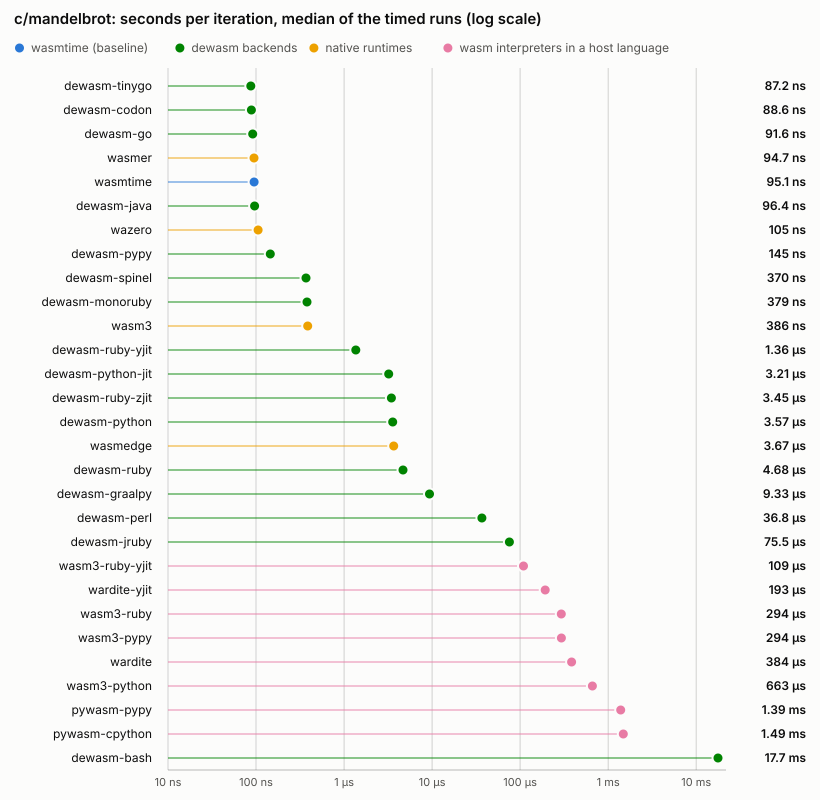
</picture>

Full numbers for <code>c/mandelbrot</code>

| Runner | Iterations | ns/op (min) | ns/op (median) | Cold start `t(0)` | Total `t(N)` | vs wasmtime | Load |
| --- | --- | --- | --- | --- | --- | --- | --- |
| `wasmtime` | 2 296 534 | 94.8 | 94.7 | 7.6 ms | 225.3 ms | 1.00x | — |
| `wasmer` | 3 189 797 | 94.3 | 94.4 | 9.5 ms | 310.4 ms | 1.00x | — |
| `wasmedge` | 59 621 | 3761 | 3784 | 15.6 ms | 239.8 ms | 40x | — |
| `wazero` | 2 788 930 | 105.8 | 106.3 | 5.5 ms | 300.7 ms | 1.12x | — |
| `wasm3` | 673 890 | 448.4 | 450.0 | 4.9 ms | 307.1 ms | 4.73x | — |
| `dewasm-ruby` | 41 827 | 4435 | 4442 | 37.2 ms | 222.7 ms | 47x | — |
| `dewasm-ruby-yjit` | 45 698 | 4408 | 4420 | 37.4 ms | 238.9 ms | 47x | — |
| `dewasm-ruby-zjit` | 48 422 | 4434 | 4429 | 37.4 ms | 252.1 ms | 47x | — |
| `dewasm-python` | 65 536 | 3540 | 3549 | 28.6 ms | 260.6 ms | 37x | — |
| `dewasm-pypy` | 2 072 024 | 139.7 | 140.2 | 37.6 ms | 327.1 ms | 1.47x | — |
| `dewasm-perl` | 5 479 | 54913 | 55323 | 11.1 ms | 312.0 ms | 579x | — |
| `dewasm-go` | 905 207 | 232.5 | 232.9 | 3.1 ms | 213.6 ms | 2.45x | — |
| `dewasm-java` | 2 833 577 | 95.1 | 95.8 | 61.8 ms | 331.4 ms | 1.00x | — |
| `dewasm-bash` | 208 | 16977683 | 17024387 | 12.5 ms | 3.54 s | 179113x | — |
| `pywasm-cpython` | 256 | 1445249 | 1452877 | 44.5 ms | 414.5 ms | 15247x | 0.9 ms |
| `pywasm-pypy` | 102 | 1846056 | 1845232 | 74.9 ms | 263.2 ms | 19476x | 4.9 ms |
| `wardite` | 670 | 370178 | 372797 | 50.1 ms | 298.1 ms | 3905x | 3.6 ms |
| `wardite-yjit` | 1 451 | 177756 | 178692 | 95.1 ms | 353.0 ms | 1875x | 9.1 ms |

#### `c/sha256`

<picture>
  <source media="(prefers-color-scheme: dark)" srcset="figs/c-sha256-dark.svg">
  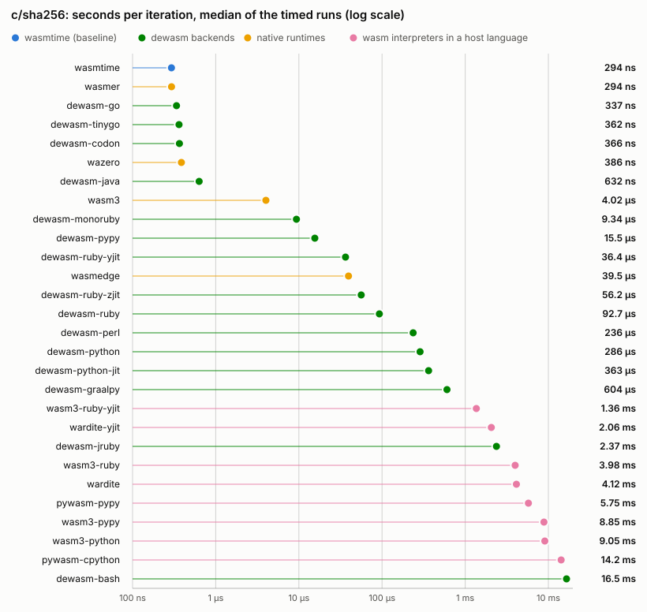
</picture>

Full numbers for <code>c/sha256</code>

| Runner | Iterations | ns/op (min) | ns/op (median) | Cold start `t(0)` | Total `t(N)` | vs wasmtime | Load |
| --- | --- | --- | --- | --- | --- | --- | --- |
| `wasmtime` | 1 045 402 | 288.7 | 289.0 | 6.2 ms | 308.0 ms | 1.00x | — |
| `wasmer` | 1 012 616 | 288.5 | 289.0 | 9.3 ms | 301.5 ms | 1.00x | — |
| `wasmedge` | 7 200 | 41252 | 41510 | 15.5 ms | 312.5 ms | 143x | — |
| `wazero` | 802 468 | 373.6 | 374.3 | 5.8 ms | 305.6 ms | 1.29x | — |
| `wasm3` | 59 828 | 4969 | 4996 | 4.8 ms | 302.1 ms | 17x | — |
| `dewasm-ruby` | 3 879 | 77951 | 78307 | 37.3 ms | 339.6 ms | 270x | — |
| `dewasm-ruby-yjit` | 4 902 | 47868 | 48340 | 37.6 ms | 272.3 ms | 166x | — |
| `dewasm-ruby-zjit` | 4 460 | 52258 | 52190 | 37.6 ms | 270.7 ms | 181x | — |
| `dewasm-python` | 1 130 | 264716 | 266828 | 28.5 ms | 327.7 ms | 917x | — |
| `dewasm-pypy` | 13 124 | 14150 | 14249 | 39.3 ms | 225.0 ms | 49x | — |
| `dewasm-perl` | 913 | 316339 | 317578 | 11.5 ms | 300.3 ms | 1096x | — |
| `dewasm-go` | 619 024 | 341.2 | 342.2 | 4.2 ms | 215.4 ms | 1.18x | — |
| `dewasm-java` | 661 058 | 461.1 | 464.7 | 58.9 ms | 363.7 ms | 1.60x | — |
| `dewasm-bash` | 21 | 13415361 | 13491083 | 14.4 ms | 296.1 ms | 46468x | — |
| `pywasm-cpython` | 19 | 14237537 | 14261568 | 44.8 ms | 315.3 ms | 49316x | 1.3 ms |
| `pywasm-pypy` | 28 | 6953801 | 6947685 | 82.0 ms | 276.7 ms | 24087x | 7.2 ms |
| `wardite` | 62 | 4022305 | 4089675 | 50.6 ms | 299.9 ms | 13933x | 3.8 ms |
| `wardite-yjit` | 136 | 1866015 | 1864172 | 96.0 ms | 349.7 ms | 6464x | 9.1 ms |

#### `c/wordcount`

<picture>
  <source media="(prefers-color-scheme: dark)" srcset="figs/c-wordcount-dark.svg">
  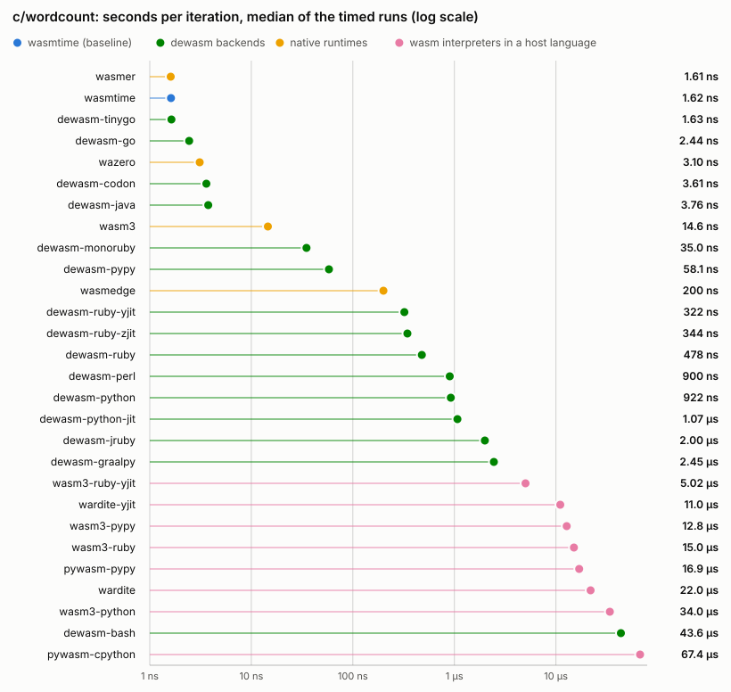
</picture>

Full numbers for <code>c/wordcount</code>

| Runner | Iterations | ns/op (min) | ns/op (median) | Cold start `t(0)` | Total `t(N)` | vs wasmtime | Load |
| --- | --- | --- | --- | --- | --- | --- | --- |
| `wasmtime` | 157 637 187 | 1.65 | 1.67 | 6.4 ms | 266.8 ms | 1.00x | — |
| `wasmer` | 179 760 700 | 1.63 | 1.68 | 9.3 ms | 303.1 ms | 0.99x | — |
| `wasmedge` | 1 320 980 | 202.0 | 202.8 | 16.4 ms | 283.3 ms | 122x | — |
| `wazero` | 100 143 883 | 2.99 | 2.99 | 6.2 ms | 305.5 ms | 1.81x | — |
| `wasm3` | 16 777 216 | 20.4 | 20.5 | 5.0 ms | 347.6 ms | 12x | — |
| `dewasm-ruby` | 762 010 | 404.2 | 409.3 | 38.6 ms | 346.7 ms | 245x | — |
| `dewasm-ruby-yjit` | 1 046 821 | 270.8 | 272.1 | 39.1 ms | 322.6 ms | 164x | — |
| `dewasm-ruby-zjit` | 958 667 | 292.7 | 293.5 | 39.5 ms | 320.1 ms | 177x | — |
| `dewasm-python` | 344 306 | 875.9 | 887.5 | 32.5 ms | 334.0 ms | 530x | — |
| `dewasm-pypy` | 4 966 832 | 55.9 | 56.3 | 43.0 ms | 320.8 ms | 34x | — |
| `dewasm-perl` | 202 952 | 1461 | 1465 | 19.2 ms | 315.8 ms | 885x | — |
| `dewasm-go` | 85 795 492 | 2.40 | 2.44 | 3.7 ms | 210.0 ms | 1.46x | — |
| `dewasm-java` | 56 691 018 | 3.49 | 3.48 | 63.6 ms | 261.3 ms | 2.11x | — |
| `dewasm-bash` | 5 647 | 36534 | 36882 | 109.3 ms | 315.6 ms | 22118x | — |
| `pywasm-cpython` | 4 741 | 57794 | 58903 | 278.1 ms | 552.1 ms | 34989x | 1.3 ms |
| `pywasm-pypy` | 12 594 | 15099 | 15299 | 184.6 ms | 374.7 ms | 9141x | 7.6 ms |
| `wardite` | 15 874 | 20463 | 20510 | 117.2 ms | 442.0 ms | 12388x | 3.8 ms |
| `wardite-yjit` | 25 217 | 9599 | 9682 | 134.0 ms | 376.1 ms | 5811x | 9.1 ms |

#### `wat/call_direct`

<picture>
  <source media="(prefers-color-scheme: dark)" srcset="figs/wat-call-direct-dark.svg">
  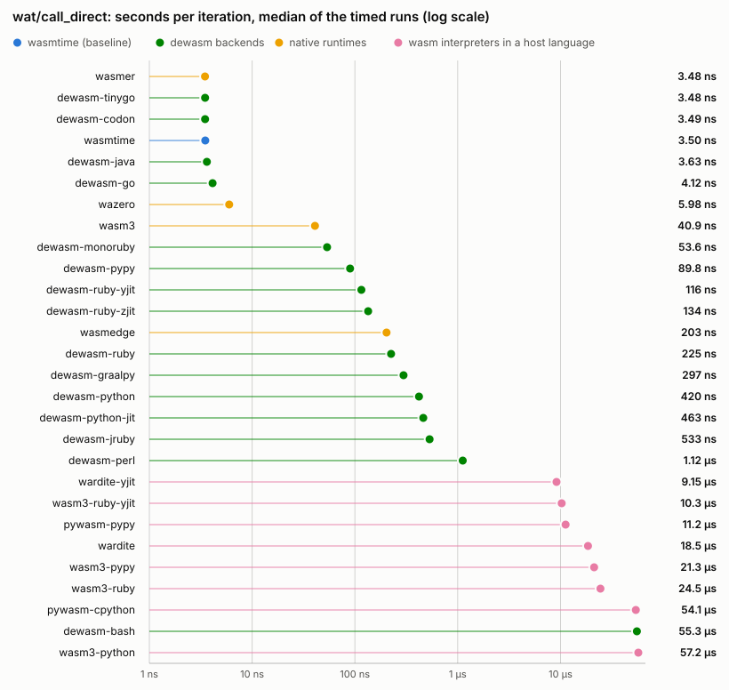
</picture>

Full numbers for <code>wat/call_direct</code>

| Runner | Iterations | ns/op (min) | ns/op (median) | Cold start `t(0)` | Total `t(N)` | vs wasmtime | Load |
| --- | --- | --- | --- | --- | --- | --- | --- |
| `wasmtime` | 86 184 820 | 3.48 | 3.48 | 6.5 ms | 306.6 ms | 1.00x | — |
| `wasmer` | 87 149 968 | 3.44 | 3.47 | 9.0 ms | 308.7 ms | 0.99x | — |
| `wasmedge` | 1 483 241 | 204.3 | 205.1 | 16.8 ms | 319.8 ms | 59x | — |
| `wazero` | 50 774 272 | 5.90 | 5.94 | 5.6 ms | 305.1 ms | 1.69x | — |
| `wasm3` | 6 877 712 | 49.0 | 49.3 | 5.2 ms | 342.1 ms | 14x | — |
| `dewasm-ruby` | 1 371 297 | 201.5 | 203.6 | 37.8 ms | 314.2 ms | 58x | — |
| `dewasm-ruby-yjit` | 1 700 601 | 106.7 | 107.5 | 37.7 ms | 219.2 ms | 31x | — |
| `dewasm-ruby-zjit` | 1 902 474 | 123.4 | 124.5 | 37.4 ms | 272.1 ms | 35x | — |
| `dewasm-python` | 738 780 | 413.7 | 414.2 | 27.7 ms | 333.3 ms | 119x | — |
| `dewasm-pypy` | 3 392 380 | 88.0 | 88.7 | 37.6 ms | 336.2 ms | 25x | — |
| `dewasm-perl` | 276 263 | 1095 | 1098 | 11.1 ms | 313.5 ms | 314x | — |
| `dewasm-go` | 55 884 932 | 4.05 | 4.07 | 3.7 ms | 230.2 ms | 1.16x | — |
| `dewasm-java` | 57 779 650 | 3.55 | 3.54 | 62.3 ms | 267.5 ms | 1.02x | — |
| `dewasm-bash` | 5 883 | 47041 | 47060 | 12.0 ms | 288.7 ms | 13508x | — |
| `pywasm-cpython` | 5 242 | 48190 | 49017 | 43.9 ms | 296.5 ms | 13838x | 0.7 ms |
| `pywasm-pypy` | 28 000 | 8716 | 8871 | 73.9 ms | 317.9 ms | 2503x | 3.4 ms |
| `wardite` | 13 135 | 17580 | 17905 | 50.4 ms | 281.3 ms | 5048x | 3.5 ms |
| `wardite-yjit` | 36 475 | 8076 | 8129 | 96.0 ms | 390.5 ms | 2319x | 8.9 ms |

#### `wat/call_indirect`

<picture>
  <source media="(prefers-color-scheme: dark)" srcset="figs/wat-call-indirect-dark.svg">
  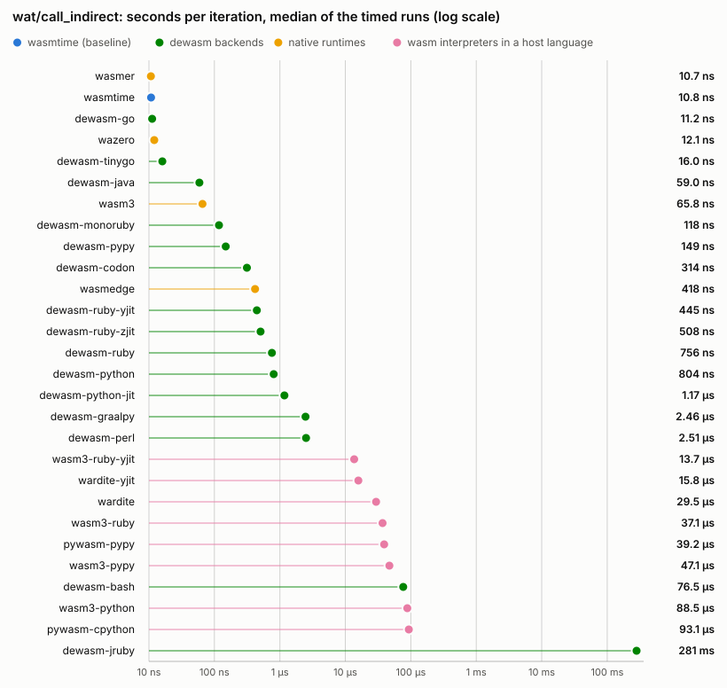
</picture>

Full numbers for <code>wat/call_indirect</code>

| Runner | Iterations | ns/op (min) | ns/op (median) | Cold start `t(0)` | Total `t(N)` | vs wasmtime | Load |
| --- | --- | --- | --- | --- | --- | --- | --- |
| `wasmtime` | 33 554 432 | 10.3 | 10.4 | 6.0 ms | 353.0 ms | 1.00x | — |
| `wasmer` | 33 554 432 | 10.3 | 10.3 | 9.1 ms | 354.4 ms | 1.00x | — |
| `wasmedge` | 730 531 | 414.4 | 416.4 | 16.3 ms | 319.0 ms | 40x | — |
| `wazero` | 16 777 216 | 11.7 | 11.8 | 5.8 ms | 202.8 ms | 1.14x | — |
| `wasm3` | 4 244 635 | 68.4 | 69.4 | 4.9 ms | 295.1 ms | 6.61x | — |
| `dewasm-ruby` | 441 211 | 657.4 | 657.5 | 37.4 ms | 327.5 ms | 64x | — |
| `dewasm-ruby-yjit` | 674 449 | 401.5 | 406.9 | 37.6 ms | 308.4 ms | 39x | — |
| `dewasm-ruby-zjit` | 573 612 | 459.9 | 469.1 | 37.4 ms | 301.1 ms | 44x | — |
| `dewasm-python` | 362 583 | 776.5 | 777.3 | 27.9 ms | 309.4 ms | 75x | — |
| `dewasm-pypy` | 1 981 557 | 135.2 | 136.2 | 38.0 ms | 306.0 ms | 13x | — |
| `dewasm-perl` | 131 072 | 2429 | 2436 | 11.4 ms | 329.7 ms | 235x | — |
| `dewasm-go` | 16 777 216 | 10.6 | 10.7 | 4.6 ms | 182.3 ms | 1.02x | — |
| `dewasm-java` | 3 700 208 | 54.5 | 56.4 | 62.4 ms | 263.9 ms | 5.27x | — |
| `dewasm-bash` | 4 385 | 64496 | 65394 | 12.3 ms | 295.1 ms | 6238x | — |
| `pywasm-cpython` | 2 427 | 80819 | 80602 | 43.0 ms | 239.2 ms | 7817x | 0.7 ms |
| `pywasm-pypy` | 9 308 | 23642 | 23791 | 74.3 ms | 294.4 ms | 2287x | 4.1 ms |
| `wardite` | 8 108 | 27262 | 27382 | 50.9 ms | 271.9 ms | 2637x | 3.6 ms |
| `wardite-yjit` | 16 995 | 13553 | 13829 | 95.6 ms | 325.9 ms | 1311x | 8.3 ms |

#### `wat/f64_alu`

<picture>
  <source media="(prefers-color-scheme: dark)" srcset="figs/wat-f64-alu-dark.svg">
  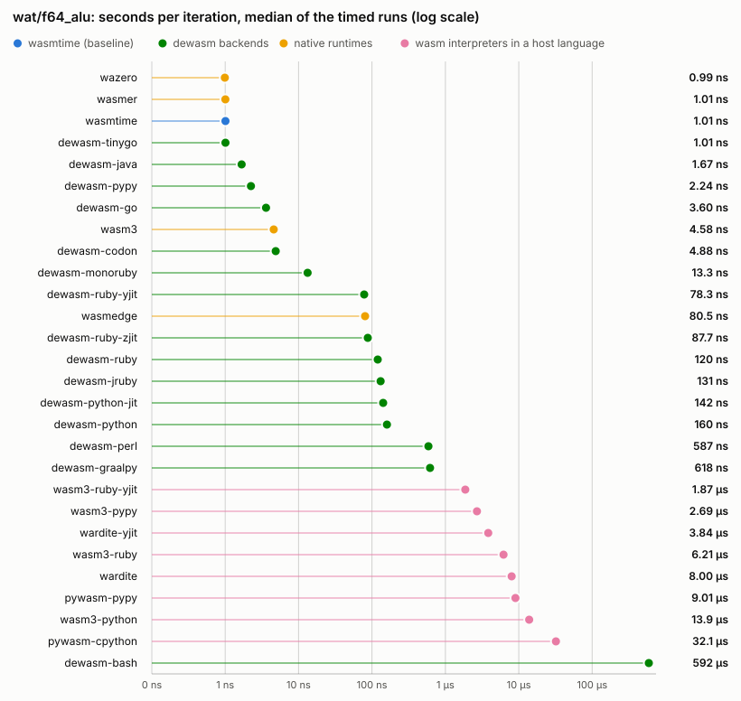
</picture>

Full numbers for <code>wat/f64_alu</code>

| Runner | Iterations | ns/op (min) | ns/op (median) | Cold start `t(0)` | Total `t(N)` | vs wasmtime | Load |
| --- | --- | --- | --- | --- | --- | --- | --- |
| `wasmtime` | 308 263 040 | 0.97 | 0.97 | 5.9 ms | 303.6 ms | 1.00x | — |
| `wasmer` | 308 031 142 | 0.97 | 0.97 | 9.1 ms | 306.5 ms | 1.00x | — |
| `wasmedge` | 3 577 591 | 81.5 | 81.7 | 16.2 ms | 307.9 ms | 84x | — |
| `wazero` | 313 546 425 | 0.96 | 0.96 | 5.8 ms | 305.6 ms | 0.99x | — |
| `wasm3` | 55 763 037 | 5.41 | 5.41 | 4.8 ms | 306.5 ms | 5.60x | — |
| `dewasm-ruby` | 2 853 475 | 102.1 | 102.1 | 36.8 ms | 328.3 ms | 106x | — |
| `dewasm-ruby-yjit` | 3 047 651 | 76.1 | 76.8 | 37.7 ms | 269.6 ms | 79x | — |
| `dewasm-ruby-zjit` | 2 871 394 | 81.9 | 82.4 | 37.6 ms | 272.9 ms | 85x | — |
| `dewasm-python` | 1 847 927 | 151.3 | 151.3 | 28.1 ms | 307.7 ms | 157x | — |
| `dewasm-pypy` | 132 532 820 | 2.12 | 2.13 | 37.8 ms | 318.8 ms | 2.20x | — |
| `dewasm-perl` | 371 789 | 821.8 | 824.4 | 15.6 ms | 321.1 ms | 851x | — |
| `dewasm-go` | 63 778 820 | 3.46 | 3.45 | 3.4 ms | 223.8 ms | 3.58x | — |
| `dewasm-java` | 178 763 105 | 1.61 | 1.61 | 62.5 ms | 350.7 ms | 1.67x | — |
| `dewasm-bash` | 593 | 496847 | 498237 | 12.8 ms | 307.4 ms | 514426x | — |
| `pywasm-cpython` | 9 415 | 28658 | 28639 | 43.9 ms | 313.8 ms | 29672x | 0.6 ms |
| `pywasm-pypy` | 29 532 | 6609 | 6686 | 73.5 ms | 268.7 ms | 6843x | 3.2 ms |
| `wardite` | 39 492 | 7398 | 7467 | 50.3 ms | 342.5 ms | 7660x | 3.7 ms |
| `wardite-yjit` | 83 936 | 3473 | 3499 | 96.7 ms | 388.2 ms | 3596x | 8.2 ms |

#### `wat/i32_alu`

<picture>
  <source media="(prefers-color-scheme: dark)" srcset="figs/wat-i32-alu-dark.svg">
  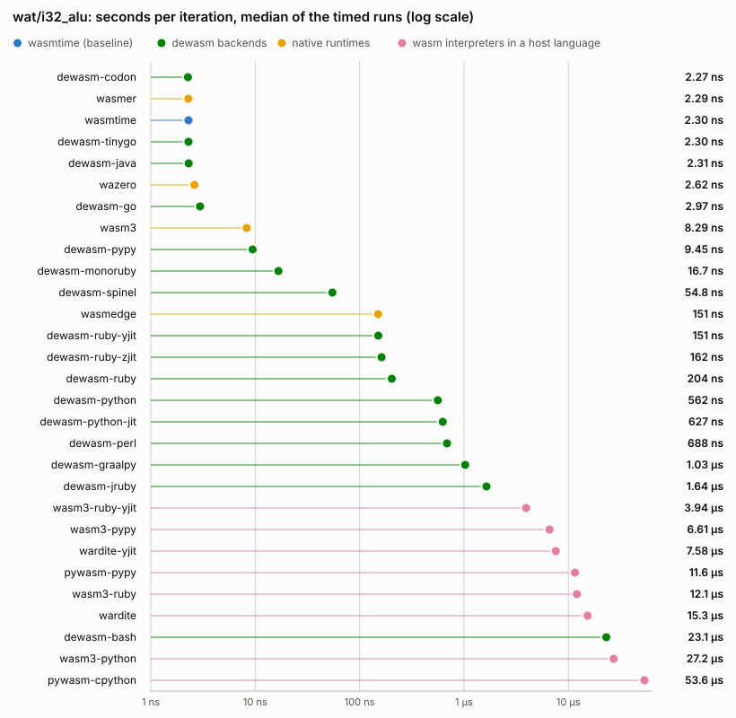
</picture>

Full numbers for <code>wat/i32_alu</code>

| Runner | Iterations | ns/op (min) | ns/op (median) | Cold start `t(0)` | Total `t(N)` | vs wasmtime | Load |
| --- | --- | --- | --- | --- | --- | --- | --- |
| `wasmtime` | 130 673 147 | 2.29 | 2.30 | 5.9 ms | 305.3 ms | 1.00x | — |
| `wasmer` | 125 657 518 | 2.34 | 2.36 | 10.0 ms | 303.5 ms | 1.02x | — |
| `wasmedge` | 2 753 954 | 157.9 | 157.9 | 16.7 ms | 451.6 ms | 69x | — |
| `wazero` | 115 619 881 | 2.65 | 2.68 | 5.8 ms | 312.7 ms | 1.16x | — |
| `wasm3` | 16 131 938 | 12.8 | 12.9 | 4.9 ms | 211.8 ms | 5.60x | — |
| `dewasm-ruby` | 1 593 876 | 180.6 | 182.4 | 36.9 ms | 324.7 ms | 79x | — |
| `dewasm-ruby-yjit` | 1 824 076 | 137.2 | 138.9 | 36.7 ms | 286.9 ms | 60x | — |
| `dewasm-ruby-zjit` | 1 748 235 | 148.6 | 149.5 | 37.3 ms | 297.0 ms | 65x | — |
| `dewasm-python` | 520 156 | 557.1 | 557.8 | 27.4 ms | 317.2 ms | 243x | — |
| `dewasm-pypy` | 29 450 684 | 9.43 | 9.42 | 38.3 ms | 316.0 ms | 4.12x | — |
| `dewasm-perl` | 441 655 | 680.4 | 684.0 | 11.1 ms | 311.6 ms | 297x | — |
| `dewasm-go` | 72 310 665 | 3.03 | 3.02 | 3.4 ms | 222.4 ms | 1.32x | — |
| `dewasm-java` | 94 552 487 | 2.36 | 2.33 | 59.1 ms | 282.1 ms | 1.03x | — |
| `dewasm-bash` | 13 965 | 22020 | 22097 | 12.9 ms | 320.4 ms | 9613x | — |
| `pywasm-cpython` | 5 505 | 52761 | 53405 | 44.5 ms | 335.0 ms | 23033x | 0.7 ms |
| `pywasm-pypy` | 13 808 | 16251 | 16464 | 76.2 ms | 300.6 ms | 7094x | 3.5 ms |
| `wardite` | 16 538 | 14990 | 15050 | 50.0 ms | 297.9 ms | 6544x | 4.3 ms |
| `wardite-yjit` | 30 797 | 6832 | 6867 | 94.6 ms | 305.0 ms | 2983x | 7.9 ms |

#### `wat/i64_alu`

<picture>
  <source media="(prefers-color-scheme: dark)" srcset="figs/wat-i64-alu-dark.svg">
  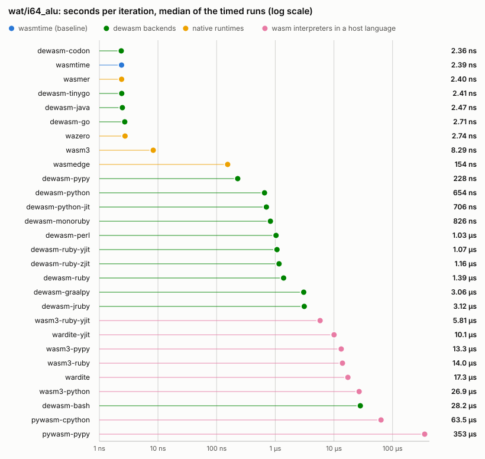
</picture>

Full numbers for <code>wat/i64_alu</code>

| Runner | Iterations | ns/op (min) | ns/op (median) | Cold start `t(0)` | Total `t(N)` | vs wasmtime | Load |
| --- | --- | --- | --- | --- | --- | --- | --- |
| `wasmtime` | 131 618 411 | 2.30 | 2.30 | 6.2 ms | 308.7 ms | 1.00x | — |
| `wasmer` | 130 260 558 | 2.29 | 2.30 | 9.1 ms | 308.0 ms | 1.00x | — |
| `wasmedge` | 1 980 463 | 156.7 | 159.8 | 15.9 ms | 326.3 ms | 68x | — |
| `wazero` | 109 897 127 | 2.63 | 2.66 | 5.8 ms | 294.8 ms | 1.14x | — |
| `wasm3` | 16 777 216 | 12.0 | 12.1 | 5.0 ms | 206.8 ms | 5.24x | — |
| `dewasm-ruby` | 225 605 | 1296 | 1307 | 37.3 ms | 329.6 ms | 564x | — |
| `dewasm-ruby-yjit` | 295 187 | 939.3 | 954.0 | 37.3 ms | 314.6 ms | 409x | — |
| `dewasm-ruby-zjit` | 281 212 | 1019 | 1025 | 37.4 ms | 324.1 ms | 444x | — |
| `dewasm-python` | 444 939 | 611.4 | 631.2 | 28.3 ms | 300.4 ms | 266x | — |
| `dewasm-pypy` | 971 910 | 219.1 | 221.1 | 37.9 ms | 250.8 ms | 95x | — |
| `dewasm-perl` | 305 485 | 993.7 | 996.4 | 11.1 ms | 314.7 ms | 432x | — |
| `dewasm-go` | 82 585 389 | 2.59 | 2.59 | 3.8 ms | 217.5 ms | 1.13x | — |
| `dewasm-java` | 83 499 022 | 2.34 | 2.33 | 63.6 ms | 258.6 ms | 1.02x | — |
| `dewasm-bash` | 11 101 | 24217 | 24316 | 13.4 ms | 282.3 ms | 10539x | — |
| `pywasm-cpython` | 4 508 | 56570 | 56562 | 43.0 ms | 298.0 ms | 24619x | 0.7 ms |
| `pywasm-pypy` | 512 | 354804 | 358787 | 77.7 ms | 259.3 ms | 154413x | 3.4 ms |
| `wardite` | 19 188 | 16042 | 16277 | 50.2 ms | 358.0 ms | 6982x | 3.5 ms |
| `wardite-yjit` | 33 710 | 8814 | 8906 | 94.1 ms | 391.2 ms | 3836x | 8.5 ms |

#### `wat/mem_rw`

<picture>
  <source media="(prefers-color-scheme: dark)" srcset="figs/wat-mem-rw-dark.svg">
  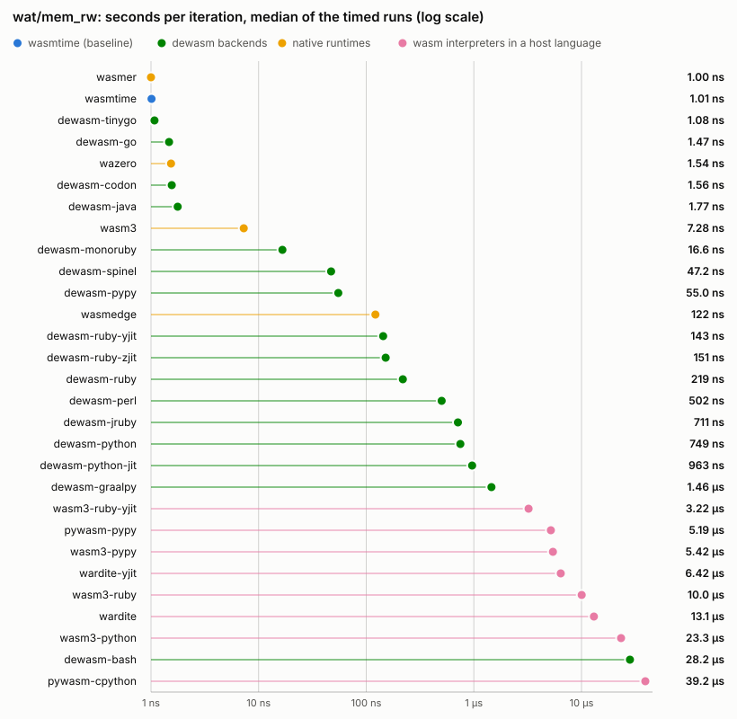
</picture>

Full numbers for <code>wat/mem_rw</code>

| Runner | Iterations | ns/op (min) | ns/op (median) | Cold start `t(0)` | Total `t(N)` | vs wasmtime | Load |
| --- | --- | --- | --- | --- | --- | --- | --- |
| `wasmtime` | 312 876 423 | 0.98 | 0.99 | 7.2 ms | 315.3 ms | 1.00x | — |
| `wasmer` | 299 553 254 | 0.99 | 0.99 | 8.8 ms | 304.9 ms | 1.00x | — |
| `wasmedge` | 1 949 460 | 126.5 | 126.9 | 16.3 ms | 263.0 ms | 129x | — |
| `wazero` | 196 106 564 | 1.52 | 1.53 | 5.5 ms | 303.7 ms | 1.54x | — |
| `wasm3` | 33 554 432 | 9.99 | 10.0 | 4.9 ms | 340.2 ms | 10x | — |
| `dewasm-ruby` | 1 673 508 | 174.0 | 175.5 | 37.0 ms | 328.2 ms | 177x | — |
| `dewasm-ruby-yjit` | 2 248 511 | 130.0 | 130.7 | 37.7 ms | 330.1 ms | 132x | — |
| `dewasm-ruby-zjit` | 2 030 148 | 138.4 | 139.9 | 37.6 ms | 318.5 ms | 140x | — |
| `dewasm-python` | 384 461 | 732.5 | 741.9 | 27.7 ms | 309.3 ms | 744x | — |
| `dewasm-pypy` | 5 536 715 | 52.7 | 53.1 | 38.8 ms | 330.4 ms | 53x | — |
| `dewasm-perl` | 316 931 | 960.9 | 964.0 | 10.9 ms | 315.4 ms | 976x | — |
| `dewasm-go` | 149 028 696 | 1.48 | 1.47 | 4.1 ms | 224.2 ms | 1.50x | — |
| `dewasm-java` | 162 847 521 | 1.75 | 1.73 | 58.9 ms | 343.4 ms | 1.77x | — |
| `dewasm-bash` | 11 586 | 26555 | 26618 | 12.6 ms | 320.2 ms | 26965x | — |
| `pywasm-cpython` | 8 415 | 38144 | 38136 | 44.1 ms | 365.1 ms | 38734x | 0.7 ms |
| `pywasm-pypy` | 16 194 | 10335 | 10439 | 74.3 ms | 241.7 ms | 10495x | 4.4 ms |
| `wardite` | 15 360 | 12976 | 13184 | 50.2 ms | 249.5 ms | 13177x | 3.9 ms |
| `wardite-yjit` | 36 555 | 5909 | 5942 | 94.1 ms | 310.1 ms | 6001x | 8.4 ms |

### Application benchmarks

Seconds per **run** of a real cached program on fixed input.
Every runner executes the same work, so wall times compare directly.

#### `app/cowsay`

<picture>
  <source media="(prefers-color-scheme: dark)" srcset="figs/app-cowsay-dark.svg">
  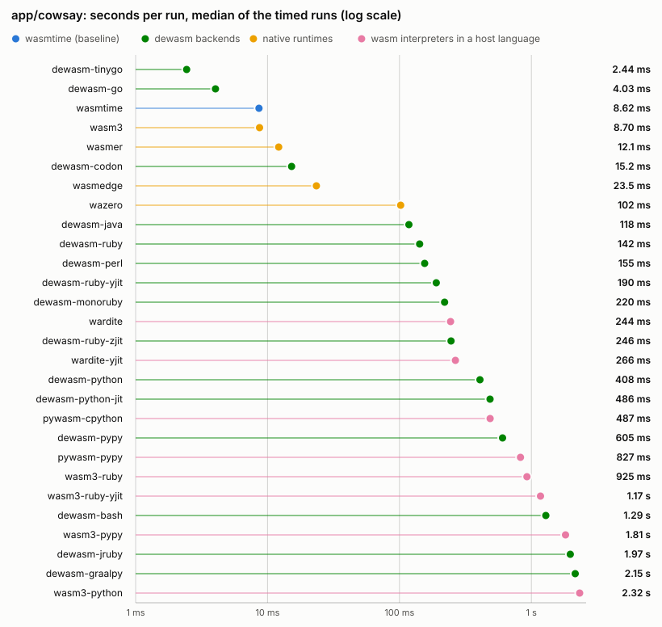
</picture>

Full numbers for <code>app/cowsay</code>

| Runner | Runs/sample | Wall time (min) | Wall time (median) | vs wasmtime | Load |
| --- | --- | --- | --- | --- | --- |
| `wasmtime` | 24 | 10.7 ms | 10.8 ms | 1.00x | — |
| `wasmer` | 17 | 14.5 ms | 15.2 ms | 1.36x | — |
| `wasmedge` | 11 | 27.0 ms | 27.6 ms | 2.53x | — |
| `wazero` | 3 | 104.5 ms | 104.8 ms | 9.80x | — |
| `wasm3` | 35 | 7.7 ms | 8.0 ms | 0.72x | — |
| `dewasm-ruby` | 3 | 135.9 ms | 136.7 ms | 13x | — |
| `dewasm-ruby-yjit` | 2 | 179.8 ms | 182.5 ms | 17x | — |
| `dewasm-ruby-zjit` | 2 | 236.6 ms | 239.0 ms | 22x | — |
| `dewasm-python` | 1 | 408.6 ms | 409.4 ms | 38x | — |
| `dewasm-pypy` | 1 | 604.0 ms | 604.7 ms | 57x | — |
| `dewasm-perl` | 3 | 106.3 ms | 106.4 ms | 9.96x | — |
| `dewasm-go` | 1 | 5.5 ms | 6.0 ms | 0.52x | — |
| `dewasm-java` | 3 | 123.0 ms | 124.3 ms | 12x | — |
| `dewasm-bash` | 1 | 1.11 s | 1.11 s | 104x | — |
| `pywasm-cpython` | 1 | 482.4 ms | 484.8 ms | 45x | 274.7 ms |
| `pywasm-pypy` | 1 | 819.0 ms | 828.8 ms | 77x | 444.4 ms |
| `wardite` | 2 | 226.8 ms | 228.7 ms | 21x | 107.9 ms |
| `wardite-yjit` | 2 | 250.9 ms | 253.0 ms | 24x | 77.8 ms |

#### `app/sqlite3_query`

<picture>
  <source media="(prefers-color-scheme: dark)" srcset="figs/app-sqlite3-query-dark.svg">
  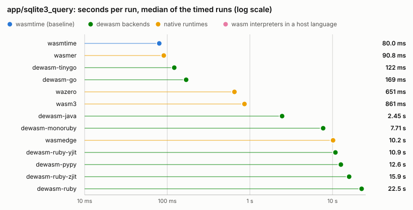
</picture>

Full numbers for <code>app/sqlite3_query</code>

| Runner | Runs/sample | Wall time (min) | Wall time (median) | vs wasmtime | Load |
| --- | --- | --- | --- | --- | --- |
| `wasmtime` | 3 | 75.4 ms | 75.5 ms | 1.00x | — |
| `wasmer` | 3 | 84.8 ms | 85.1 ms | 1.12x | — |
| `wasmedge` | 1 | 9.47 s | 9.55 s | 126x | — |
| `wazero` | 1 | 614.6 ms | 621.2 ms | 8.15x | — |
| `wasm3` | 1 | 891.0 ms | 1.07 s | 12x | — |
| `dewasm-ruby` | 1 | 18.67 s | 18.73 s | 248x | — |
| `dewasm-ruby-yjit` | 1 | 8.87 s | 8.88 s | 118x | — |
| `dewasm-ruby-zjit` | 1 | 13.46 s | 13.52 s | 179x | — |
| `dewasm-python` | 1 | 53.60 s | 53.68 s | 711x | — |
| `dewasm-pypy` | 1 | 11.42 s | 11.48 s | 152x | — |
| `dewasm-perl` | 1 | 108.08 s | 108.46 s | 1434x | — |
| `dewasm-go` | 1 | 169.5 ms | 169.8 ms | 2.25x | — |
| `dewasm-java` | 1 | 2.30 s | 2.31 s | 31x | — |

## Not measured

Every pair the suite did not measure, and why.
A missing runner or an unbuilt module is stated here rather than left as a gap in the tables above.

| Workload | Runner | Reason |
| --- | --- | --- |
| `app/sqlite3_query` | `dewasm-bash` | excluded: bash runs ~10000x slower than wasmtime on compute, so 100k SQL inserts do not finish in a practical time |
| `app/sqlite3_query` | `pywasm-cpython` | excluded on cost, not capability: pywasm runs this program correctly (byte-identical to wasmtime under -batch) at ~17.9 ms/row: measured 358 s at 20k rows, so the 100k-row script needs roughly half an hour per sample |
| `app/sqlite3_query` | `pywasm-pypy` | excluded on cost, not capability: pywasm runs this program correctly (byte-identical to wasmtime under -batch) at ~17.9 ms/row: measured 358 s at 20k rows, so the 100k-row script needs roughly half an hour per sample |
| `app/sqlite3_query` | `wardite` | excluded: wardite loads sqlite3-shell.wasm but cannot execute a query, raising Wardite::EvalError ("maybe empty or invalid stack", convert.generated.rb:200) as soon as any SQL runs |
| `app/sqlite3_query` | `wardite-yjit` | excluded: wardite loads sqlite3-shell.wasm but cannot execute a query, raising Wardite::EvalError ("maybe empty or invalid stack", convert.generated.rb:200) as soon as any SQL runs |

