# Benchmarks

<!-- AUTO-GENERATED by `cargo xtask render-speed`; do not edit by hand. Unlike docs/support.md there is no freshness test: timings are not reproducible byte-for-byte, so this file is a dated measurement, not a compared snapshot. -->

Measured performance of dewasm-generated code, taken on one host on one day.
It is compared against wasm runtimes and same-language wasm interpreters.
How to run and read these measurements is [README.md](README.md).

## Environment

Measured 2026-10-04T17:43:54Z.

| | |
| --- | --- |
| OS | macOS 27.0.1 |
| Kernel | Darwin 27.0.0 |
| CPU | Apple M1 Pro |
| Architecture | aarch64 |

Version strings are captured by executing each runtime.
A runner missing from this table was unavailable on this host; its cells appear under [Not measured](#not-measured).

| Runner | Version |
| --- | --- |
| `wasmtime` | `wasmtime 49.0.2 (3c8a3e79a 2026-10-02)` |
| `wasmer` | `wasmer 7.5.0` |
| `wasmedge` | `wasmedge version 0.17.2` |
| `wazero` | `1.12.0` |
| `wasm3` | `Wasm3 v0.9.1-beta.1 on arm64-v8a` |
| `dewasm-ruby` | `ruby 4.0.7 (2026-09-15 revision 229531a6cf) +PRISM [arm64-darwin25]` |
| `dewasm-ruby-yjit` | `ruby 4.0.7 (2026-09-15 revision 229531a6cf) +PRISM [arm64-darwin25]` |
| `dewasm-ruby-zjit` | `ruby 4.0.7 (2026-09-15 revision 229531a6cf) +PRISM [arm64-darwin25]` |
| `dewasm-monoruby` | `monoruby 0.3.0 (revision 27e6e7f8e5) [arm64-darwin25]` |
| `dewasm-jruby` | `jruby 10.1.2.0 (4.0.0) 2026-09-30 c6d2b769d0 OpenJDK 64-Bit Server VM 25.0.4.1+1-LTS on 25.0.4.1+1-LTS +indy +jit [arm64-darwin]` |
| `dewasm-spinel` | `spinel 2026.09.12+4866 (cb2b080eb) [apple clang 21.0.0 (cc)]` |
| `dewasm-python` | `Python 3.14.8 (main, Oct  3 2026, 00:54:40) [Clang 22.1.3 ]` |
| `dewasm-python-jit` | `Python 3.14.8 (main, Oct  3 2026, 00:54:40) [Clang 22.1.3 ]` |
| `dewasm-pypy` | `Python 3.11.16 (78565394c9b5, Oct 02 2026, 19:09:04)` |
| `dewasm-graalpy` | `GraalPy 3.12.8 (Oracle GraalVM Native 25.0.3)` |
| `dewasm-perl` | `v5.44.0` |
| `dewasm-go` | `go version go1.27.1 darwin/arm64` |
| `dewasm-tinygo` | `tinygo version 0.42.0 darwin/arm64 (using go version go1.27.1 and LLVM version 22.1.4)` |
| `dewasm-java` | `openjdk version "25.0.4.1" 2026-08-18 LTS` |
| `dewasm-codon` | `0.20.1` |
| `dewasm-bash` | `5.3.20(1)-release` |
| `wasm3-ruby` | `Wasm3 v0.9.0 on wasm` |
| `wasm3-ruby-yjit` | `Wasm3 v0.9.0 on wasm` |
| `wasm3-python` | `Wasm3 v0.9.0 on wasm` |
| `wasm3-pypy` | `Wasm3 v0.9.0 on wasm` |
| `pywasm-cpython` | `pywasm 2.2.3` |
| `pywasm-pypy` | `pywasm 2.2.3` |
| `wardite` | `wardite 0.9.0` |
| `wardite-yjit` | `wardite 0.9.0` |

## Results

Each workload has a chart with its full numbers folded underneath.
A chart has a log axis in seconds, and its title states the unit.
Color is the runner family.

### Microbenchmarks

Seconds per **iteration**.
Iteration counts are calibrated per runner.
So compare the per-iteration figures, not the raw wall times.

#### `wat/br_table`

<picture>
  <source media="(prefers-color-scheme: dark)" srcset="figs/wat-br-table-dark.svg">
  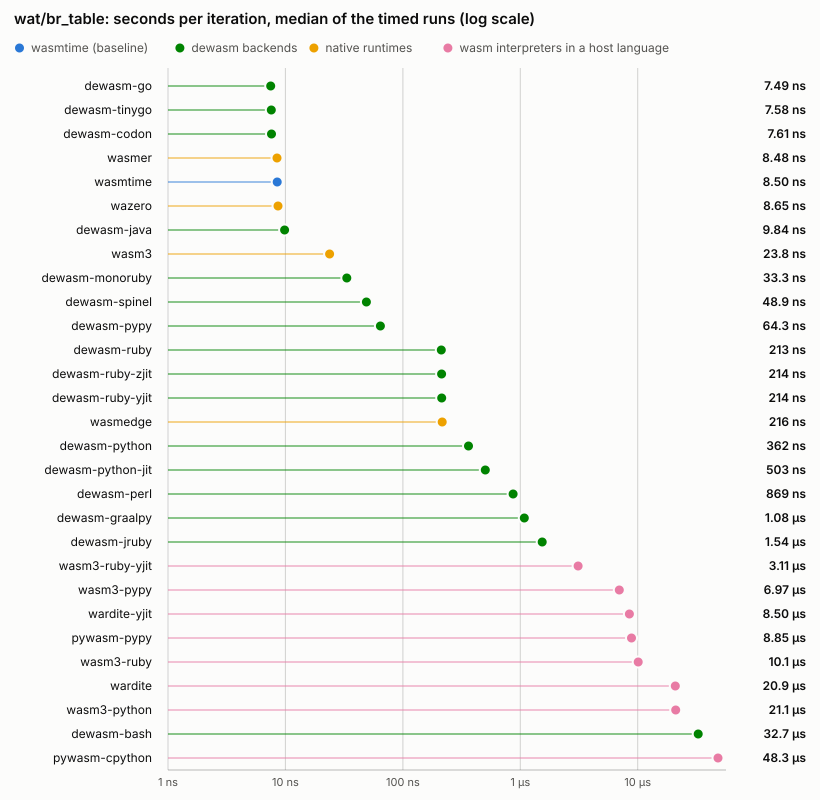
</picture>

Full numbers for <code>wat/br_table</code>

| Runner | Iterations | Minimum `ns/op` | Median `ns/op` | Cold start `t(0)` | Total `t(N)` | vs. `wasmtime` | Load |
| --- | --- | --- | --- | --- | --- | --- | --- |
| `wasmtime` | 35 268 614 | 8.48 | 8.50 | 5.3 ms | 304.4 ms | 1.00x | — |
| `wasmer` | 35 161 129 | 8.47 | 8.48 | 9.5 ms | 307.4 ms | 1.00x | — |
| `wasmedge` | 1 322 898 | 214.9 | 216.2 | 19.4 ms | 303.6 ms | 25x | — |
| `wazero` | 34 542 599 | 8.67 | 8.65 | 5.9 ms | 305.6 ms | 1.02x | — |
| `wasm3` | 12 933 324 | 23.7 | 23.8 | 6.9 ms | 313.6 ms | 2.80x | — |
| `dewasm-ruby` | 846 178 | 212.3 | 212.7 | 35.6 ms | 215.2 ms | 25x | — |
| `dewasm-ruby-yjit` | 1 252 021 | 212.7 | 214.2 | 35.9 ms | 302.2 ms | 25x | — |
| `dewasm-ruby-zjit` | 1 375 749 | 213.5 | 213.8 | 35.8 ms | 329.5 ms | 25x | — |
| `dewasm-monoruby` | 7 559 662 | 33.3 | 33.3 | 30.6 ms | 282.5 ms | 3.93x | — |
| `dewasm-jruby` | 108 960 | 1583 | 1535 | 1.29 s | 1.47 s | 187x | — |
| `dewasm-spinel` | 6 128 120 | 48.9 | 48.9 | 2.3 ms | 301.8 ms | 5.76x | — |
| `dewasm-python` | 815 783 | 360.7 | 361.9 | 17.6 ms | 311.8 ms | 43x | — |
| `dewasm-python-jit` | 655 866 | 499.3 | 503.1 | 17.9 ms | 345.3 ms | 59x | — |
| `dewasm-pypy` | 4 292 268 | 63.9 | 64.3 | 38.3 ms | 312.5 ms | 7.53x | — |
| `dewasm-graalpy` | 286 971 | 1090 | 1082 | 109.6 ms | 422.4 ms | 129x | — |
| `dewasm-perl` | 344 216 | 856.6 | 868.8 | 11.0 ms | 305.8 ms | 101x | — |
| `dewasm-go` | 39 072 955 | 7.46 | 7.49 | 2.5 ms | 294.1 ms | 0.88x | — |
| `dewasm-tinygo` | 38 520 285 | 7.58 | 7.58 | 1.9 ms | 293.7 ms | 0.89x | — |
| `dewasm-java` | 26 443 295 | 9.72 | 9.84 | 56.2 ms | 313.3 ms | 1.15x | — |
| `dewasm-codon` | 39 709 386 | 7.60 | 7.61 | 11.9 ms | 313.7 ms | 0.90x | — |
| `dewasm-bash` | 8 988 | 32457 | 32713 | 12.9 ms | 304.6 ms | 3827x | — |
| `wasm3-ruby` | 53 282 | 9977 | 10095 | 113.3 ms | 644.9 ms | 1176x | — |
| `wasm3-ruby-yjit` | 94 882 | 3048 | 3105 | 312.9 ms | 602.1 ms | 359x | — |
| `wasm3-python` | 13 843 | 21127 | 21061 | 296.0 ms | 588.5 ms | 2491x | — |
| `wasm3-pypy` | 31 932 | 6903 | 6973 | 456.7 ms | 677.1 ms | 814x | — |
| `pywasm-cpython` | 7 296 | 48051 | 48265 | 31.0 ms | 381.6 ms | 5665x | 0.9 ms |
| `pywasm-pypy` | 21 099 | 8779 | 8853 | 73.1 ms | 258.4 ms | 1035x | 4.2 ms |
| `wardite` | 10 863 | 20653 | 20875 | 48.3 ms | 272.6 ms | 2435x | 3.3 ms |
| `wardite-yjit` | 28 231 | 8503 | 8502 | 92.7 ms | 332.8 ms | 1003x | 8.4 ms |

#### `wat/call_direct`

<picture>
  <source media="(prefers-color-scheme: dark)" srcset="figs/wat-call-direct-dark.svg">
  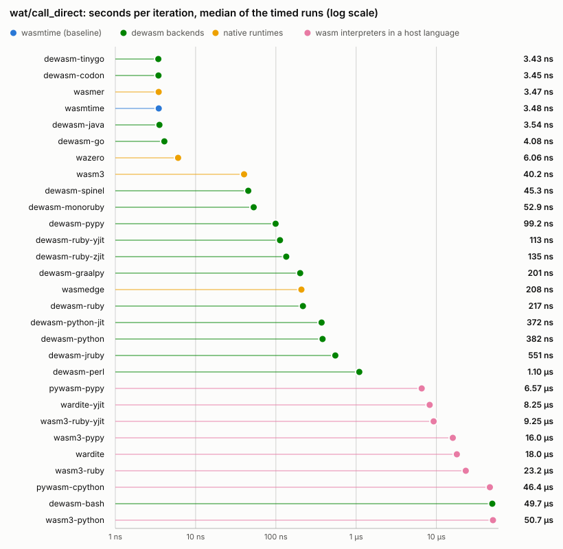
</picture>

Full numbers for <code>wat/call_direct</code>

| Runner | Iterations | Minimum `ns/op` | Median `ns/op` | Cold start `t(0)` | Total `t(N)` | vs. `wasmtime` | Load |
| --- | --- | --- | --- | --- | --- | --- | --- |
| `wasmtime` | 83 675 962 | 3.47 | 3.48 | 4.9 ms | 294.9 ms | 1.00x | — |
| `wasmer` | 83 419 221 | 3.45 | 3.47 | 8.7 ms | 296.1 ms | 0.99x | — |
| `wasmedge` | 1 415 277 | 207.7 | 208.1 | 18.9 ms | 312.9 ms | 60x | — |
| `wazero` | 49 173 209 | 6.05 | 6.06 | 6.0 ms | 303.3 ms | 1.74x | — |
| `wasm3` | 6 544 962 | 40.2 | 40.2 | 7.6 ms | 270.6 ms | 12x | — |
| `dewasm-ruby` | 857 095 | 216.9 | 217.4 | 35.3 ms | 221.2 ms | 63x | — |
| `dewasm-ruby-yjit` | 1 997 845 | 111.9 | 112.5 | 35.5 ms | 259.0 ms | 32x | — |
| `dewasm-ruby-zjit` | 1 829 230 | 131.6 | 134.6 | 35.5 ms | 276.3 ms | 38x | — |
| `dewasm-monoruby` | 4 453 791 | 52.7 | 52.9 | 30.5 ms | 265.2 ms | 15x | — |
| `dewasm-jruby` | 406 925 | 537.2 | 551.3 | 1.30 s | 1.52 s | 155x | — |
| `dewasm-spinel` | 6 576 345 | 45.2 | 45.3 | 2.2 ms | 299.3 ms | 13x | — |
| `dewasm-python` | 784 566 | 380.8 | 381.5 | 17.4 ms | 316.2 ms | 110x | — |
| `dewasm-python-jit` | 812 578 | 369.6 | 371.6 | 17.4 ms | 317.7 ms | 107x | — |
| `dewasm-pypy` | 3 251 880 | 98.3 | 99.2 | 38.1 ms | 357.7 ms | 28x | — |
| `dewasm-graalpy` | 911 604 | 188.1 | 201.0 | 106.4 ms | 277.9 ms | 54x | — |
| `dewasm-perl` | 274 948 | 1093 | 1095 | 11.1 ms | 311.7 ms | 315x | — |
| `dewasm-go` | 74 157 355 | 4.05 | 4.08 | 2.5 ms | 303.0 ms | 1.17x | — |
| `dewasm-tinygo` | 87 792 033 | 3.43 | 3.43 | 1.9 ms | 302.9 ms | 0.99x | — |
| `dewasm-java` | 68 468 081 | 3.54 | 3.54 | 55.8 ms | 298.2 ms | 1.02x | — |
| `dewasm-codon` | 88 086 201 | 3.43 | 3.45 | 12.4 ms | 314.3 ms | 0.99x | — |
| `dewasm-bash` | 5 863 | 49696 | 49721 | 12.7 ms | 304.0 ms | 14337x | — |
| `wasm3-ruby` | 11 773 | 23198 | 23237 | 112.9 ms | 386.0 ms | 6693x | — |
| `wasm3-ruby-yjit` | 21 070 | 9363 | 9247 | 194.7 ms | 391.9 ms | 2701x | — |
| `wasm3-python` | 6 084 | 50612 | 50713 | 291.8 ms | 599.7 ms | 14602x | — |
| `wasm3-pypy` | 17 806 | 15978 | 16013 | 451.9 ms | 736.4 ms | 4610x | — |
| `pywasm-cpython` | 6 206 | 46449 | 46432 | 31.0 ms | 319.3 ms | 13401x | 0.6 ms |
| `pywasm-pypy` | 39 478 | 6528 | 6568 | 72.4 ms | 330.1 ms | 1883x | 2.7 ms |
| `wardite` | 12 224 | 17963 | 17981 | 47.9 ms | 267.5 ms | 5183x | 2.7 ms |
| `wardite-yjit` | 31 535 | 8262 | 8248 | 92.2 ms | 352.8 ms | 2384x | 7.3 ms |

#### `wat/call_indirect`

<picture>
  <source media="(prefers-color-scheme: dark)" srcset="figs/wat-call-indirect-dark.svg">
  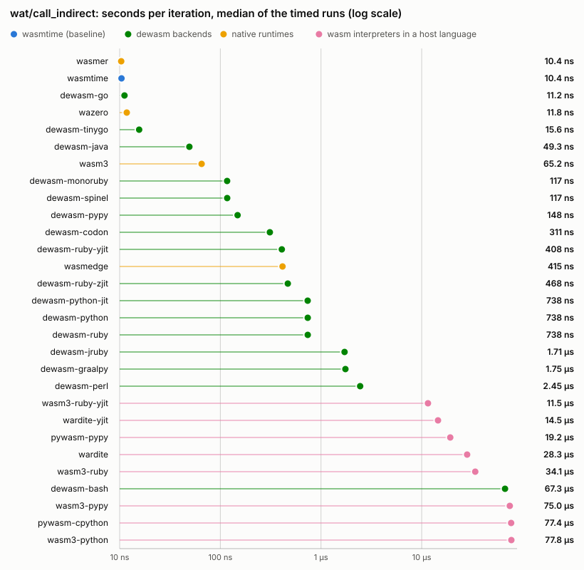
</picture>

Full numbers for <code>wat/call_indirect</code>

| Runner | Iterations | Minimum `ns/op` | Median `ns/op` | Cold start `t(0)` | Total `t(N)` | vs. `wasmtime` | Load |
| --- | --- | --- | --- | --- | --- | --- | --- |
| `wasmtime` | 33 554 432 | 10.4 | 10.4 | 4.8 ms | 353.8 ms | 1.00x | — |
| `wasmer` | 33 554 432 | 10.3 | 10.4 | 8.8 ms | 355.0 ms | 0.99x | — |
| `wasmedge` | 575 721 | 413.8 | 414.7 | 18.9 ms | 257.2 ms | 40x | — |
| `wazero` | 16 777 216 | 11.7 | 11.8 | 5.4 ms | 201.8 ms | 1.13x | — |
| `wasm3` | 4 273 778 | 64.7 | 65.2 | 6.7 ms | 283.4 ms | 6.22x | — |
| `dewasm-ruby` | 398 637 | 737.4 | 738.2 | 35.8 ms | 329.7 ms | 71x | — |
| `dewasm-ruby-yjit` | 682 341 | 408.1 | 408.1 | 35.9 ms | 314.3 ms | 39x | — |
| `dewasm-ruby-zjit` | 604 431 | 471.1 | 467.7 | 36.5 ms | 321.3 ms | 45x | — |
| `dewasm-monoruby` | 2 001 583 | 116.6 | 116.8 | 30.4 ms | 263.7 ms | 11x | — |
| `dewasm-jruby` | 114 910 | 1700 | 1714 | 1.29 s | 1.49 s | 163x | — |
| `dewasm-spinel` | 2 531 759 | 116.8 | 116.9 | 2.1 ms | 297.9 ms | 11x | — |
| `dewasm-python` | 408 365 | 735.4 | 738.2 | 17.5 ms | 317.9 ms | 71x | — |
| `dewasm-python-jit` | 395 392 | 733.4 | 737.7 | 17.7 ms | 307.7 ms | 70x | — |
| `dewasm-pypy` | 1 898 525 | 147.8 | 148.4 | 38.3 ms | 319.0 ms | 14x | — |
| `dewasm-graalpy` | 151 356 | 1776 | 1748 | 106.4 ms | 375.2 ms | 171x | — |
| `dewasm-perl` | 131 072 | 2422 | 2450 | 11.6 ms | 329.0 ms | 233x | — |
| `dewasm-go` | 16 777 216 | 11.1 | 11.2 | 2.6 ms | 188.8 ms | 1.07x | — |
| `dewasm-tinygo` | 16 777 216 | 15.5 | 15.6 | 1.9 ms | 262.6 ms | 1.49x | — |
| `dewasm-java` | 4 040 351 | 49.3 | 49.3 | 55.6 ms | 254.8 ms | 4.74x | — |
| `dewasm-codon` | 839 713 | 306.3 | 310.5 | 12.0 ms | 269.2 ms | 29x | — |
| `dewasm-bash` | 4 333 | 67324 | 67316 | 13.1 ms | 304.8 ms | 6471x | — |
| `wasm3-ruby` | 8 358 | 33921 | 34066 | 112.6 ms | 396.1 ms | 3260x | — |
| `wasm3-ruby-yjit` | 27 716 | 11534 | 11544 | 237.5 ms | 557.2 ms | 1109x | — |
| `wasm3-python` | 2 629 | 78374 | 77755 | 292.3 ms | 498.3 ms | 7533x | — |
| `wasm3-pypy` | 2 204 | 76099 | 75045 | 452.3 ms | 620.0 ms | 7315x | — |
| `pywasm-cpython` | 3 846 | 77375 | 77389 | 31.4 ms | 329.0 ms | 7437x | 0.7 ms |
| `pywasm-pypy` | 9 687 | 18924 | 19216 | 73.1 ms | 256.4 ms | 1819x | 3.6 ms |
| `wardite` | 12 672 | 28235 | 28262 | 48.7 ms | 406.5 ms | 2714x | 2.8 ms |
| `wardite-yjit` | 13 422 | 14316 | 14514 | 91.5 ms | 283.7 ms | 1376x | 7.4 ms |

#### `wat/conv`

<picture>
  <source media="(prefers-color-scheme: dark)" srcset="figs/wat-conv-dark.svg">
  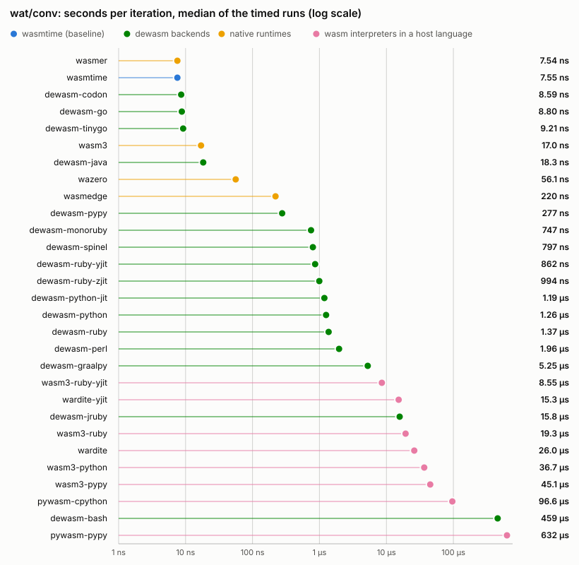
</picture>

Full numbers for <code>wat/conv</code>

| Runner | Iterations | Minimum `ns/op` | Median `ns/op` | Cold start `t(0)` | Total `t(N)` | vs. `wasmtime` | Load |
| --- | --- | --- | --- | --- | --- | --- | --- |
| `wasmtime` | 39 066 118 | 7.53 | 7.55 | 4.9 ms | 298.9 ms | 1.00x | — |
| `wasmer` | 39 992 661 | 7.53 | 7.54 | 8.7 ms | 309.7 ms | 1.00x | — |
| `wasmedge` | 1 391 979 | 220.3 | 220.4 | 19.0 ms | 325.7 ms | 29x | — |
| `wazero` | 5 483 483 | 56.0 | 56.1 | 5.3 ms | 312.6 ms | 7.45x | — |
| `wasm3` | 16 777 216 | 17.0 | 17.0 | 6.9 ms | 291.9 ms | 2.26x | — |
| `dewasm-ruby` | 202 283 | 1367 | 1369 | 35.7 ms | 312.3 ms | 182x | — |
| `dewasm-ruby-yjit` | 325 433 | 860.8 | 862.1 | 36.1 ms | 316.3 ms | 114x | — |
| `dewasm-ruby-zjit` | 263 704 | 970.7 | 994.0 | 35.7 ms | 291.7 ms | 129x | — |
| `dewasm-monoruby` | 370 214 | 742.0 | 747.5 | 30.9 ms | 305.6 ms | 99x | — |
| `dewasm-jruby` | 11 903 | 16668 | 15768 | 1.29 s | 1.49 s | 2215x | — |
| `dewasm-spinel` | 379 879 | 789.8 | 796.6 | 2.1 ms | 302.1 ms | 105x | — |
| `dewasm-python` | 232 569 | 1253 | 1256 | 17.6 ms | 308.9 ms | 166x | — |
| `dewasm-python-jit` | 255 859 | 1183 | 1185 | 17.6 ms | 320.3 ms | 157x | — |
| `dewasm-pypy` | 1 018 238 | 275.8 | 277.3 | 38.7 ms | 319.5 ms | 37x | — |
| `dewasm-graalpy` | 47 574 | 5142 | 5254 | 106.5 ms | 351.1 ms | 683x | — |
| `dewasm-perl` | 151 399 | 1960 | 1960 | 15.1 ms | 311.9 ms | 260x | — |
| `dewasm-go` | 33 994 509 | 8.78 | 8.80 | 2.9 ms | 301.5 ms | 1.17x | — |
| `dewasm-tinygo` | 33 554 432 | 9.19 | 9.21 | 1.9 ms | 310.4 ms | 1.22x | — |
| `dewasm-java` | 10 856 721 | 18.3 | 18.3 | 56.2 ms | 254.6 ms | 2.43x | — |
| `dewasm-codon` | 35 181 067 | 8.58 | 8.59 | 12.1 ms | 313.9 ms | 1.14x | — |
| `dewasm-bash` | 656 | 457164 | 458795 | 13.1 ms | 313.0 ms | 60742x | — |
| `wasm3-ruby` | 14 557 | 19332 | 19321 | 111.4 ms | 392.9 ms | 2569x | — |
| `wasm3-ruby-yjit` | 21 078 | 8505 | 8552 | 236.4 ms | 415.7 ms | 1130x | — |
| `wasm3-python` | 5 834 | 36250 | 36665 | 291.1 ms | 502.6 ms | 4816x | — |
| `wasm3-pypy` | 4 470 | 45984 | 45093 | 450.6 ms | 656.2 ms | 6110x | — |
| `pywasm-cpython` | 2 623 | 96416 | 96556 | 30.7 ms | 283.6 ms | 12811x | 0.6 ms |
| `pywasm-pypy` | 381 | 630782 | 632248 | 72.3 ms | 312.6 ms | 83810x | 3.0 ms |
| `wardite` | 10 266 | 25757 | 26034 | 47.6 ms | 312.0 ms | 3422x | 2.7 ms |
| `wardite-yjit` | 14 955 | 15169 | 15258 | 91.5 ms | 318.4 ms | 2015x | 7.4 ms |

#### `wat/eh_throw`

<picture>
  <source media="(prefers-color-scheme: dark)" srcset="figs/wat-eh-throw-dark.svg">
  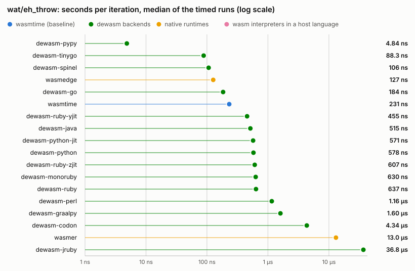
</picture>

Full numbers for <code>wat/eh_throw</code>

| Runner | Iterations | Minimum `ns/op` | Median `ns/op` | Cold start `t(0)` | Total `t(N)` | vs. `wasmtime` | Load |
| --- | --- | --- | --- | --- | --- | --- | --- |
| `wasmtime` | 1 278 228 | 230.8 | 231.4 | 4.6 ms | 299.6 ms | 1.00x | — |
| `wasmer` | 19 526 | 12999 | 13035 | 9.6 ms | 263.4 ms | 56x | — |
| `wasmedge` | 2 587 713 | 126.3 | 126.6 | 19.5 ms | 346.4 ms | 0.55x | — |
| `dewasm-ruby` | 451 564 | 634.1 | 636.9 | 35.4 ms | 321.8 ms | 2.75x | — |
| `dewasm-ruby-yjit` | 490 594 | 452.9 | 454.9 | 35.8 ms | 258.0 ms | 1.96x | — |
| `dewasm-ruby-zjit` | 433 541 | 607.7 | 607.4 | 35.8 ms | 299.3 ms | 2.63x | — |
| `dewasm-monoruby` | 423 848 | 629.0 | 630.0 | 30.6 ms | 297.2 ms | 2.73x | — |
| `dewasm-jruby` | 4 721 | 39093 | 36753 | 1.29 s | 1.47 s | 169x | — |
| `dewasm-spinel` | 2 758 007 | 106.3 | 106.4 | 2.1 ms | 295.3 ms | 0.46x | — |
| `dewasm-python` | 513 687 | 575.8 | 578.2 | 17.4 ms | 313.1 ms | 2.50x | — |
| `dewasm-python-jit` | 548 161 | 567.5 | 570.6 | 19.3 ms | 330.4 ms | 2.46x | — |
| `dewasm-pypy` | 4 000 000 | 4.61 | 4.84 | 38.1 ms | 56.5 ms | 0.02x | — |
| `dewasm-graalpy` | 165 210 | 1567 | 1604 | 106.4 ms | 365.4 ms | 6.79x | — |
| `dewasm-perl` | 259 875 | 1156 | 1156 | 11.8 ms | 312.3 ms | 5.01x | — |
| `dewasm-go` | 1 541 685 | 181.7 | 184.0 | 2.4 ms | 282.6 ms | 0.79x | — |
| `dewasm-tinygo` | 3 035 147 | 86.5 | 88.3 | 2.0 ms | 264.4 ms | 0.37x | — |
| `dewasm-java` | 412 395 | 514.5 | 515.4 | 56.2 ms | 268.3 ms | 2.23x | — |
| `dewasm-codon` | 65 536 | 4296 | 4340 | 11.9 ms | 293.5 ms | 19x | — |

#### `wat/eh_try`

<picture>
  <source media="(prefers-color-scheme: dark)" srcset="figs/wat-eh-try-dark.svg">
  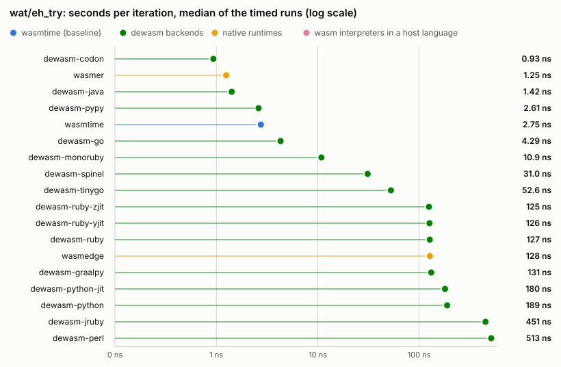
</picture>

Full numbers for <code>wat/eh_try</code>

| Runner | Iterations | Minimum `ns/op` | Median `ns/op` | Cold start `t(0)` | Total `t(N)` | vs. `wasmtime` | Load |
| --- | --- | --- | --- | --- | --- | --- | --- |
| `wasmtime` | 109 924 227 | 2.74 | 2.75 | 4.7 ms | 306.4 ms | 1.00x | — |
| `wasmer` | 242 432 659 | 1.25 | 1.25 | 8.9 ms | 311.1 ms | 0.45x | — |
| `wasmedge` | 2 432 602 | 127.0 | 127.6 | 19.0 ms | 327.8 ms | 46x | — |
| `dewasm-ruby` | 1 456 073 | 127.0 | 127.1 | 35.5 ms | 220.5 ms | 46x | — |
| `dewasm-ruby-yjit` | 2 449 244 | 126.3 | 126.5 | 36.1 ms | 345.5 ms | 46x | — |
| `dewasm-ruby-zjit` | 2 379 406 | 124.7 | 124.8 | 36.4 ms | 333.1 ms | 45x | — |
| `dewasm-monoruby` | 25 932 616 | 10.9 | 10.9 | 30.2 ms | 312.3 ms | 3.96x | — |
| `dewasm-jruby` | 421 674 | 457.2 | 451.0 | 1.30 s | 1.49 s | 167x | — |
| `dewasm-spinel` | 8 917 809 | 31.0 | 31.0 | 2.1 ms | 278.5 ms | 11x | — |
| `dewasm-python` | 1 571 690 | 188.4 | 188.7 | 17.3 ms | 313.4 ms | 69x | — |
| `dewasm-python-jit` | 1 638 775 | 178.3 | 179.8 | 17.1 ms | 309.4 ms | 65x | — |
| `dewasm-pypy` | 114 491 592 | 2.62 | 2.61 | 38.7 ms | 338.1 ms | 0.95x | — |
| `dewasm-graalpy` | 1 346 368 | 118.1 | 131.5 | 105.1 ms | 264.1 ms | 43x | — |
| `dewasm-perl` | 582 081 | 511.2 | 513.1 | 11.1 ms | 308.7 ms | 186x | — |
| `dewasm-go` | 70 684 725 | 4.28 | 4.29 | 2.6 ms | 305.4 ms | 1.56x | — |
| `dewasm-tinygo` | 5 995 669 | 52.6 | 52.6 | 1.9 ms | 317.3 ms | 19x | — |
| `dewasm-java` | 197 333 379 | 1.42 | 1.42 | 55.6 ms | 336.7 ms | 0.52x | — |
| `dewasm-codon` | 322 619 804 | 0.93 | 0.93 | 11.9 ms | 313.5 ms | 0.34x | — |

#### `wat/f32_alu`

<picture>
  <source media="(prefers-color-scheme: dark)" srcset="figs/wat-f32-alu-dark.svg">
  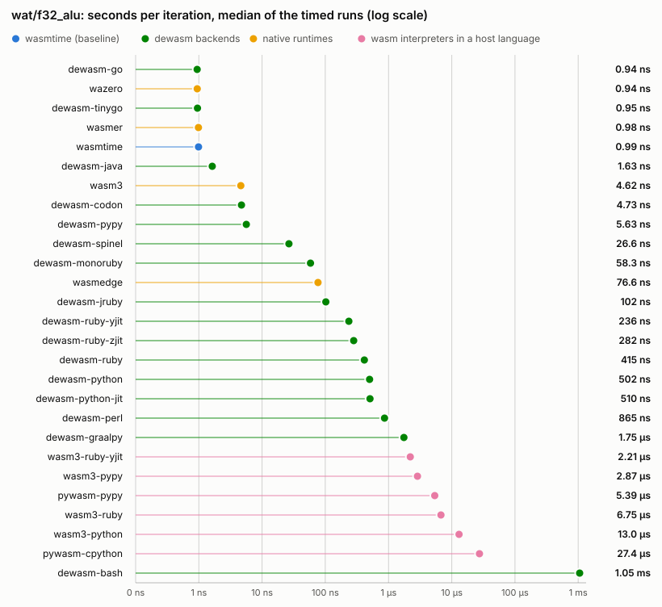
</picture>

Full numbers for <code>wat/f32_alu</code>

| Runner | Iterations | Minimum `ns/op` | Median `ns/op` | Cold start `t(0)` | Total `t(N)` | vs. `wasmtime` | Load |
| --- | --- | --- | --- | --- | --- | --- | --- |
| `wasmtime` | 306 541 265 | 0.99 | 0.99 | 4.7 ms | 307.3 ms | 1.00x | — |
| `wasmer` | 308 927 630 | 0.98 | 0.99 | 9.0 ms | 312.4 ms | 0.99x | — |
| `wasmedge` | 3 161 082 | 76.4 | 76.6 | 18.7 ms | 260.2 ms | 77x | — |
| `wazero` | 314 046 908 | 0.94 | 0.94 | 5.2 ms | 300.2 ms | 0.95x | — |
| `wasm3` | 65 585 316 | 4.60 | 4.62 | 6.7 ms | 308.2 ms | 4.66x | — |
| `dewasm-ruby` | 703 123 | 416.9 | 414.6 | 36.1 ms | 329.2 ms | 422x | — |
| `dewasm-ruby-yjit` | 1 235 288 | 233.3 | 235.7 | 35.7 ms | 323.9 ms | 236x | — |
| `dewasm-ruby-zjit` | 944 789 | 279.0 | 281.6 | 35.7 ms | 299.4 ms | 283x | — |
| `dewasm-monoruby` | 4 698 950 | 57.3 | 58.3 | 30.2 ms | 299.5 ms | 58x | — |
| `dewasm-jruby` | 2 024 960 | 110.1 | 102.0 | 1.30 s | 1.52 s | 112x | — |
| `dewasm-spinel` | 11 999 567 | 26.6 | 26.6 | 2.2 ms | 320.8 ms | 27x | — |
| `dewasm-python` | 608 089 | 499.3 | 501.7 | 17.6 ms | 321.3 ms | 506x | — |
| `dewasm-python-jit` | 459 488 | 505.1 | 509.6 | 17.5 ms | 249.6 ms | 512x | — |
| `dewasm-pypy` | 33 236 016 | 5.57 | 5.63 | 38.2 ms | 223.4 ms | 5.65x | — |
| `dewasm-graalpy` | 119 461 | 1738 | 1750 | 108.1 ms | 315.7 ms | 1760x | — |
| `dewasm-perl` | 347 369 | 863.8 | 865.0 | 11.0 ms | 311.1 ms | 875x | — |
| `dewasm-go` | 321 438 505 | 0.93 | 0.94 | 2.5 ms | 302.8 ms | 0.95x | — |
| `dewasm-tinygo` | 315 701 610 | 0.95 | 0.95 | 1.9 ms | 301.2 ms | 0.96x | — |
| `dewasm-java` | 174 865 321 | 1.62 | 1.63 | 56.0 ms | 339.8 ms | 1.64x | — |
| `dewasm-codon` | 63 510 600 | 4.69 | 4.73 | 12.0 ms | 309.5 ms | 4.75x | — |
| `dewasm-bash` | 168 | 1054096 | 1054541 | 13.0 ms | 190.1 ms | 1067656x | — |
| `wasm3-ruby` | 32 333 | 6688 | 6746 | 111.3 ms | 327.6 ms | 6774x | — |
| `wasm3-ruby-yjit` | 84 693 | 2193 | 2209 | 214.6 ms | 400.3 ms | 2221x | — |
| `wasm3-python` | 21 920 | 13034 | 13030 | 288.8 ms | 574.5 ms | 13201x | — |
| `wasm3-pypy` | 76 085 | 2871 | 2870 | 444.7 ms | 663.1 ms | 2907x | — |
| `pywasm-cpython` | 11 224 | 27249 | 27430 | 31.3 ms | 337.1 ms | 27599x | 0.5 ms |
| `pywasm-pypy` | 33 365 | 5408 | 5390 | 70.8 ms | 251.3 ms | 5478x | 2.6 ms |

#### `wat/f64_alu`

<picture>
  <source media="(prefers-color-scheme: dark)" srcset="figs/wat-f64-alu-dark.svg">
  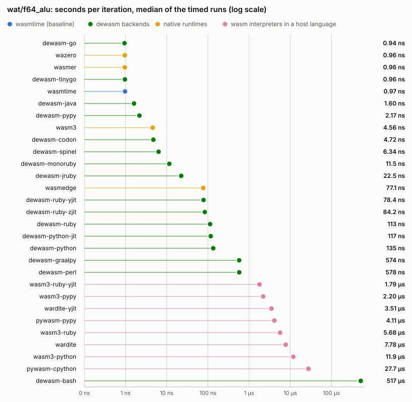
</picture>

Full numbers for <code>wat/f64_alu</code>

| Runner | Iterations | Minimum `ns/op` | Median `ns/op` | Cold start `t(0)` | Total `t(N)` | vs. `wasmtime` | Load |
| --- | --- | --- | --- | --- | --- | --- | --- |
| `wasmtime` | 308 201 693 | 0.96 | 0.97 | 4.7 ms | 300.9 ms | 1.00x | — |
| `wasmer` | 320 066 420 | 0.96 | 0.96 | 9.1 ms | 317.1 ms | 1.00x | — |
| `wasmedge` | 3 905 197 | 76.9 | 77.1 | 18.9 ms | 319.2 ms | 80x | — |
| `wazero` | 312 002 039 | 0.96 | 0.96 | 5.1 ms | 303.5 ms | 1.00x | — |
| `wasm3` | 65 654 007 | 4.53 | 4.56 | 6.7 ms | 304.0 ms | 4.71x | — |
| `dewasm-ruby` | 2 363 254 | 112.2 | 112.9 | 36.0 ms | 301.3 ms | 117x | — |
| `dewasm-ruby-yjit` | 3 717 944 | 78.4 | 78.4 | 35.6 ms | 326.9 ms | 82x | — |
| `dewasm-ruby-zjit` | 4 518 008 | 84.4 | 84.2 | 36.7 ms | 417.8 ms | 88x | — |
| `dewasm-monoruby` | 25 662 864 | 11.5 | 11.5 | 30.2 ms | 325.8 ms | 12x | — |
| `dewasm-jruby` | 11 112 350 | 23.6 | 22.5 | 1.29 s | 1.56 s | 25x | — |
| `dewasm-spinel` | 46 814 621 | 6.33 | 6.34 | 2.1 ms | 298.7 ms | 6.59x | — |
| `dewasm-python` | 2 205 155 | 134.7 | 135.0 | 17.4 ms | 314.5 ms | 140x | — |
| `dewasm-python-jit` | 2 560 906 | 116.9 | 117.1 | 17.4 ms | 316.9 ms | 122x | — |
| `dewasm-pypy` | 134 852 736 | 2.18 | 2.17 | 38.5 ms | 332.6 ms | 2.27x | — |
| `dewasm-graalpy` | 315 566 | 559.4 | 574.3 | 107.3 ms | 283.8 ms | 582x | — |
| `dewasm-perl` | 526 189 | 574.2 | 577.9 | 15.0 ms | 317.1 ms | 598x | — |
| `dewasm-go` | 318 710 236 | 0.93 | 0.94 | 2.4 ms | 300.3 ms | 0.97x | — |
| `dewasm-tinygo` | 316 068 376 | 0.95 | 0.96 | 1.9 ms | 302.0 ms | 0.99x | — |
| `dewasm-java` | 203 455 516 | 1.62 | 1.60 | 53.8 ms | 383.2 ms | 1.68x | — |
| `dewasm-codon` | 64 251 356 | 4.69 | 4.72 | 11.8 ms | 313.1 ms | 4.88x | — |
| `dewasm-bash` | 569 | 509621 | 517316 | 12.8 ms | 302.8 ms | 530293x | — |
| `wasm3-ruby` | 56 376 | 5658 | 5683 | 110.8 ms | 429.7 ms | 5887x | — |
| `wasm3-ruby-yjit` | 157 326 | 1785 | 1794 | 217.7 ms | 498.6 ms | 1858x | — |
| `wasm3-python` | 65 536 | 11839 | 11884 | 290.9 ms | 1.07 s | 12319x | — |
| `wasm3-pypy` | 106 401 | 2175 | 2203 | 445.6 ms | 677.0 ms | 2263x | — |
| `pywasm-cpython` | 10 889 | 27703 | 27695 | 30.9 ms | 332.5 ms | 28827x | 0.5 ms |
| `pywasm-pypy` | 55 350 | 4066 | 4112 | 71.3 ms | 296.4 ms | 4231x | 2.8 ms |
| `wardite` | 24 753 | 7689 | 7777 | 47.1 ms | 237.4 ms | 8001x | 3.5 ms |
| `wardite-yjit` | 80 822 | 3510 | 3513 | 93.7 ms | 377.4 ms | 3652x | 7.2 ms |

#### `wat/i32_alu`

<picture>
  <source media="(prefers-color-scheme: dark)" srcset="figs/wat-i32-alu-dark.svg">
  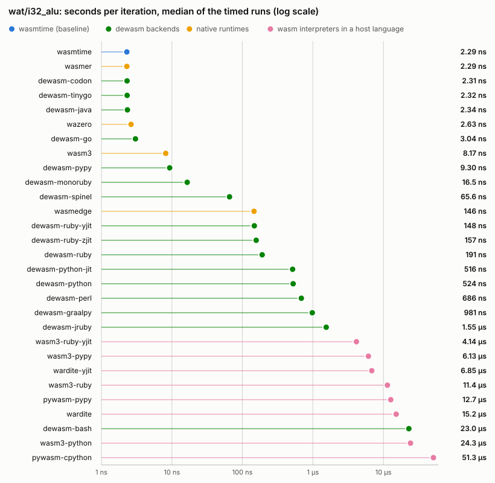
</picture>

Full numbers for <code>wat/i32_alu</code>

| Runner | Iterations | Minimum `ns/op` | Median `ns/op` | Cold start `t(0)` | Total `t(N)` | vs. `wasmtime` | Load |
| --- | --- | --- | --- | --- | --- | --- | --- |
| `wasmtime` | 130 957 896 | 2.28 | 2.29 | 4.9 ms | 303.4 ms | 1.00x | — |
| `wasmer` | 130 424 827 | 2.29 | 2.29 | 9.0 ms | 307.6 ms | 1.00x | — |
| `wasmedge` | 2 119 096 | 146.2 | 146.2 | 19.1 ms | 328.9 ms | 64x | — |
| `wazero` | 114 146 574 | 2.62 | 2.63 | 5.2 ms | 303.8 ms | 1.15x | — |
| `wasm3` | 36 766 529 | 8.17 | 8.17 | 6.8 ms | 307.4 ms | 3.59x | — |
| `dewasm-ruby` | 1 555 278 | 190.0 | 190.7 | 35.2 ms | 330.7 ms | 83x | — |
| `dewasm-ruby-yjit` | 1 978 196 | 147.6 | 147.7 | 35.2 ms | 327.2 ms | 65x | — |
| `dewasm-ruby-zjit` | 1 922 338 | 158.3 | 157.1 | 36.0 ms | 340.3 ms | 69x | — |
| `dewasm-monoruby` | 11 232 335 | 16.5 | 16.5 | 30.8 ms | 215.6 ms | 7.22x | — |
| `dewasm-jruby` | 135 375 | 1537 | 1546 | 1.28 s | 1.49 s | 674x | — |
| `dewasm-spinel` | 4 608 809 | 65.6 | 65.6 | 2.1 ms | 304.5 ms | 29x | — |
| `dewasm-python` | 579 742 | 524.1 | 524.4 | 17.3 ms | 321.2 ms | 230x | — |
| `dewasm-python-jit` | 585 624 | 508.4 | 515.8 | 17.3 ms | 315.0 ms | 223x | — |
| `dewasm-pypy` | 31 191 027 | 9.32 | 9.30 | 38.8 ms | 329.5 ms | 4.09x | — |
| `dewasm-graalpy` | 193 840 | 995.9 | 981.0 | 104.0 ms | 297.0 ms | 437x | — |
| `dewasm-perl` | 438 203 | 683.7 | 685.9 | 11.2 ms | 310.8 ms | 300x | — |
| `dewasm-go` | 99 571 002 | 3.01 | 3.04 | 2.7 ms | 302.9 ms | 1.32x | — |
| `dewasm-tinygo` | 122 715 469 | 2.30 | 2.32 | 1.8 ms | 284.2 ms | 1.01x | — |
| `dewasm-java` | 82 100 163 | 2.33 | 2.34 | 56.2 ms | 247.7 ms | 1.02x | — |
| `dewasm-codon` | 132 564 503 | 2.30 | 2.31 | 11.9 ms | 316.6 ms | 1.01x | — |
| `dewasm-bash` | 12 672 | 22893 | 22984 | 13.2 ms | 303.3 ms | 10044x | — |
| `wasm3-ruby` | 26 331 | 11377 | 11426 | 109.6 ms | 409.2 ms | 4991x | — |
| `wasm3-ruby-yjit` | 45 222 | 4067 | 4143 | 229.8 ms | 413.7 ms | 1784x | — |
| `wasm3-python` | 17 679 | 24188 | 24282 | 291.7 ms | 719.3 ms | 10612x | — |
| `wasm3-pypy` | 40 200 | 6164 | 6135 | 446.3 ms | 694.1 ms | 2704x | — |
| `pywasm-cpython` | 5 797 | 51177 | 51325 | 30.8 ms | 327.4 ms | 22453x | 0.6 ms |
| `pywasm-pypy` | 17 398 | 12411 | 12720 | 72.9 ms | 288.8 ms | 5445x | 2.9 ms |
| `wardite` | 17 200 | 15175 | 15215 | 47.5 ms | 308.5 ms | 6658x | 2.7 ms |
| `wardite-yjit` | 41 764 | 6860 | 6847 | 90.0 ms | 376.5 ms | 3010x | 6.9 ms |

#### `wat/i32_div`

<picture>
  <source media="(prefers-color-scheme: dark)" srcset="figs/wat-i32-div-dark.svg">
  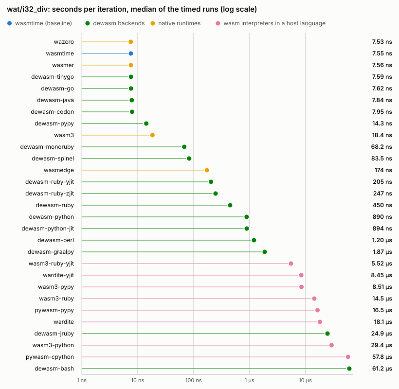
</picture>

Full numbers for <code>wat/i32_div</code>

| Runner | Iterations | Minimum `ns/op` | Median `ns/op` | Cold start `t(0)` | Total `t(N)` | vs. `wasmtime` | Load |
| --- | --- | --- | --- | --- | --- | --- | --- |
| `wasmtime` | 40 028 629 | 7.53 | 7.55 | 4.7 ms | 306.1 ms | 1.00x | — |
| `wasmer` | 39 966 806 | 7.54 | 7.56 | 8.8 ms | 310.1 ms | 1.00x | — |
| `wasmedge` | 1 825 508 | 173.5 | 173.6 | 19.3 ms | 336.0 ms | 23x | — |
| `wazero` | 39 886 239 | 7.53 | 7.53 | 5.1 ms | 305.4 ms | 1.00x | — |
| `wasm3` | 16 227 796 | 18.4 | 18.4 | 6.8 ms | 306.0 ms | 2.45x | — |
| `dewasm-ruby` | 664 069 | 448.6 | 449.9 | 35.1 ms | 332.9 ms | 60x | — |
| `dewasm-ruby-yjit` | 1 318 916 | 203.1 | 204.7 | 35.5 ms | 303.4 ms | 27x | — |
| `dewasm-ruby-zjit` | 1 149 413 | 248.8 | 247.5 | 36.5 ms | 322.4 ms | 33x | — |
| `dewasm-monoruby` | 3 669 223 | 68.2 | 68.2 | 30.4 ms | 280.5 ms | 9.05x | — |
| `dewasm-jruby` | 7 159 | 23388 | 24897 | 1.29 s | 1.46 s | 3107x | — |
| `dewasm-spinel` | 3 632 648 | 83.4 | 83.5 | 2.2 ms | 305.3 ms | 11x | — |
| `dewasm-python` | 331 019 | 891.8 | 889.7 | 17.7 ms | 313.0 ms | 118x | — |
| `dewasm-python-jit` | 333 681 | 891.6 | 894.2 | 17.5 ms | 315.0 ms | 118x | — |
| `dewasm-pypy` | 18 431 071 | 14.1 | 14.3 | 38.3 ms | 298.5 ms | 1.88x | — |
| `dewasm-graalpy` | 114 341 | 1877 | 1871 | 107.9 ms | 322.6 ms | 249x | — |
| `dewasm-perl` | 251 568 | 1199 | 1203 | 11.0 ms | 312.5 ms | 159x | — |
| `dewasm-go` | 39 409 154 | 7.61 | 7.62 | 2.4 ms | 302.2 ms | 1.01x | — |
| `dewasm-tinygo` | 38 895 697 | 7.59 | 7.59 | 1.8 ms | 296.9 ms | 1.01x | — |
| `dewasm-java` | 30 075 854 | 7.81 | 7.84 | 57.8 ms | 292.6 ms | 1.04x | — |
| `dewasm-codon` | 37 045 583 | 7.91 | 7.95 | 11.8 ms | 304.8 ms | 1.05x | — |
| `dewasm-bash` | 4 790 | 60315 | 61180 | 13.0 ms | 301.9 ms | 8012x | — |
| `wasm3-ruby` | 21 231 | 14217 | 14455 | 110.2 ms | 412.0 ms | 1889x | — |
| `wasm3-ruby-yjit` | 35 111 | 5524 | 5515 | 223.3 ms | 417.3 ms | 734x | — |
| `wasm3-python` | 10 402 | 29245 | 29366 | 290.3 ms | 594.5 ms | 3885x | — |
| `wasm3-pypy` | 27 452 | 8509 | 8514 | 446.6 ms | 680.2 ms | 1130x | — |
| `pywasm-cpython` | 5 064 | 57416 | 57800 | 30.8 ms | 321.6 ms | 7627x | 0.6 ms |
| `pywasm-pypy` | 12 868 | 15949 | 16464 | 72.4 ms | 277.6 ms | 2119x | 2.8 ms |
| `wardite` | 12 145 | 18037 | 18147 | 47.5 ms | 266.5 ms | 2396x | 2.7 ms |
| `wardite-yjit` | 35 454 | 8505 | 8445 | 90.9 ms | 392.5 ms | 1130x | 7.0 ms |

#### `wat/i64_alu`

<picture>
  <source media="(prefers-color-scheme: dark)" srcset="figs/wat-i64-alu-dark.svg">
  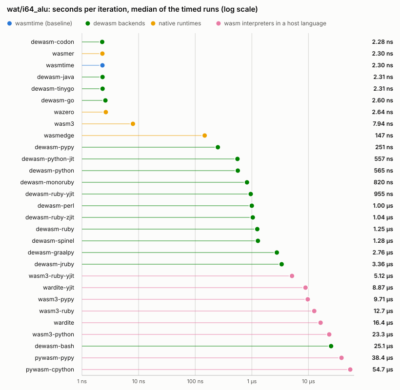
</picture>

Full numbers for <code>wat/i64_alu</code>

| Runner | Iterations | Minimum `ns/op` | Median `ns/op` | Cold start `t(0)` | Total `t(N)` | vs. `wasmtime` | Load |
| --- | --- | --- | --- | --- | --- | --- | --- |
| `wasmtime` | 130 306 361 | 2.29 | 2.30 | 4.7 ms | 303.5 ms | 1.00x | — |
| `wasmer` | 131 565 084 | 2.29 | 2.30 | 8.8 ms | 310.2 ms | 1.00x | — |
| `wasmedge` | 1 737 996 | 146.0 | 146.9 | 18.9 ms | 272.7 ms | 64x | — |
| `wazero` | 113 396 707 | 2.62 | 2.64 | 5.1 ms | 302.7 ms | 1.14x | — |
| `wasm3` | 38 281 446 | 7.90 | 7.94 | 7.7 ms | 310.2 ms | 3.45x | — |
| `dewasm-ruby` | 215 618 | 1235 | 1248 | 35.2 ms | 301.6 ms | 539x | — |
| `dewasm-ruby-yjit` | 296 425 | 954.6 | 955.4 | 35.8 ms | 318.7 ms | 416x | — |
| `dewasm-ruby-zjit` | 248 242 | 1029 | 1039 | 35.9 ms | 291.4 ms | 449x | — |
| `dewasm-monoruby` | 364 161 | 814.4 | 820.0 | 30.1 ms | 326.7 ms | 355x | — |
| `dewasm-jruby` | 45 960 | 3621 | 3360 | 1.29 s | 1.46 s | 1579x | — |
| `dewasm-spinel` | 226 249 | 1278 | 1279 | 2.1 ms | 291.3 ms | 557x | — |
| `dewasm-python` | 527 303 | 564.0 | 564.8 | 17.3 ms | 314.7 ms | 246x | — |
| `dewasm-python-jit` | 543 944 | 553.5 | 557.1 | 17.4 ms | 318.5 ms | 241x | — |
| `dewasm-pypy` | 1 008 776 | 251.8 | 251.3 | 38.3 ms | 292.3 ms | 110x | — |
| `dewasm-graalpy` | 65 572 | 2778 | 2764 | 103.5 ms | 285.7 ms | 1211x | — |
| `dewasm-perl` | 302 687 | 992.8 | 999.5 | 11.1 ms | 311.6 ms | 433x | — |
| `dewasm-go` | 115 223 956 | 2.59 | 2.60 | 2.5 ms | 301.1 ms | 1.13x | — |
| `dewasm-tinygo` | 128 479 271 | 2.30 | 2.31 | 2.0 ms | 297.9 ms | 1.00x | — |
| `dewasm-java` | 124 472 871 | 2.31 | 2.31 | 56.5 ms | 343.6 ms | 1.01x | — |
| `dewasm-codon` | 129 878 206 | 2.27 | 2.28 | 11.9 ms | 307.0 ms | 0.99x | — |
| `dewasm-bash` | 11 716 | 24999 | 25083 | 13.6 ms | 306.5 ms | 10899x | — |
| `wasm3-ruby` | 23 235 | 12685 | 12659 | 110.6 ms | 405.4 ms | 5531x | — |
| `wasm3-ruby-yjit` | 49 005 | 5053 | 5119 | 228.6 ms | 476.2 ms | 2203x | — |
| `wasm3-python` | 12 868 | 23196 | 23267 | 291.7 ms | 590.2 ms | 10113x | — |
| `wasm3-pypy` | 23 076 | 9736 | 9714 | 446.2 ms | 670.9 ms | 4245x | — |
| `pywasm-cpython` | 5 530 | 54511 | 54691 | 31.3 ms | 332.8 ms | 23766x | 0.6 ms |
| `pywasm-pypy` | 4 640 | 38329 | 38373 | 74.9 ms | 252.7 ms | 16711x | 3.0 ms |
| `wardite` | 18 834 | 16169 | 16364 | 48.9 ms | 353.4 ms | 7049x | 2.7 ms |
| `wardite-yjit` | 25 768 | 8813 | 8873 | 93.9 ms | 321.0 ms | 3842x | 7.6 ms |

#### `wat/i64_div`

<picture>
  <source media="(prefers-color-scheme: dark)" srcset="figs/wat-i64-div-dark.svg">
  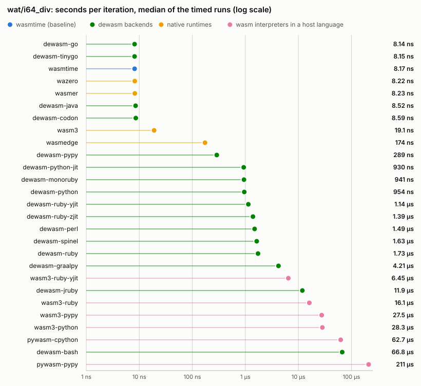
</picture>

Full numbers for <code>wat/i64_div</code>

| Runner | Iterations | Minimum `ns/op` | Median `ns/op` | Cold start `t(0)` | Total `t(N)` | vs. `wasmtime` | Load |
| --- | --- | --- | --- | --- | --- | --- | --- |
| `wasmtime` | 36 409 744 | 8.15 | 8.17 | 4.8 ms | 301.4 ms | 1.00x | — |
| `wasmer` | 36 407 890 | 8.15 | 8.23 | 9.2 ms | 306.1 ms | 1.00x | — |
| `wasmedge` | 1 612 609 | 173.4 | 173.5 | 18.8 ms | 298.6 ms | 21x | — |
| `wazero` | 36 862 526 | 8.18 | 8.22 | 5.3 ms | 306.8 ms | 1.00x | — |
| `wasm3` | 15 035 020 | 18.9 | 19.1 | 6.8 ms | 290.9 ms | 2.32x | — |
| `dewasm-ruby` | 159 499 | 1712 | 1731 | 35.2 ms | 308.3 ms | 210x | — |
| `dewasm-ruby-yjit` | 302 054 | 1134 | 1138 | 35.6 ms | 378.3 ms | 139x | — |
| `dewasm-ruby-zjit` | 164 393 | 1381 | 1390 | 35.6 ms | 262.6 ms | 169x | — |
| `dewasm-monoruby` | 292 791 | 924.7 | 940.9 | 30.7 ms | 301.5 ms | 113x | — |
| `dewasm-jruby` | 16 662 | 12880 | 11858 | 1.28 s | 1.50 s | 1581x | — |
| `dewasm-spinel` | 183 889 | 1626 | 1635 | 2.1 ms | 301.1 ms | 200x | — |
| `dewasm-python` | 318 415 | 952.1 | 954.4 | 17.3 ms | 320.5 ms | 117x | — |
| `dewasm-python-jit` | 323 388 | 930.2 | 930.4 | 17.6 ms | 318.4 ms | 114x | — |
| `dewasm-pypy` | 935 646 | 289.0 | 288.7 | 38.2 ms | 308.6 ms | 35x | — |
| `dewasm-graalpy` | 50 587 | 4162 | 4208 | 105.0 ms | 315.6 ms | 511x | — |
| `dewasm-perl` | 200 072 | 1491 | 1494 | 11.0 ms | 309.4 ms | 183x | — |
| `dewasm-go` | 36 353 937 | 8.12 | 8.14 | 2.5 ms | 297.7 ms | 1.00x | — |
| `dewasm-tinygo` | 37 087 773 | 8.11 | 8.15 | 1.9 ms | 302.7 ms | 1.00x | — |
| `dewasm-java` | 24 253 506 | 8.49 | 8.52 | 56.0 ms | 261.8 ms | 1.04x | — |
| `dewasm-codon` | 35 333 100 | 8.55 | 8.59 | 11.8 ms | 314.1 ms | 1.05x | — |
| `dewasm-bash` | 4 397 | 66725 | 66829 | 12.8 ms | 306.2 ms | 8189x | — |
| `wasm3-ruby` | 16 863 | 15749 | 16058 | 110.5 ms | 376.1 ms | 1933x | — |
| `wasm3-ruby-yjit` | 34 041 | 6619 | 6450 | 226.5 ms | 451.9 ms | 812x | — |
| `wasm3-python` | 11 332 | 28143 | 28279 | 292.7 ms | 611.6 ms | 3454x | — |
| `wasm3-pypy` | 7 062 | 27557 | 27480 | 443.3 ms | 637.9 ms | 3382x | — |
| `pywasm-cpython` | 3 824 | 62246 | 62655 | 30.8 ms | 268.8 ms | 7639x | 0.6 ms |
| `pywasm-pypy` | 828 | 212116 | 210808 | 71.3 ms | 246.9 ms | 26033x | 2.8 ms |

#### `wat/mem_narrow`

<picture>
  <source media="(prefers-color-scheme: dark)" srcset="figs/wat-mem-narrow-dark.svg">
  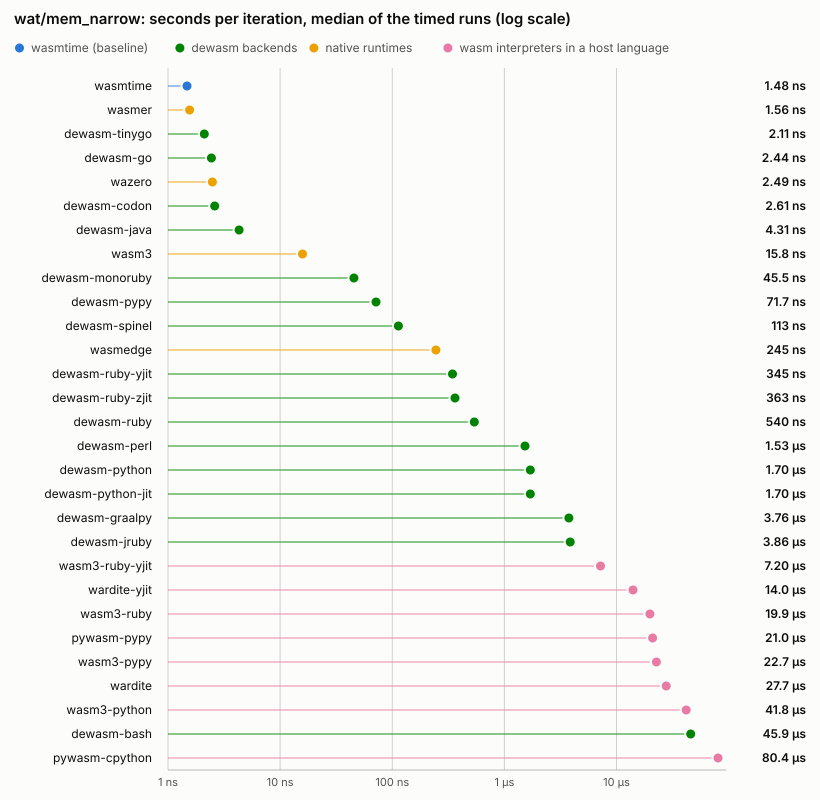
</picture>

Full numbers for <code>wat/mem_narrow</code>

| Runner | Iterations | Minimum `ns/op` | Median `ns/op` | Cold start `t(0)` | Total `t(N)` | vs. `wasmtime` | Load |
| --- | --- | --- | --- | --- | --- | --- | --- |
| `wasmtime` | 204 761 815 | 1.48 | 1.48 | 4.6 ms | 306.7 ms | 1.00x | — |
| `wasmer` | 196 592 641 | 1.55 | 1.56 | 8.8 ms | 313.2 ms | 1.05x | — |
| `wasmedge` | 1 181 701 | 244.9 | 244.9 | 18.8 ms | 308.2 ms | 166x | — |
| `wazero` | 120 864 240 | 2.49 | 2.49 | 5.2 ms | 305.8 ms | 1.69x | — |
| `wasm3` | 16 777 216 | 15.7 | 15.8 | 6.7 ms | 270.4 ms | 11x | — |
| `dewasm-ruby` | 515 476 | 535.9 | 539.6 | 35.4 ms | 311.6 ms | 363x | — |
| `dewasm-ruby-yjit` | 829 144 | 343.1 | 344.6 | 35.4 ms | 319.9 ms | 233x | — |
| `dewasm-ruby-zjit` | 641 437 | 364.0 | 363.1 | 35.8 ms | 269.2 ms | 247x | — |
| `dewasm-monoruby` | 7 638 536 | 45.0 | 45.5 | 30.3 ms | 374.0 ms | 31x | — |
| `dewasm-jruby` | 55 939 | 3898 | 3863 | 1.29 s | 1.51 s | 2642x | — |
| `dewasm-spinel` | 2 552 231 | 113.3 | 113.3 | 2.4 ms | 291.6 ms | 77x | — |
| `dewasm-python` | 179 385 | 1674 | 1701 | 17.8 ms | 318.1 ms | 1135x | — |
| `dewasm-python-jit` | 180 353 | 1693 | 1702 | 17.3 ms | 322.7 ms | 1148x | — |
| `dewasm-pypy` | 3 893 687 | 71.6 | 71.7 | 37.9 ms | 316.8 ms | 49x | — |
| `dewasm-graalpy` | 64 810 | 3717 | 3759 | 105.4 ms | 346.3 ms | 2519x | — |
| `dewasm-perl` | 198 857 | 1516 | 1528 | 11.1 ms | 312.6 ms | 1028x | — |
| `dewasm-go` | 124 532 940 | 2.42 | 2.44 | 2.5 ms | 303.8 ms | 1.64x | — |
| `dewasm-tinygo` | 145 274 575 | 2.10 | 2.11 | 2.0 ms | 306.4 ms | 1.42x | — |
| `dewasm-java` | 61 863 139 | 4.31 | 4.31 | 54.0 ms | 320.9 ms | 2.92x | — |
| `dewasm-codon` | 115 541 143 | 2.60 | 2.61 | 11.9 ms | 312.8 ms | 1.77x | — |
| `dewasm-bash` | 6 560 | 44954 | 45865 | 12.7 ms | 307.6 ms | 30469x | — |
| `wasm3-ruby` | 13 039 | 19343 | 19872 | 110.9 ms | 363.1 ms | 13110x | — |
| `wasm3-ruby-yjit` | 32 178 | 7261 | 7196 | 234.7 ms | 468.4 ms | 4921x | — |
| `wasm3-python` | 7 950 | 42364 | 41829 | 288.9 ms | 625.7 ms | 28713x | — |
| `wasm3-pypy` | 8 512 | 22054 | 22704 | 448.9 ms | 636.7 ms | 14948x | — |
| `pywasm-cpython` | 3 253 | 80241 | 80382 | 31.1 ms | 292.1 ms | 54385x | 0.7 ms |
| `pywasm-pypy` | 9 960 | 20878 | 20976 | 71.8 ms | 279.7 ms | 14151x | 3.2 ms |
| `wardite` | 9 942 | 27543 | 27720 | 47.8 ms | 321.7 ms | 18668x | 3.0 ms |
| `wardite-yjit` | 22 592 | 13977 | 14045 | 90.9 ms | 406.6 ms | 9474x | 7.2 ms |

#### `wat/mem_rw`

<picture>
  <source media="(prefers-color-scheme: dark)" srcset="figs/wat-mem-rw-dark.svg">
  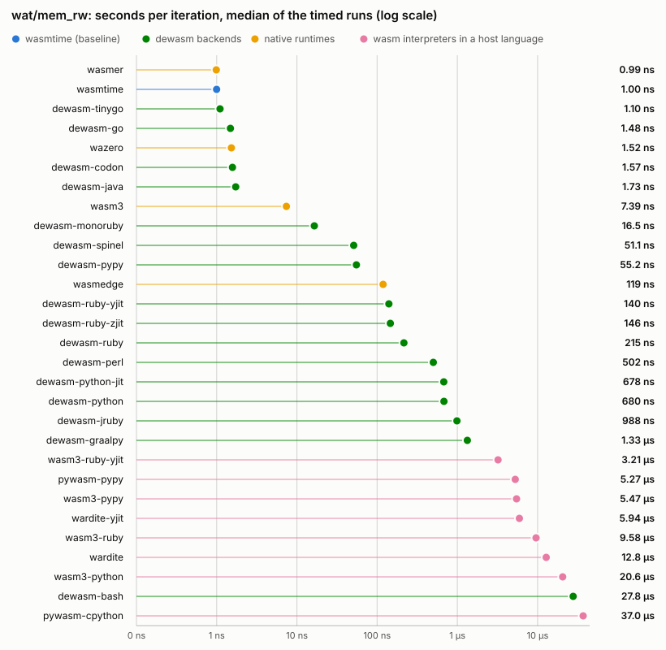
</picture>

Full numbers for <code>wat/mem_rw</code>

| Runner | Iterations | Minimum `ns/op` | Median `ns/op` | Cold start `t(0)` | Total `t(N)` | vs. `wasmtime` | Load |
| --- | --- | --- | --- | --- | --- | --- | --- |
| `wasmtime` | 302 011 028 | 0.99 | 1.00 | 4.6 ms | 303.6 ms | 1.00x | — |
| `wasmer` | 308 352 746 | 0.99 | 0.99 | 8.8 ms | 313.9 ms | 1.00x | — |
| `wasmedge` | 2 522 110 | 118.5 | 118.7 | 18.8 ms | 317.6 ms | 120x | — |
| `wazero` | 195 330 272 | 1.52 | 1.52 | 5.2 ms | 302.5 ms | 1.54x | — |
| `wasm3` | 41 124 393 | 7.36 | 7.39 | 6.8 ms | 309.7 ms | 7.44x | — |
| `dewasm-ruby` | 1 429 508 | 213.7 | 215.4 | 35.5 ms | 341.0 ms | 216x | — |
| `dewasm-ruby-yjit` | 2 015 940 | 138.2 | 140.2 | 35.3 ms | 313.9 ms | 140x | — |
| `dewasm-ruby-zjit` | 1 943 917 | 146.2 | 146.3 | 35.8 ms | 320.1 ms | 148x | — |
| `dewasm-monoruby` | 15 426 272 | 16.5 | 16.5 | 30.5 ms | 285.1 ms | 17x | — |
| `dewasm-jruby` | 219 298 | 899.3 | 987.6 | 1.29 s | 1.49 s | 909x | — |
| `dewasm-spinel` | 5 857 748 | 51.0 | 51.1 | 2.1 ms | 300.6 ms | 51x | — |
| `dewasm-python` | 452 130 | 676.7 | 680.5 | 17.2 ms | 323.1 ms | 684x | — |
| `dewasm-python-jit` | 420 251 | 676.5 | 677.7 | 17.7 ms | 302.0 ms | 683x | — |
| `dewasm-pypy` | 5 631 482 | 54.7 | 55.2 | 38.5 ms | 346.4 ms | 55x | — |
| `dewasm-graalpy` | 155 682 | 1367 | 1331 | 105.5 ms | 318.3 ms | 1381x | — |
| `dewasm-perl` | 533 724 | 501.5 | 501.8 | 11.0 ms | 278.6 ms | 507x | — |
| `dewasm-go` | 201 003 980 | 1.48 | 1.48 | 2.5 ms | 300.4 ms | 1.50x | — |
| `dewasm-tinygo` | 266 847 407 | 1.09 | 1.10 | 2.1 ms | 294.0 ms | 1.11x | — |
| `dewasm-java` | 156 518 506 | 1.72 | 1.73 | 56.3 ms | 326.1 ms | 1.74x | — |
| `dewasm-codon` | 190 365 059 | 1.57 | 1.57 | 12.0 ms | 310.2 ms | 1.58x | — |
| `dewasm-bash` | 9 710 | 27729 | 27766 | 12.7 ms | 282.0 ms | 28015x | — |
| `wasm3-ruby` | 31 242 | 9552 | 9576 | 110.4 ms | 408.8 ms | 9651x | — |
| `wasm3-ruby-yjit` | 61 303 | 3229 | 3215 | 218.6 ms | 416.6 ms | 3263x | — |
| `wasm3-python` | 14 873 | 20684 | 20578 | 290.4 ms | 598.1 ms | 20897x | — |
| `wasm3-pypy` | 34 130 | 5382 | 5473 | 446.7 ms | 630.4 ms | 5438x | — |
| `pywasm-cpython` | 8 411 | 36866 | 36985 | 30.9 ms | 341.0 ms | 37245x | 0.6 ms |
| `pywasm-pypy` | 50 820 | 5182 | 5270 | 71.5 ms | 334.8 ms | 5235x | 2.8 ms |
| `wardite` | 25 251 | 12906 | 12796 | 48.4 ms | 374.2 ms | 13039x | 2.8 ms |
| `wardite-yjit` | 46 034 | 5968 | 5940 | 91.7 ms | 366.4 ms | 6030x | 7.1 ms |

#### `wat/tail_call`

<picture>
  <source media="(prefers-color-scheme: dark)" srcset="figs/wat-tail-call-dark.svg">
  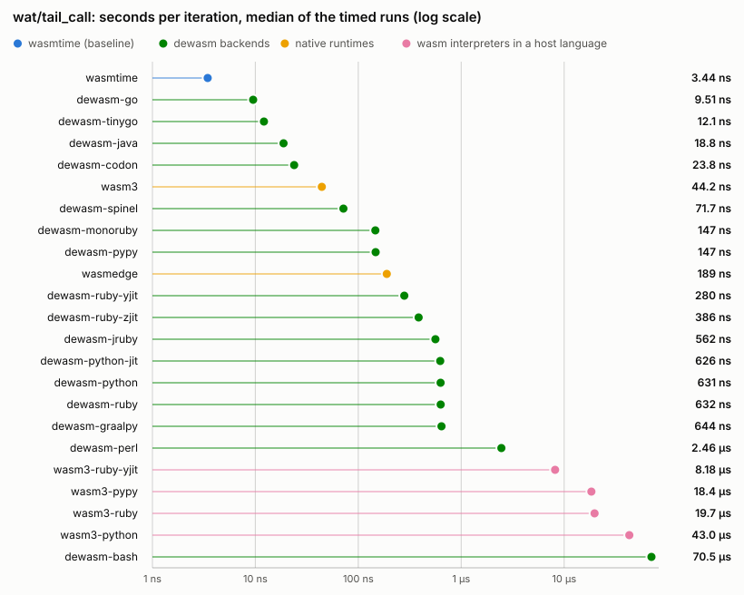
</picture>

Full numbers for <code>wat/tail_call</code>

| Runner | Iterations | Minimum `ns/op` | Median `ns/op` | Cold start `t(0)` | Total `t(N)` | vs. `wasmtime` | Load |
| --- | --- | --- | --- | --- | --- | --- | --- |
| `wasmtime` | 87 008 413 | 3.44 | 3.44 | 4.8 ms | 303.9 ms | 1.00x | — |
| `wasmedge` | 1 836 328 | 187.6 | 189.2 | 20.9 ms | 365.3 ms | 55x | — |
| `wasm3` | 6 697 691 | 43.9 | 44.2 | 6.8 ms | 301.0 ms | 13x | — |
| `dewasm-ruby` | 460 242 | 630.6 | 631.8 | 35.3 ms | 325.5 ms | 183x | — |
| `dewasm-ruby-yjit` | 1 014 593 | 280.3 | 280.1 | 36.9 ms | 321.3 ms | 82x | — |
| `dewasm-ruby-zjit` | 607 686 | 384.6 | 385.5 | 35.8 ms | 269.5 ms | 112x | — |
| `dewasm-monoruby` | 2 064 487 | 145.3 | 146.7 | 30.4 ms | 330.4 ms | 42x | — |
| `dewasm-jruby` | 312 630 | 605.4 | 562.2 | 1.30 s | 1.49 s | 176x | — |
| `dewasm-spinel` | 4 170 799 | 71.5 | 71.7 | 2.1 ms | 300.5 ms | 21x | — |
| `dewasm-python` | 405 684 | 629.6 | 630.5 | 17.9 ms | 273.3 ms | 183x | — |
| `dewasm-python-jit` | 445 383 | 623.1 | 625.5 | 17.8 ms | 295.3 ms | 181x | — |
| `dewasm-pypy` | 1 505 992 | 147.9 | 147.4 | 38.5 ms | 261.2 ms | 43x | — |
| `dewasm-graalpy` | 323 168 | 641.9 | 643.9 | 108.6 ms | 316.1 ms | 187x | — |
| `dewasm-perl` | 131 072 | 2444 | 2458 | 11.2 ms | 331.5 ms | 711x | — |
| `dewasm-go` | 33 887 603 | 8.74 | 9.51 | 2.4 ms | 298.6 ms | 2.54x | — |
| `dewasm-tinygo` | 16 777 216 | 12.1 | 12.1 | 1.8 ms | 204.3 ms | 3.51x | — |
| `dewasm-java` | 14 752 385 | 18.5 | 18.8 | 56.0 ms | 329.3 ms | 5.39x | — |
| `dewasm-codon` | 10 519 185 | 23.6 | 23.8 | 12.0 ms | 260.4 ms | 6.87x | — |
| `dewasm-bash` | 4 176 | 69536 | 70539 | 12.8 ms | 303.2 ms | 20223x | — |
| `wasm3-ruby` | 15 094 | 19648 | 19741 | 111.0 ms | 407.5 ms | 5714x | — |
| `wasm3-ruby-yjit` | 24 037 | 7963 | 8177 | 192.3 ms | 383.7 ms | 2316x | — |
| `wasm3-python` | 7 712 | 43243 | 43019 | 288.0 ms | 621.5 ms | 12576x | — |
| `wasm3-pypy` | 12 004 | 18416 | 18398 | 446.9 ms | 668.0 ms | 5356x | — |

#### `c/mandelbrot`

<picture>
  <source media="(prefers-color-scheme: dark)" srcset="figs/c-mandelbrot-dark.svg">
  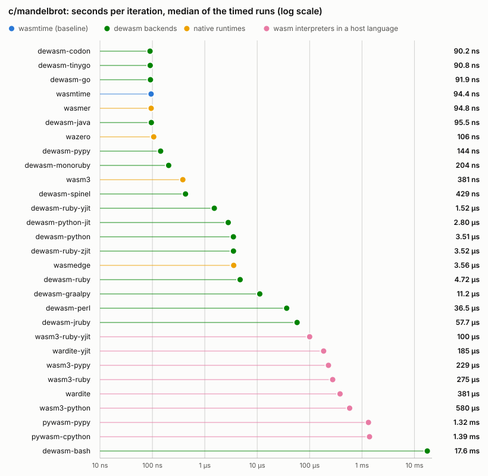
</picture>

Full numbers for <code>c/mandelbrot</code>

| Runner | Iterations | Minimum `ns/op` | Median `ns/op` | Cold start `t(0)` | Total `t(N)` | vs. `wasmtime` | Load |
| --- | --- | --- | --- | --- | --- | --- | --- |
| `wasmtime` | 3 196 249 | 94.3 | 94.4 | 4.8 ms | 306.4 ms | 1.00x | — |
| `wasmer` | 3 298 768 | 94.8 | 94.8 | 9.0 ms | 321.8 ms | 1.01x | — |
| `wasmedge` | 62 029 | 3542 | 3559 | 18.8 ms | 238.5 ms | 38x | — |
| `wazero` | 2 857 708 | 105.4 | 106.0 | 5.3 ms | 306.5 ms | 1.12x | — |
| `wasm3` | 787 106 | 344.5 | 381.1 | 6.7 ms | 277.8 ms | 3.65x | — |
| `dewasm-ruby` | 65 536 | 4697 | 4718 | 35.8 ms | 343.6 ms | 50x | — |
| `dewasm-ruby-yjit` | 178 866 | 1512 | 1516 | 35.5 ms | 306.0 ms | 16x | — |
| `dewasm-ruby-zjit` | 80 560 | 3513 | 3524 | 35.6 ms | 318.6 ms | 37x | — |
| `dewasm-monoruby` | 967 013 | 203.6 | 204.4 | 30.6 ms | 227.4 ms | 2.16x | — |
| `dewasm-jruby` | 3 596 | 58220 | 57693 | 1.33 s | 1.54 s | 617x | — |
| `dewasm-spinel` | 694 360 | 423.6 | 428.6 | 2.1 ms | 296.3 ms | 4.49x | — |
| `dewasm-python` | 65 536 | 3517 | 3513 | 17.7 ms | 248.2 ms | 37x | — |
| `dewasm-python-jit` | 65 536 | 2820 | 2802 | 18.2 ms | 203.0 ms | 30x | — |
| `dewasm-pypy` | 2 088 738 | 142.5 | 143.7 | 38.6 ms | 336.1 ms | 1.51x | — |
| `dewasm-graalpy` | 20 463 | 11309 | 11195 | 113.3 ms | 344.8 ms | 120x | — |
| `dewasm-perl` | 8 126 | 36361 | 36507 | 11.2 ms | 306.6 ms | 385x | — |
| `dewasm-go` | 3 124 584 | 91.9 | 91.9 | 2.5 ms | 289.7 ms | 0.97x | — |
| `dewasm-tinygo` | 3 313 524 | 90.4 | 90.8 | 1.9 ms | 301.3 ms | 0.96x | — |
| `dewasm-java` | 2 941 635 | 94.2 | 95.5 | 57.6 ms | 334.8 ms | 1.00x | — |
| `dewasm-codon` | 3 480 249 | 89.9 | 90.2 | 12.2 ms | 325.1 ms | 0.95x | — |
| `dewasm-bash` | 197 | 17527436 | 17583469 | 13.2 ms | 3.47 s | 185798x | — |
| `wasm3-ruby` | 881 | 273246 | 275340 | 110.9 ms | 351.6 ms | 2897x | — |
| `wasm3-ruby-yjit` | 2 604 | 98963 | 100026 | 252.4 ms | 510.1 ms | 1049x | — |
| `wasm3-python` | 512 | 572080 | 579664 | 294.7 ms | 587.6 ms | 6064x | — |
| `wasm3-pypy` | 1 080 | 226046 | 228784 | 450.4 ms | 694.6 ms | 2396x | — |
| `pywasm-cpython` | 256 | 1388454 | 1389716 | 31.5 ms | 387.0 ms | 14718x | 0.8 ms |
| `pywasm-pypy` | 138 | 1309243 | 1323079 | 73.8 ms | 254.5 ms | 13879x | 4.0 ms |
| `wardite` | 777 | 384477 | 380658 | 48.2 ms | 346.9 ms | 4076x | 4.0 ms |
| `wardite-yjit` | 1 163 | 182979 | 184848 | 93.3 ms | 306.1 ms | 1940x | 8.4 ms |

#### `c/sha256`

<picture>
  <source media="(prefers-color-scheme: dark)" srcset="figs/c-sha256-dark.svg">
  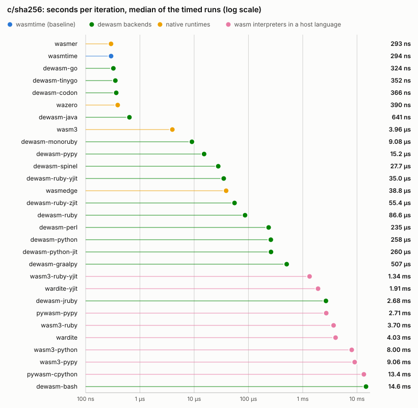
</picture>

Full numbers for <code>c/sha256</code>

| Runner | Iterations | Minimum `ns/op` | Median `ns/op` | Cold start `t(0)` | Total `t(N)` | vs. `wasmtime` | Load |
| --- | --- | --- | --- | --- | --- | --- | --- |
| `wasmtime` | 1 022 258 | 292.7 | 294.0 | 4.8 ms | 304.0 ms | 1.00x | — |
| `wasmer` | 1 023 831 | 293.1 | 293.3 | 8.8 ms | 308.9 ms | 1.00x | — |
| `wasmedge` | 6 892 | 38483 | 38815 | 18.9 ms | 284.1 ms | 131x | — |
| `wazero` | 776 420 | 385.6 | 389.9 | 5.5 ms | 304.9 ms | 1.32x | — |
| `wasm3` | 65 536 | 3965 | 3963 | 6.7 ms | 266.5 ms | 14x | — |
| `dewasm-ruby` | 3 348 | 86384 | 86553 | 35.4 ms | 324.6 ms | 295x | — |
| `dewasm-ruby-yjit` | 8 108 | 34450 | 34994 | 35.9 ms | 315.2 ms | 118x | — |
| `dewasm-ruby-zjit` | 3 291 | 54673 | 55422 | 36.2 ms | 216.1 ms | 187x | — |
| `dewasm-monoruby` | 27 127 | 9094 | 9080 | 32.9 ms | 279.6 ms | 31x | — |
| `dewasm-jruby` | 112 | 2614960 | 2676782 | 1.31 s | 1.60 s | 8933x | — |
| `dewasm-spinel` | 10 868 | 27696 | 27747 | 2.2 ms | 303.2 ms | 95x | — |
| `dewasm-python` | 1 158 | 258189 | 258201 | 17.9 ms | 316.9 ms | 882x | — |
| `dewasm-python-jit` | 1 150 | 260448 | 260226 | 18.7 ms | 318.2 ms | 890x | — |
| `dewasm-pypy` | 20 082 | 15088 | 15220 | 39.5 ms | 342.4 ms | 52x | — |
| `dewasm-graalpy` | 512 | 507071 | 506508 | 110.3 ms | 369.9 ms | 1732x | — |
| `dewasm-perl` | 1 281 | 235113 | 235489 | 11.1 ms | 312.3 ms | 803x | — |
| `dewasm-go` | 937 355 | 322.8 | 324.5 | 2.6 ms | 305.2 ms | 1.10x | — |
| `dewasm-tinygo` | 850 179 | 349.7 | 352.5 | 2.3 ms | 299.6 ms | 1.19x | — |
| `dewasm-java` | 373 490 | 638.4 | 640.9 | 56.0 ms | 294.4 ms | 2.18x | — |
| `dewasm-codon` | 827 441 | 364.6 | 366.3 | 12.0 ms | 313.7 ms | 1.25x | — |
| `dewasm-bash` | 16 | 14622135 | 14648971 | 15.0 ms | 249.0 ms | 49954x | — |
| `wasm3-ruby` | 78 | 3670114 | 3699937 | 115.2 ms | 401.4 ms | 12538x | — |
| `wasm3-ruby-yjit` | 143 | 1341143 | 1337361 | 269.7 ms | 461.5 ms | 4582x | — |
| `wasm3-python` | 26 | 8067486 | 7997043 | 298.7 ms | 508.5 ms | 27561x | — |
| `wasm3-pypy` | 20 | 9327429 | 9058929 | 466.7 ms | 653.3 ms | 31865x | — |
| `pywasm-cpython` | 20 | 13332644 | 13390467 | 32.5 ms | 299.2 ms | 45548x | 1.1 ms |
| `pywasm-pypy` | 84 | 2713287 | 2710545 | 79.3 ms | 307.2 ms | 9269x | 6.2 ms |
| `wardite` | 72 | 4025575 | 4026953 | 48.1 ms | 338.0 ms | 13753x | 3.9 ms |
| `wardite-yjit` | 121 | 1900975 | 1914715 | 93.0 ms | 323.0 ms | 6494x | 8.6 ms |

#### `c/wordcount`

<picture>
  <source media="(prefers-color-scheme: dark)" srcset="figs/c-wordcount-dark.svg">
  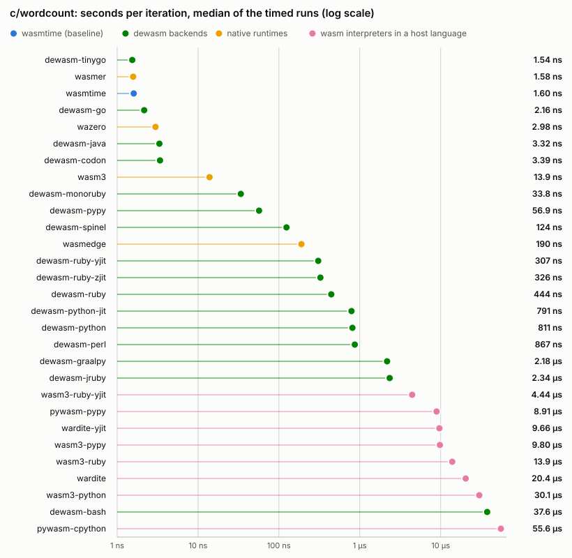
</picture>

Full numbers for <code>c/wordcount</code>

| Runner | Iterations | Minimum `ns/op` | Median `ns/op` | Cold start `t(0)` | Total `t(N)` | vs. `wasmtime` | Load |
| --- | --- | --- | --- | --- | --- | --- | --- |
| `wasmtime` | 191 556 862 | 1.57 | 1.60 | 4.9 ms | 305.5 ms | 1.00x | — |
| `wasmer` | 189 289 662 | 1.56 | 1.58 | 8.8 ms | 304.7 ms | 1.00x | — |
| `wasmedge` | 1 440 074 | 189.4 | 189.9 | 19.5 ms | 292.2 ms | 121x | — |
| `wazero` | 96 977 347 | 2.96 | 2.98 | 5.6 ms | 293.0 ms | 1.89x | — |
| `wasm3` | 16 777 216 | 13.9 | 13.9 | 7.4 ms | 240.4 ms | 8.85x | — |
| `dewasm-ruby` | 588 950 | 444.8 | 444.3 | 37.3 ms | 299.2 ms | 283x | — |
| `dewasm-ruby-yjit` | 887 640 | 304.7 | 306.6 | 37.1 ms | 307.6 ms | 194x | — |
| `dewasm-ruby-zjit` | 877 701 | 323.8 | 325.7 | 37.5 ms | 321.7 ms | 206x | — |
| `dewasm-monoruby` | 8 171 849 | 33.6 | 33.8 | 31.3 ms | 305.6 ms | 21x | — |
| `dewasm-jruby` | 98 388 | 2286 | 2344 | 1.35 s | 1.58 s | 1457x | — |
| `dewasm-spinel` | 2 427 683 | 123.0 | 124.0 | 2.4 ms | 301.1 ms | 78x | — |
| `dewasm-python` | 367 096 | 804.1 | 810.7 | 20.9 ms | 316.0 ms | 512x | — |
| `dewasm-python-jit` | 400 206 | 781.2 | 790.6 | 23.1 ms | 335.7 ms | 498x | — |
| `dewasm-pypy` | 4 966 750 | 56.8 | 56.9 | 43.8 ms | 325.9 ms | 36x | — |
| `dewasm-graalpy` | 122 364 | 2073 | 2176 | 151.2 ms | 404.8 ms | 1321x | — |
| `dewasm-perl` | 341 910 | 865.7 | 866.9 | 14.8 ms | 310.8 ms | 552x | — |
| `dewasm-go` | 134 059 387 | 2.14 | 2.16 | 2.5 ms | 290.0 ms | 1.37x | — |
| `dewasm-tinygo` | 190 791 107 | 1.53 | 1.54 | 1.9 ms | 294.2 ms | 0.98x | — |
| `dewasm-java` | 81 953 526 | 3.21 | 3.32 | 54.0 ms | 317.1 ms | 2.05x | — |
| `dewasm-codon` | 90 175 373 | 3.39 | 3.39 | 11.9 ms | 317.2 ms | 2.16x | — |
| `dewasm-bash` | 6 435 | 37726 | 37649 | 111.4 ms | 354.2 ms | 24044x | — |
| `wasm3-ruby` | 21 390 | 13936 | 13907 | 167.1 ms | 465.2 ms | 8882x | — |
| `wasm3-ruby-yjit` | 64 986 | 4453 | 4437 | 302.6 ms | 592.0 ms | 2838x | — |
| `wasm3-python` | 7 083 | 29666 | 30068 | 409.9 ms | 620.0 ms | 18907x | — |
| `wasm3-pypy` | 21 178 | 10187 | 9797 | 570.9 ms | 786.6 ms | 6493x | — |
| `pywasm-cpython` | 5 622 | 55872 | 55567 | 251.8 ms | 565.9 ms | 35609x | 1.2 ms |
| `pywasm-pypy` | 24 730 | 8890 | 8913 | 171.9 ms | 391.7 ms | 5666x | 6.2 ms |
| `wardite` | 17 222 | 20132 | 20410 | 115.8 ms | 462.5 ms | 12831x | 3.4 ms |
| `wardite-yjit` | 25 009 | 9574 | 9658 | 126.9 ms | 366.3 ms | 6102x | 8.8 ms |

### Application benchmarks

Seconds per **run** of a real cached program on fixed input.
Every runner executes the same work, so wall times compare directly.

#### `app/cowsay`

<picture>
  <source media="(prefers-color-scheme: dark)" srcset="figs/app-cowsay-dark.svg">
  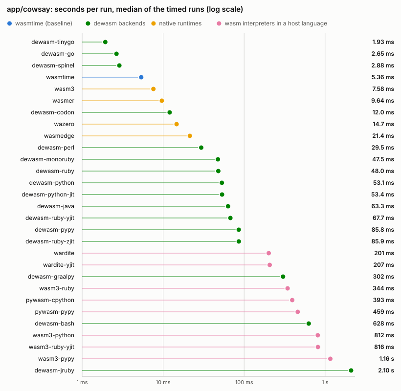
</picture>

Full numbers for <code>app/cowsay</code>

| Runner | Runs/sample | Wall time (minimum) | Wall time (median) | vs. `wasmtime` | Load |
| --- | --- | --- | --- | --- | --- |
| `wasmtime` | 54 | 5.3 ms | 5.4 ms | 1.00x | — |
| `wasmer` | 32 | 9.6 ms | 9.6 ms | 1.79x | — |
| `wasmedge` | 15 | 21.3 ms | 21.4 ms | 3.98x | — |
| `wazero` | 21 | 14.7 ms | 14.7 ms | 2.74x | — |
| `wasm3` | 36 | 7.6 ms | 7.6 ms | 1.41x | — |
| `dewasm-ruby` | 7 | 46.9 ms | 48.0 ms | 8.77x | — |
| `dewasm-ruby-yjit` | 5 | 67.0 ms | 67.7 ms | 13x | — |
| `dewasm-ruby-zjit` | 4 | 84.9 ms | 85.9 ms | 16x | — |
| `dewasm-monoruby` | 7 | 47.3 ms | 47.5 ms | 8.86x | — |
| `dewasm-jruby` | 1 | 2.09 s | 2.10 s | 391x | — |
| `dewasm-spinel` | 57 | 2.8 ms | 2.9 ms | 0.53x | — |
| `dewasm-python` | 6 | 53.1 ms | 53.1 ms | 9.94x | — |
| `dewasm-python-jit` | 6 | 53.1 ms | 53.4 ms | 9.93x | — |
| `dewasm-pypy` | 4 | 84.7 ms | 85.8 ms | 16x | — |
| `dewasm-graalpy` | 2 | 302.3 ms | 302.4 ms | 57x | — |
| `dewasm-perl` | 10 | 29.0 ms | 29.5 ms | 5.44x | — |
| `dewasm-go` | 36 | 2.6 ms | 2.7 ms | 0.49x | — |
| `dewasm-tinygo` | 64 | 1.9 ms | 1.9 ms | 0.35x | — |
| `dewasm-java` | 5 | 63.2 ms | 63.3 ms | 12x | — |
| `dewasm-codon` | 23 | 12.0 ms | 12.0 ms | 2.25x | — |
| `dewasm-bash` | 1 | 626.1 ms | 627.6 ms | 117x | — |
| `wasm3-ruby` | 1 | 343.3 ms | 344.4 ms | 64x | — |
| `wasm3-ruby-yjit` | 1 | 813.3 ms | 816.0 ms | 152x | — |
| `wasm3-python` | 1 | 809.7 ms | 811.6 ms | 152x | — |
| `wasm3-pypy` | 1 | 1.16 s | 1.16 s | 216x | — |
| `pywasm-cpython` | 1 | 390.8 ms | 392.7 ms | 73x | 18.9 ms |
| `pywasm-pypy` | 1 | 458.4 ms | 459.3 ms | 86x | 114.3 ms |
| `wardite` | 2 | 201.2 ms | 201.3 ms | 38x | 11.6 ms |
| `wardite-yjit` | 2 | 205.6 ms | 206.9 ms | 38x | 23.9 ms |

#### `app/sqlite3_query`

<picture>
  <source media="(prefers-color-scheme: dark)" srcset="figs/app-sqlite3-query-dark.svg">
  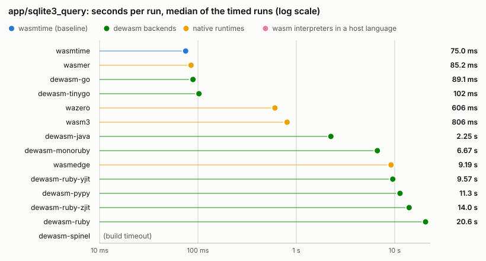
</picture>

Full numbers for <code>app/sqlite3_query</code>

| Runner | Runs/sample | Wall time (minimum) | Wall time (median) | vs. `wasmtime` | Load |
| --- | --- | --- | --- | --- | --- |
| `wasmtime` | 5 | 74.1 ms | 75.0 ms | 1.00x | — |
| `wasmer` | 4 | 84.4 ms | 85.2 ms | 1.14x | — |
| `wasmedge` | 1 | 9.12 s | 9.19 s | 123x | — |
| `wazero` | 1 | 604.7 ms | 605.5 ms | 8.16x | — |
| `wasm3` | 1 | 691.1 ms | 805.9 ms | 9.33x | — |
| `dewasm-ruby` | 1 | 20.52 s | 20.60 s | 277x | — |
| `dewasm-ruby-yjit` | 1 | 9.47 s | 9.57 s | 128x | — |
| `dewasm-ruby-zjit` | 1 | 13.96 s | 14.02 s | 189x | — |
| `dewasm-monoruby` | 1 | 6.66 s | 6.67 s | 90x | — |
| `dewasm-pypy` | 1 | 11.22 s | 11.33 s | 151x | — |
| `dewasm-go` | 4 | 89.0 ms | 89.1 ms | 1.20x | — |
| `dewasm-tinygo` | 3 | 102.2 ms | 102.4 ms | 1.38x | — |
| `dewasm-java` | 1 | 2.23 s | 2.25 s | 30x | — |

#### `app/sqlite3_mod_query`

<picture>
  <source media="(prefers-color-scheme: dark)" srcset="figs/app-sqlite3-mod-query-dark.svg">
  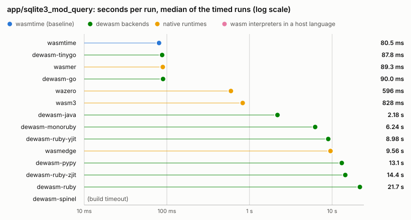
</picture>

Full numbers for <code>app/sqlite3_mod_query</code>

| Runner | Runs/sample | Wall time (minimum) | Wall time (median) | vs. `wasmtime` | Load |
| --- | --- | --- | --- | --- | --- |
| `wasmtime` | 2 | 80.0 ms | 80.5 ms | 1.00x | — |
| `wasmer` | 2 | 89.2 ms | 89.3 ms | 1.11x | — |
| `wasmedge` | 1 | 9.54 s | 9.56 s | 119x | — |
| `wazero` | 1 | 593.6 ms | 596.0 ms | 7.42x | — |
| `wasm3` | 1 | 824.2 ms | 827.6 ms | 10x | — |
| `dewasm-ruby` | 1 | 21.66 s | 21.68 s | 271x | — |
| `dewasm-ruby-yjit` | 1 | 8.69 s | 8.98 s | 109x | — |
| `dewasm-ruby-zjit` | 1 | 14.44 s | 14.44 s | 180x | — |
| `dewasm-monoruby` | 1 | 6.22 s | 6.24 s | 78x | — |
| `dewasm-pypy` | 1 | 13.09 s | 13.09 s | 164x | — |
| `dewasm-go` | 4 | 90.0 ms | 90.0 ms | 1.12x | — |
| `dewasm-tinygo` | 4 | 87.3 ms | 87.8 ms | 1.09x | — |
| `dewasm-java` | 1 | 2.16 s | 2.18 s | 27x | — |

#### `app/minigzip`

<picture>
  <source media="(prefers-color-scheme: dark)" srcset="figs/app-minigzip-dark.svg">
  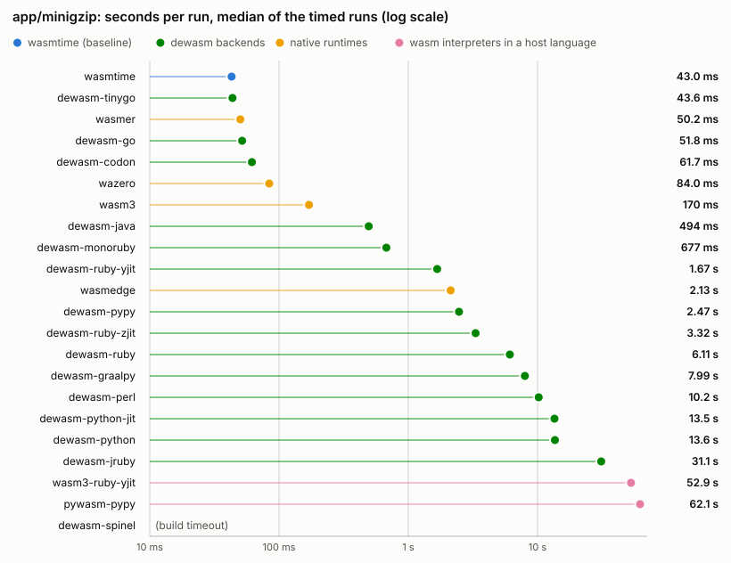
</picture>

Full numbers for <code>app/minigzip</code>

| Runner | Runs/sample | Wall time (minimum) | Wall time (median) | vs. `wasmtime` | Load |
| --- | --- | --- | --- | --- | --- |
| `wasmtime` | 6 | 42.6 ms | 43.0 ms | 1.00x | — |
| `wasmer` | 6 | 49.9 ms | 50.2 ms | 1.17x | — |
| `wasmedge` | 1 | 2.13 s | 2.13 s | 50x | — |
| `wazero` | 4 | 83.7 ms | 84.0 ms | 1.96x | — |
| `wasm3` | 2 | 170.0 ms | 170.4 ms | 3.99x | — |
| `dewasm-ruby` | 1 | 6.09 s | 6.11 s | 143x | — |
| `dewasm-ruby-yjit` | 1 | 1.67 s | 1.67 s | 39x | — |
| `dewasm-ruby-zjit` | 1 | 3.32 s | 3.32 s | 78x | — |
| `dewasm-monoruby` | 1 | 673.0 ms | 677.2 ms | 16x | — |
| `dewasm-jruby` | 1 | 30.12 s | 31.09 s | 706x | — |
| `dewasm-python` | 1 | 13.63 s | 13.64 s | 320x | — |
| `dewasm-python-jit` | 1 | 13.50 s | 13.53 s | 317x | — |
| `dewasm-pypy` | 1 | 2.46 s | 2.47 s | 58x | — |
| `dewasm-graalpy` | 1 | 7.74 s | 7.99 s | 182x | — |
| `dewasm-perl` | 1 | 10.20 s | 10.22 s | 239x | — |
| `dewasm-go` | 6 | 51.3 ms | 51.8 ms | 1.20x | — |
| `dewasm-tinygo` | 7 | 43.5 ms | 43.6 ms | 1.02x | — |
| `dewasm-java` | 1 | 455.3 ms | 493.8 ms | 11x | — |
| `dewasm-codon` | 5 | 61.7 ms | 61.7 ms | 1.45x | — |
| `wasm3-ruby-yjit` | 1 | 52.01 s | 52.86 s | 1220x | — |
| `pywasm-pypy` | 1 | 61.92 s | 62.14 s | 1452x | 224.5 ms |

## Not measured

Every pair the suite did not measure, and why.
A missing runner or an unbuilt module is stated here rather than left as a gap in the tables above.
Kind classifies the gap:

- `cost`: runs correctly, but too slowly to keep in the suite;
- `capability`: the runner cannot execute the workload;
- `setup`: this host lacks the runner or the built module;
- `time limit`: the build or the run went past its time limit.

| Workload | Runner | Kind | Reason |
| --- | --- | --- | --- |
| `wat/eh_throw` | `wazero` | `capability` | `wazero` rejects the tag section: its exception-handling feature is not enabled |
| `wat/eh_throw` | `wasm3` | `capability` | wasm3 fails to load the module: the tag section is unknown to it |
| `wat/eh_throw` | `dewasm-bash` | `capability` | the Bash backend has no exception-handling lowering and rejects the module at conversion time |
| `wat/eh_throw` | `wasm3-ruby` | `capability` | the converted wasm3 fails to load the module like the native one: the tag section is unknown to it |
| `wat/eh_throw` | `wasm3-ruby-yjit` | `capability` | the converted wasm3 fails to load the module like the native one: the tag section is unknown to it |
| `wat/eh_throw` | `wasm3-python` | `capability` | the converted wasm3 fails to load the module like the native one: the tag section is unknown to it |
| `wat/eh_throw` | `wasm3-pypy` | `capability` | the converted wasm3 fails to load the module like the native one: the tag section is unknown to it |
| `wat/eh_throw` | `pywasm-cpython` | `capability` | `pywasm` has no exception-handling opcodes and fails decoding the module |
| `wat/eh_throw` | `pywasm-pypy` | `capability` | `pywasm` has no exception-handling opcodes and fails decoding the module |
| `wat/eh_throw` | `wardite` | `capability` | `wardite` fails to load the tag section |
| `wat/eh_throw` | `wardite-yjit` | `capability` | `wardite` fails to load the tag section |
| `wat/eh_try` | `wazero` | `capability` | `wazero` rejects the tag section: its exception-handling feature is not enabled |
| `wat/eh_try` | `wasm3` | `capability` | wasm3 fails to load the module: the tag section is unknown to it |
| `wat/eh_try` | `dewasm-bash` | `capability` | the Bash backend has no exception-handling lowering and rejects the module at conversion time |
| `wat/eh_try` | `wasm3-ruby` | `capability` | the converted wasm3 fails to load the module like the native one: the tag section is unknown to it |
| `wat/eh_try` | `wasm3-ruby-yjit` | `capability` | the converted wasm3 fails to load the module like the native one: the tag section is unknown to it |
| `wat/eh_try` | `wasm3-python` | `capability` | the converted wasm3 fails to load the module like the native one: the tag section is unknown to it |
| `wat/eh_try` | `wasm3-pypy` | `capability` | the converted wasm3 fails to load the module like the native one: the tag section is unknown to it |
| `wat/eh_try` | `pywasm-cpython` | `capability` | `pywasm` has no exception-handling opcodes and fails decoding the module |
| `wat/eh_try` | `pywasm-pypy` | `capability` | `pywasm` has no exception-handling opcodes and fails decoding the module |
| `wat/eh_try` | `wardite` | `capability` | `wardite` fails to load the tag section |
| `wat/eh_try` | `wardite-yjit` | `capability` | `wardite` fails to load the tag section |
| `wat/f32_alu` | `wardite` | `capability` | `wardite` does not re-round f32 arithmetic to single precision, so a chain of dependent operations gives a result other than Wasmtime's, and the output comparison would fail the whole run |
| `wat/f32_alu` | `wardite-yjit` | `capability` | `wardite` does not re-round f32 arithmetic to single precision, so a chain of dependent operations gives a result other than Wasmtime's, and the output comparison would fail the whole run |
| `wat/i64_div` | `wardite` | `capability` | `wardite` computes `i64.div_s` at `f64` precision, wrong for operands beyond 2^53 |
| `wat/i64_div` | `wardite-yjit` | `capability` | `wardite` computes `i64.div_s` at `f64` precision, wrong for operands beyond 2^53 |
| `wat/tail_call` | `wasmer` | `capability` | `wasmer` rejects the module: tail-call support is not enabled |
| `wat/tail_call` | `wazero` | `capability` | `wazero` rejects `return_call`: its tail-call feature is not enabled |
| `wat/tail_call` | `pywasm-cpython` | `capability` | `pywasm` has no tail-call opcodes and fails decoding `return_call` |
| `wat/tail_call` | `pywasm-pypy` | `capability` | `pywasm` has no tail-call opcodes and fails decoding `return_call` |
| `wat/tail_call` | `wardite` | `capability` | `wardite` decodes `return_call` but has no implementation for it |
| `wat/tail_call` | `wardite-yjit` | `capability` | `wardite` decodes `return_call` but has no implementation for it |
| `app/sqlite3_query` | `dewasm-jruby` | `cost` | JRuby runs this program correctly but too slowly to keep: the largest generated methods exceed the JVM's per-method bytecode limit and never JIT (issue #206) |
| `app/sqlite3_query` | `dewasm-spinel` | `time limit` | the build went past its limit of 900 s |
| `app/sqlite3_query` | `dewasm-python` | `cost` | `dewasm-python` runs this program correctly but too slowly to keep; it stays measured on the other app cases and the microbenchmarks |
| `app/sqlite3_query` | `dewasm-python-jit` | `cost` | the JIT-enabled CPython runs this program correctly but in the same cost class as plain CPython, so it is excluded for the same reason as `dewasm-python` |
| `app/sqlite3_query` | `dewasm-graalpy` | `cost` | GraalPy runs this program correctly but no faster than CPython: the engine's JIT does not reach the largest generated methods |
| `app/sqlite3_query` | `dewasm-perl` | `cost` | `dewasm-perl` runs this program correctly but too slowly to keep; it stays measured on the other app cases and the microbenchmarks |
| `app/sqlite3_query` | `dewasm-codon` | `cost` | the artifact build does not finish in a practical time: `codon build -release` does not get past Codon's capture analysis on the sqlite3 shell's largest generated functions |
| `app/sqlite3_query` | `dewasm-bash` | `cost` | Bash executes compute workloads orders of magnitude slower than Wasmtime, so the query script does not finish in a practical time |
| `app/sqlite3_query` | `wasm3-ruby` | `cost` | the converted wasm3 runs this program correctly but too slowly to keep on any of the four wasm3-* runners |
| `app/sqlite3_query` | `wasm3-ruby-yjit` | `cost` | the converted wasm3 runs this program correctly but too slowly to keep on any of the four wasm3-* runners |
| `app/sqlite3_query` | `wasm3-python` | `cost` | the converted wasm3 runs this program correctly but too slowly to keep on any of the four wasm3-* runners |
| `app/sqlite3_query` | `wasm3-pypy` | `cost` | the converted wasm3 runs this program correctly but too slowly to keep on any of the four wasm3-* runners |
| `app/sqlite3_query` | `pywasm-cpython` | `cost` | `pywasm` runs this program correctly but too slowly for the query script |
| `app/sqlite3_query` | `pywasm-pypy` | `cost` | `pywasm` runs this program correctly but too slowly for the query script |
| `app/sqlite3_query` | `wardite` | `capability` | `wardite` loads the sqlite3 shell but fails with an evaluation error as soon as any SQL runs |
| `app/sqlite3_query` | `wardite-yjit` | `capability` | `wardite` loads the sqlite3 shell but fails with an evaluation error as soon as any SQL runs |
| `app/sqlite3_mod_query` | `dewasm-jruby` | `cost` | JRuby runs this program correctly but too slowly to keep: the largest generated methods exceed the JVM's per-method bytecode limit and never JIT (issue #206) |
| `app/sqlite3_mod_query` | `dewasm-spinel` | `time limit` | the build went past its limit of 900 s |
| `app/sqlite3_mod_query` | `dewasm-python` | `cost` | `dewasm-python` runs this program correctly but too slowly to keep; it stays measured on the other app cases and the microbenchmarks |
| `app/sqlite3_mod_query` | `dewasm-python-jit` | `cost` | the JIT-enabled CPython runs this program correctly but in the same cost class as plain CPython, so it is excluded for the same reason as `dewasm-python` |
| `app/sqlite3_mod_query` | `dewasm-graalpy` | `cost` | GraalPy runs this program correctly but no faster than CPython: the engine's JIT does not reach the largest generated methods |
| `app/sqlite3_mod_query` | `dewasm-perl` | `cost` | `dewasm-perl` runs this program correctly but too slowly to keep; it stays measured on the other app cases and the microbenchmarks |
| `app/sqlite3_mod_query` | `dewasm-codon` | `cost` | the artifact build does not finish in a practical time: `codon build -release` does not get past Codon's capture analysis on the sqlite3 shell's largest generated functions |
| `app/sqlite3_mod_query` | `dewasm-bash` | `cost` | Bash executes compute workloads orders of magnitude slower than Wasmtime, so the query script does not finish in a practical time |
| `app/sqlite3_mod_query` | `wasm3-ruby` | `cost` | the converted wasm3 runs this program correctly but too slowly to keep on any of the four wasm3-* runners |
| `app/sqlite3_mod_query` | `wasm3-ruby-yjit` | `cost` | the converted wasm3 runs this program correctly but too slowly to keep on any of the four wasm3-* runners |
| `app/sqlite3_mod_query` | `wasm3-python` | `cost` | the converted wasm3 runs this program correctly but too slowly to keep on any of the four wasm3-* runners |
| `app/sqlite3_mod_query` | `wasm3-pypy` | `cost` | the converted wasm3 runs this program correctly but too slowly to keep on any of the four wasm3-* runners |
| `app/sqlite3_mod_query` | `pywasm-cpython` | `cost` | `pywasm` runs this program correctly but too slowly for the query script |
| `app/sqlite3_mod_query` | `pywasm-pypy` | `cost` | `pywasm` runs this program correctly but too slowly for the query script |
| `app/sqlite3_mod_query` | `wardite` | `capability` | `wardite` loads the sqlite3 shell but fails with an evaluation error as soon as any SQL runs |
| `app/sqlite3_mod_query` | `wardite-yjit` | `capability` | `wardite` loads the sqlite3 shell but fails with an evaluation error as soon as any SQL runs |
| `app/minigzip` | `dewasm-spinel` | `time limit` | the build went past its limit of 900 s |
| `app/minigzip` | `dewasm-bash` | `cost` | Bash compresses this workload's input too slowly to finish in a practical time |
| `app/minigzip` | `wasm3-ruby` | `cost` | the converted Wasm3 compresses the input correctly but too slowly to keep on Ruby, PyPy and CPython; `wasm3-ruby-yjit` stays measured |
| `app/minigzip` | `wasm3-python` | `cost` | the converted Wasm3 compresses the input correctly but too slowly to keep on Ruby, PyPy and CPython; `wasm3-ruby-yjit` stays measured |
| `app/minigzip` | `wasm3-pypy` | `cost` | the converted Wasm3 compresses the input correctly but too slowly to keep on Ruby, PyPy and CPython; `wasm3-ruby-yjit` stays measured |
| `app/minigzip` | `pywasm-cpython` | `cost` | `pywasm` under CPython compresses this workload's input too slowly to finish in a practical time |
| `app/minigzip` | `wardite` | `capability` | `wardite` computes the correct compressed output but its driver crashes on exit: `minigzip` closes `stdout` itself, and `wardite`'s `fd_close` closes the real file descriptor under it |
| `app/minigzip` | `wardite-yjit` | `capability` | `wardite` computes the correct compressed output but its driver crashes on exit: `minigzip` closes `stdout` itself, and `wardite`'s `fd_close` closes the real file descriptor under it |

