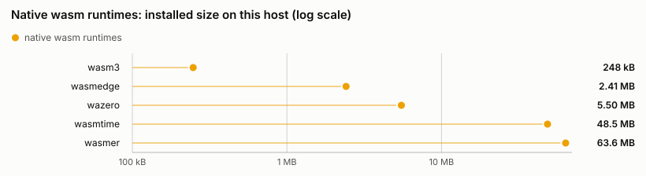
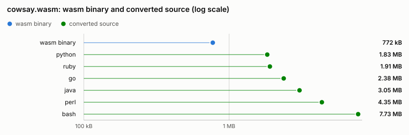
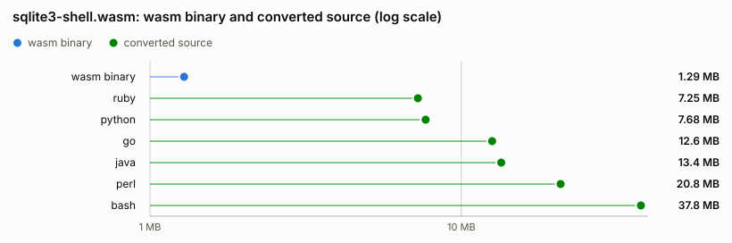
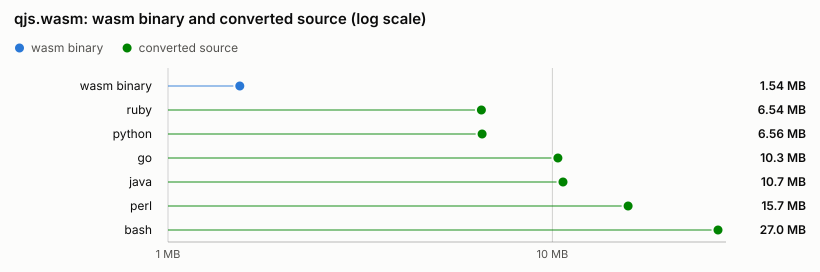
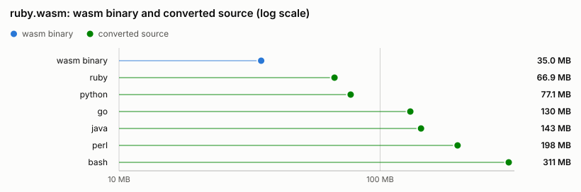

# Sizes

<!-- AUTO-GENERATED by `cargo xtask size`; do not edit by hand. Unlike docs/support.md there is no freshness test: sizes depend on the host's installed runtimes, so this file is a dated measurement, not a compared snapshot. -->

What it costs to distribute a wasm program, taken on one host on one day: the wasm binary plus a runtime that can execute it, against the source dewasm converts that same binary into.
How to run and read these measurements is [README.md](README.md).

## Environment

Measured 2026-08-06T02:31:05Z.

| | |
| --- | --- |
| OS | macOS 26.5.2 |
| Kernel | Darwin 25.5.0 |
| CPU | Apple M1 Pro |
| Arch | aarch64 |

Version strings are captured by executing each runtime.
A runtime missing from this table was not installed on this host; it appears under [Not measured](#not-measured).

| Runtime | Version |
| --- | --- |
| `wasmtime` | wasmtime 47.0.3 (5554cc1a6 2026-07-31) |
| `wasmer` | wasmer 7.2.1 |
| `wasmedge` | wasmedge version 0.17.1 |
| `wazero` | 1.12.0 |
| `wasm3` | Wasm3 v0.5.0 on arm64-v8a |

## Results

Raw bytes on disk, never compressed.
Each figure is a log axis in bytes, smallest first, with its full numbers in the table below it.

### Native runtimes

<picture>
  <source media="(prefers-color-scheme: dark)" srcset="figs/runtimes-dark.svg">
  
</picture>

| Runtime | Size |
| --- | --- |
| `wasmtime` | 48.1 MB |
| `wasmer` | 53.4 MB |
| `wasmedge` | 2.41 MB |
| `wazero` | 5.50 MB |
| `wasm3` | 175 kB |

### `cowsay.wasm`

<picture>
  <source media="(prefers-color-scheme: dark)" srcset="figs/app-cowsay-dark.svg">
  
</picture>

| Target | Size |
| --- | --- |
| wasm binary | 772 kB |
| `ruby` | 2.78 MB |
| `python` | 3.22 MB |
| `perl` | 4.37 MB |
| `bash` | 8.77 MB |
| `go` | 2.43 MB |
| `java` | 4.23 MB |

### `sqlite3-shell.wasm`

<picture>
  <source media="(prefers-color-scheme: dark)" srcset="figs/app-sqlite3-shell-dark.svg">
  
</picture>

| Target | Size |
| --- | --- |
| wasm binary | 1.31 MB |
| `ruby` | 10.7 MB |
| `python` | 14.6 MB |
| `perl` | 28.6 MB |
| `bash` | 48.1 MB |
| `go` | 12.8 MB |
| `java` | 19.6 MB |

### `qjs.wasm`

<picture>
  <source media="(prefers-color-scheme: dark)" srcset="figs/app-qjs-dark.svg">
  
</picture>

| Target | Size |
| --- | --- |
| wasm binary | 1.54 MB |
| `ruby` | 9.28 MB |
| `python` | 11.7 MB |
| `perl` | 23.1 MB |
| `bash` | 34.2 MB |
| `go` | 10.6 MB |
| `java` | 15.2 MB |

### `ruby.wasm`

<picture>
  <source media="(prefers-color-scheme: dark)" srcset="figs/app-ruby-dark.svg">
  
</picture>

| Target | Size |
| --- | --- |
| wasm binary | 35.0 MB |
| `ruby` | 91.9 MB |
| `python` | 128 MB |
| `perl` | 299 MB |
| `bash` | 389 MB |
| `go` | 131 MB |
| `java` | 209 MB |

## Not measured

Nothing: every runtime in the matrix and every app in the corpus was weighed.
