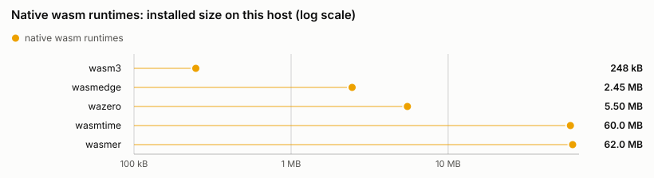
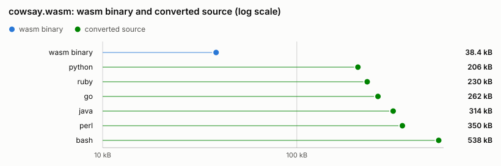
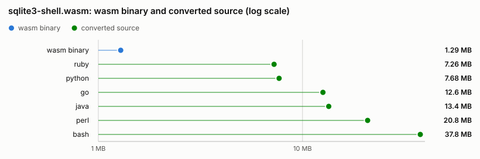
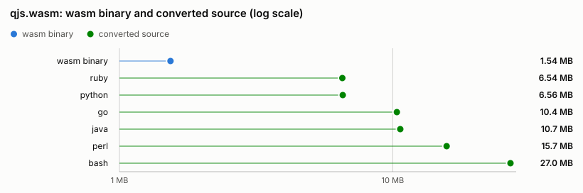
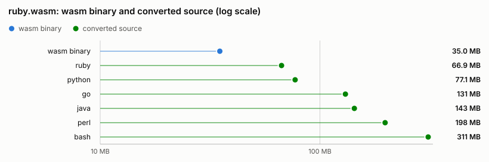

# Sizes

<!-- AUTO-GENERATED by `cargo xtask render-size`; do not edit by hand. Unlike docs/support.md there is no freshness test: sizes depend on the host's installed runtimes, so this file is a dated measurement, not a compared snapshot. -->

What it costs to distribute a wasm program, taken on one host on one day.
One side is the wasm binary plus a runtime that can execute it.
The other is the source dewasm converts that same binary into.
How to run and read these measurements is [README.md](README.md).

## Environment

Measured 2026-10-04T17:48:10Z.

| | |
| --- | --- |
| OS | macOS 27.0.1 |
| Kernel | Darwin 27.0.0 |
| CPU | Apple M1 Pro |
| Architecture | aarch64 |

Version strings are captured by executing each runtime.
A runtime missing from this table was not installed on this host; it appears under [Not measured](#not-measured).

| Runtime | Version |
| --- | --- |
| `wasmtime` | `wasmtime 49.0.2 (3c8a3e79a 2026-10-02)` |
| `wasmer` | `wasmer 7.5.0` |
| `wasmedge` | `wasmedge version 0.17.2` |
| `wazero` | `1.12.0` |
| `wasm3` | `Wasm3 v0.9.1-beta.1 on arm64-v8a` |

## Results

Raw bytes on disk, never compressed.
Each figure is a log axis in bytes, smallest first, with its full numbers in the table below it.

### Native runtimes

<picture>
  <source media="(prefers-color-scheme: dark)" srcset="figs/runtimes-dark.svg">
  
</picture>

| Runtime | Size |
| --- | --- |
| `wasmtime` | 60.0 MB |
| `wasmer` | 62.0 MB |
| `wasmedge` | 2.45 MB |
| `wazero` | 5.50 MB |
| `wasm3` | 248 kB |

### `cowsay.wasm`

<picture>
  <source media="(prefers-color-scheme: dark)" srcset="figs/app-cowsay-dark.svg">
  
</picture>

| Target | Size |
| --- | --- |
| wasm binary | 38.4 kB |
| `ruby` | 230 kB |
| `python` | 206 kB |
| `perl` | 350 kB |
| `bash` | 538 kB |
| `go` | 262 kB |
| `java` | 314 kB |

### `sqlite3-shell.wasm`

<picture>
  <source media="(prefers-color-scheme: dark)" srcset="figs/app-sqlite3-shell-dark.svg">
  
</picture>

| Target | Size |
| --- | --- |
| wasm binary | 1.29 MB |
| `ruby` | 7.26 MB |
| `python` | 7.68 MB |
| `perl` | 20.8 MB |
| `bash` | 37.8 MB |
| `go` | 12.6 MB |
| `java` | 13.4 MB |

### `qjs.wasm`

<picture>
  <source media="(prefers-color-scheme: dark)" srcset="figs/app-qjs-dark.svg">
  
</picture>

| Target | Size |
| --- | --- |
| wasm binary | 1.54 MB |
| `ruby` | 6.54 MB |
| `python` | 6.56 MB |
| `perl` | 15.7 MB |
| `bash` | 27.0 MB |
| `go` | 10.4 MB |
| `java` | 10.7 MB |

### `ruby.wasm`

<picture>
  <source media="(prefers-color-scheme: dark)" srcset="figs/app-ruby-dark.svg">
  
</picture>

| Target | Size |
| --- | --- |
| wasm binary | 35.0 MB |
| `ruby` | 66.9 MB |
| `python` | 77.1 MB |
| `perl` | 198 MB |
| `bash` | 311 MB |
| `go` | 131 MB |
| `java` | 143 MB |

## Not measured

Nothing: every runtime in the matrix and every app in the corpus was weighed.
