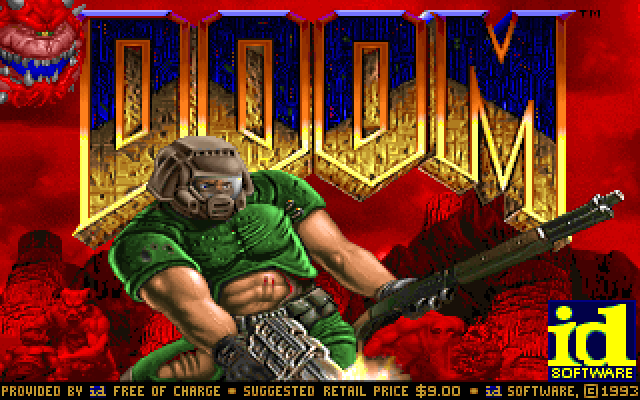

# DOOM on dewasm

One DOOM, six languages: the unmodified [jacobenget/doom.wasm](https://github.com/jacobenget/doom.wasm) v0.1.0 binary — DOOM compiled to a single wasm module with a ten-function host interface and the shareware WAD embedded — converted by `dewasm --mode library` and played through a native frontend per language:

- [`go/`](go/) — Go, rendering with [ebiten](https://github.com/hajimehoshi/ebiten)
- [`java/`](java/) — Java, rendering with Swing (plain JDK, zero dependencies)
- [`ruby/`](ruby/) — Ruby, rendering *into the terminal* as 24-bit-color ANSI half-blocks (stdlib only, run with `--yjit`)
- [`python/`](python/) — Python, the same terminal renderer (stdlib only; a proof of life at ~1.3 ticks/sec, not a game you can win)
- [`perl/`](perl/) — Perl, the same terminal renderer (core modules only; ~0.7 ticks/sec — no JIT and per-call depth accounting, ADR-55)
- [`bash/`](bash/) — pure Bash, same terminal renderer; ~2 minutes to boot and ~34 seconds per frame, an existence proof and likely a first (also available as a [single-file `doom.bash` Gist](https://gist.github.com/makenowjust/b1e9c2a585183f41a5f8f61b4bc9924c) — separate from this MIT repo because the built artifact embeds the GPL-2.0 engine)

Each frontend implements the same ten imports (framebuffer hand-off, monotonic clock, WAD loading, save games, console logging) in its own language and drives the exported `initGame`/`tickGame`/`reportKeyDown`/`reportKeyUp`. The wasm module is the portable artifact; only the host layer differs ([ADR-50](../../docs/adr/50-doom-example-shape.md)).



*The frame the framebuffer-snapshot test pins: driving the converted module under a fixed synthetic clock renders these exact pixels on every backend and the wasmtime oracle, so it doubles as a cross-backend conformance snapshot ([ADR-53](../../docs/adr/53-doom-frame-snapshot.md)). The compared oracle is `doom_frame.ppm`; this PNG is the same frame for human eyes.*

## Run

```sh
go/run.sh    # or: java/run.sh
```

`build.sh` fetches the wasm binary (checksum-pinned, via `../apps/scripts/doom.sh`) into the gitignored apps cache; no other assets are needed. Each frontend also has a headless `-smoke`/`--smoke` mode that ticks the game without a window, sanity-checks the rendered frame, and writes it to `screenshot.png`.

Measured on an Apple Silicon laptop, headless: Go ~70 ticks/sec, Java ~55 — both comfortably above DOOM's native 35Hz tic rate. Ruby reaches ~15 ticks/sec with YJIT, Python ~1.3, and Perl ~0.7, which is why those three render into the terminal instead of a window: the ANSI diff renderer costs a few ms/frame at most, so the wasm tick stays the only bottleneck. Bash, after the ADR-51/52 memory work, boots in ~2 minutes and draws a frame every ~34 seconds — not playable, but genuinely running. Terminals report key presses but not releases, so the terminal frontends synthesize key-up events after a short hold window, and fire is on `f` (Ctrl never reaches a terminal app as a plain key).

No sound: the module exposes no audio interface. This example is built by its own scripts and is not part of `cargo test`.
