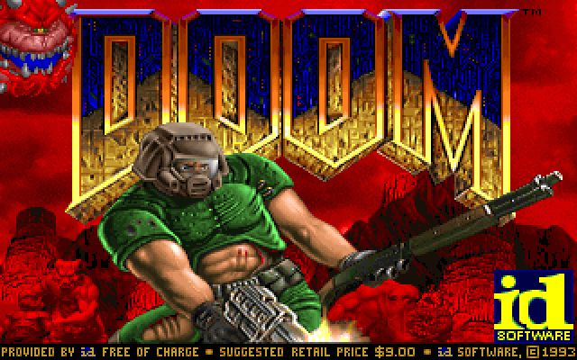

# DOOM on dewasm

One DOOM, seven languages: the unmodified [`jacobenget/doom.wasm`](https://github.com/jacobenget/doom.wasm) v0.1.0 binary.
That binary is DOOM compiled to a single wasm module, with the shareware WAD embedded.
Its host interface has ten functions.
`dewasm --mode library` converts it, and eight native frontends across seven languages play it:

- [`go/`](go/): Go, rendering with [Ebitengine](https://github.com/hajimehoshi/ebiten)
- [`java/`](java/): Java, rendering with Swing (plain JDK, zero dependencies)
- [`ruby/`](ruby/): Ruby, rendering *into the terminal* as 24-bit-color ANSI half-blocks.
  It uses the standard library only and runs with `--yjit`.
- [`ruby/gui/`](ruby/gui/): the same generated Ruby library in a window, with [Gosu](https://www.libgosu.org/).
  The 640x400 framebuffer is DOOM's native 320x200, scaled up by 2.
  It therefore sends a quarter of the pixels to the GPU.
  So the render cost does not grow with the window.
- [`codon/`](codon/): [Codon](https://github.com/exaloop/codon), the same terminal renderer with the terminal driven through `libc`.
  Codon is a statically typed Python dialect compiled ahead of time.
  The tick rate is unmeasured, since the `--smoke` sample is too short to quote.
  A debug `codon build` of the 53k-line generated source takes about 26 seconds.
- [`python/`](python/): Python, the same terminal renderer (standard library only).
  It runs ~45 ticks/sec under PyPy and ~1.2-1.8 under CPython.
- [`perl/`](perl/): Perl, the same terminal renderer (core modules only).
  It runs ~0.7 ticks/sec, with no JIT and per-call depth accounting.
- [`bash/`](bash/): pure Bash, same terminal renderer.
  It takes ~2 minutes to boot and ~34 seconds per frame, an existence proof and likely a first.
  It is also available as a [single-file `doom.bash` Gist](https://gist.github.com/makenowjust/b1e9c2a585183f41a5f8f61b4bc9924c).
  The Gist is separate from this MIT repository because the built artifact embeds the GPL-2.0 engine.

Each frontend implements the same ten imports in its own language.
They cover framebuffer hand-off, a monotonic clock, WAD loading, save games, and console logging.
Each frontend drives the exported `initGame`/`tickGame`/`reportKeyDown`/`reportKeyUp`.
The wasm module is the portable artifact; only the host layer differs.



*The frame that the framebuffer snapshot test checks.
Under a fixed synthetic clock, the converted module renders these exact pixels on every backend.
The Wasmtime oracle renders them too, so the frame doubles as a cross-backend conformance snapshot.
The compared oracle is `doom_frame.ppm`; this PNG is the same frame for human eyes.*

## Run

```sh
go/run.sh    # or: java/run.sh, ruby/gui/run.sh
```

`build.sh` fetches the wasm binary into the apps cache, which Git ignores.
It checks the binary against a fixed checksum.
It does so via `../apps/scripts/doom.sh`, and no other assets are needed.
Each frontend also has a headless `-smoke`/`--smoke` mode that ticks the game without a window.
That mode sanity-checks the rendered frame and writes it to `screenshot.png`.

Measured on an Apple Silicon laptop, headless: Go ~70 ticks/sec, Java ~55.
Both are comfortably above DOOM's native tic rate of 35Hz.
Ruby reaches ~15 ticks/sec with YJIT, and Perl ~0.7.
Python reaches ~45 under PyPy but ~1.2-1.8 under CPython.
That is why those three render into the terminal instead of a window.
The ANSI diff renderer costs at most a few milliseconds per frame.
The wasm tick therefore stays the only limit on speed.
A window is not actually ruled out at those rates, as `ruby/gui/` shows.
What the terminal avoids is the cost per pixel.
Halving the framebuffer back to 320x200 avoids that cost just as well.
The halving loses nothing, since DOOM scales it up by exactly 2.
A window also restores the key releases a terminal cannot report.
Bash boots in ~2 minutes, after the work on associative-array memory and inlined loads and stores.
It draws a frame every ~34 seconds.
It is not playable, but it is genuinely running.
Codon is the one frontend with no tick rate to report: it compiles ahead of time.
On this module that compile is the whole story (`codon/`).
Terminals report key presses but not releases.
The terminal frontends therefore generate key-up events after a short hold window.
Fire is on `f`, since Ctrl never reaches a terminal app as a plain key.

No sound: the module exposes no audio interface.
This example is built by its own scripts and is not part of `cargo test`.
