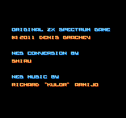

# NES on dewasm

One NES, seven languages: [`agnes`](https://github.com/kgabis/agnes) plus a thin wrapper, compiled to a single 19KB wasm module.
`agnes` is an NES emulator library in C with no dependencies, MIT.
The wrapper is [`../apps/src/nes_demo.c`](../apps/src/nes_demo.c).
The module has an **empty import section**.
`dewasm --mode library` converts it, and eight native frontends across seven languages play it:

- [`go/`](go/): Go, rendering with [Ebitengine](https://github.com/hajimehoshi/ebiten)
- [`java/`](java/): Java, rendering with Swing (plain JDK, zero dependencies)
- [`ruby/`](ruby/): Ruby, rendering *into the terminal* as 24-bit-color ANSI half-blocks.
  It uses the standard library only and runs with `--yjit`.
- [`ruby/gui/`](ruby/gui/): the same generated Ruby library in a window, with [Gosu](https://www.libgosu.org/).
  It has the shape of the DOOM example's [`ruby/gui`](../doom/ruby/gui).
  Real key releases feed the held-button bit mask of `setInput` directly.
- [`codon/`](codon/): [Codon](https://github.com/exaloop/codon), the same terminal renderer with the terminal driven through `libc`.
  Codon is a statically typed Python dialect compiled ahead of time.
  It runs ~400 frames/sec, the only terminal frontend here faster than the NES's 60Hz.
- [`python/`](python/): Python, the same terminal renderer (standard library only).
  It runs ~11 frames/sec under PyPy and ~2.2 under CPython.
- [`perl/`](perl/): Perl, the same terminal renderer (core modules only, ~0.9 frames/sec)
- [`bash/`](bash/): pure Bash, same terminal renderer.
  It takes ~20-40 seconds per frame, an existence proof in the tradition of DOOM on Bash.

See the README in each directory for exact numbers and rendering details.
The wasm module is the portable artifact.
Unlike DOOM, whose WAD is built in, the program it runs is your choice.
Any ROM that the mappers of `agnes` cover (NROM/UxROM/MMC1/MMC3) can be passed as an argument.



*The frame that the framebuffer snapshot test checks: 40 input-free frames into [Alter Ego](https://forums.nesdev.org/viewtopic.php?t=7999).
Alter Ego is the bundled demonstration ROM, a puzzle platformer by Shiru, public domain.
Every backend and the Wasmtime oracle render these exact pixels.
So the frame doubles as a cross-backend conformance snapshot in the DOOM snapshot's harness.
The compared oracle is `nes_frame.ppm`; this PNG is the same frame for human eyes.*

## Run

```sh
go/run.sh    # or: java/run.sh, ruby/run.sh, ruby/gui/run.sh, ...
go/run.sh path/to/other.nes   # any ROM agnes's mappers cover
```

`build.sh` fetches `agnes` and the Alter Ego ROM, both checked against fixed checksums.
It compiles `nes.wasm` with `clang` from `wasi-sdk` into the apps cache, which Git ignores.
It does so via `../apps/scripts/nes.sh`.
Each frontend also has a headless `-smoke`/`--smoke` mode.
It ticks the emulator without a window or terminal.
That mode sanity-checks the rendered frame and writes it to an image file.

Controls (all frontends): arrows = D-pad, `x` = A, `z` = B, Enter = Start, Space = Select, `q`/Esc = exit.

No sound: `agnes` has no APU.
The frontends are built by their own scripts and are not part of `cargo test`.
The frame snapshot above is, with the DOOM case's speed assignment (`slow`, Bash at `ultra`).
